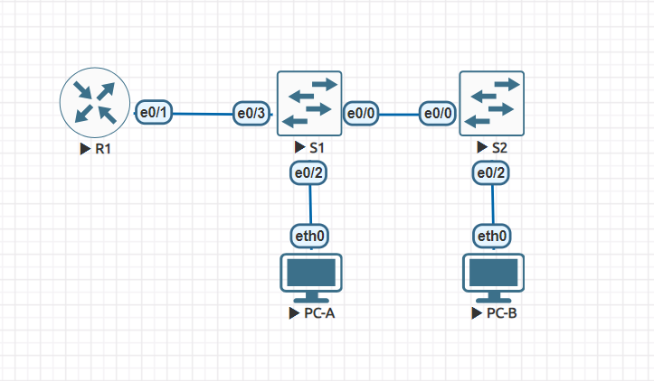

# VLAN и маршрутизация между VLAN

## Схема лабораторной работы:

Экспорт лабораторной работы из EVE-NG:

- [VLAN and Inter-VLAN routing.zip](export_zip/VLAN%20and%20Inter-VLAN%20routing.zip)

Конфигурации устройств: 
- [R1](R1)
- [S1](S1)
- [S2](S2)
- [PC-A](PC-A)
- [PC-B](PC-B)
