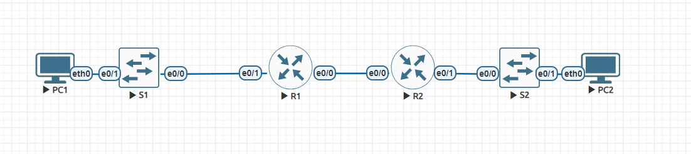

# DHCPv4/DHCPv6

## Схема лабораторной работы:


Экспорт лабораторной работы из EVE-NG:

- [DHCPv4.zip](export_zip/DHCPv4.zip)

# DHCPv4:
## Получение адреса PC-A:
```
PC-A> ip dhcp
DDORA IP 192.168.1.6/26 GW 192.168.1.1
```
```
PC-A> show ip

NAME        : PC-A[1]
IP/MASK     : 192.168.1.6/26
GATEWAY     : 192.168.1.1
DNS         :
DHCP SERVER : 192.168.1.1
DHCP LEASE  : 217752, 217800/108900/190575
DOMAIN NAME : ccna-lab.com
MAC         : 00:50:79:66:68:05
LPORT       : 20000
RHOST:PORT  : 127.0.0.1:30000
MTU         : 1500
```
## Трассировка PC-B c PC-A:
```
PC-A> trace 192.168.1.103
trace to 192.168.1.103, 8 hops max, press Ctrl+C to stop
 1   192.168.1.1   1.144 ms  1.019 ms  0.444 ms
 2   10.0.0.2   0.751 ms  0.628 ms  0.488 ms
 3   *192.168.1.103   1.011 ms (ICMP type:3, code:3, Destination port unreachable)
```
## Трассировка S2 в VLAN 200
```
PC-A> trace 192.168.1.66
trace to 192.168.1.66, 8 hops max, press Ctrl+C to stop
 1   192.168.1.1   0.871 ms  0.584 ms  0.384 ms
 2   *192.168.1.66   0.682 ms (ICMP type:3, code:3, Destination port unreachable)  *

```
### Получения адреса PC-B и трассировка PC-A
```
PC-B> ip dhcp
DORA IP 192.168.1.103/28 GW 192.168.1.97

PC-B> show ip

NAME        : PC-B[1]
IP/MASK     : 192.168.1.103/28
GATEWAY     : 192.168.1.97
DNS         :
DHCP SERVER : 10.0.0.1
DHCP LEASE  : 217794, 217800/108900/190575
DOMAIN NAME : ccna-lab.com
MAC         : 00:50:79:66:68:06
LPORT       : 20000
RHOST:PORT  : 127.0.0.1:30000
MTU         : 1500

PC-B> trace 192.168.1.6
trace to 192.168.1.6, 8 hops max, press Ctrl+C to stop
 1   192.168.1.97   0.477 ms  0.393 ms  0.418 ms
 2   10.0.0.1   0.508 ms  0.546 ms  0.580 ms
 3   *192.168.1.6   0.839 ms (ICMP type:3, code:3, Destination port unreachable)
```


Итоговые конфигурации устройств: 
- [S1](S1)
- [S2](S2)
- [R1](R1)
- [R2](R2)

# DHCPv6:
Экспорт лабораторной работы из EVE-NG:

- [DHCPv6.zip](export_zip/DHCPv6.zip)

## Включение SLAAC на R1:
```
R1(config)#do sh ipv6 int br
Ethernet0/0            [up/up]
    FE80::1
    2001:DB8:ACAD:2::1
Ethernet0/1            [up/up]
    FE80::1
    2001:DB8:ACAD:1::1


R1(config)#ipv6 unicast-routing
```
## Полученный адрес Global Unicast на PC-A:
```
PC-A#show ipv6 int
Ethernet0/0 is up, line protocol is up
  IPv6 is enabled, link-local address is FE80::A8BB:CCFF:FE00:5000
  No Virtual link-local address(es):
  Stateless address autoconfig enabled
  Global unicast address(es):
    2001:DB8:ACAD:1:A8BB:CCFF:FE00:5000, subnet is 2001:DB8:ACAD:1::/64 [EUI/CAL/PRE]
      valid lifetime 2591937 preferred lifetime 604737
  Joined group address(es):
    FF02::1
    FF02::1:FF00:5000
  MTU is 1500 bytes
  ICMP error messages limited to one every 100 milliseconds
  ICMP redirects are enabled
  ICMP unreachables are sent
  ND DAD is enabled, number of DAD attempts: 1
  ND reachable time is 30000 milliseconds (using 30000)
  ND NS retransmit interval is 1000 milliseconds
  Default router is FE80::1 on Ethernet0/0

PC-A#show ipv6 int br
Ethernet0/0            [up/up]
    FE80::A8BB:CCFF:FE00:5000
    2001:DB8:ACAD:1:A8BB:CCFF:FE00:5000
```
## Ping до адресов R1 и R2:
```
PC-A#ping ipv6 2001:DB8:ACAD:1::1
Type escape sequence to abort.
Sending 5, 100-byte ICMP Echos to 2001:DB8:ACAD:1::1, timeout is 2 seconds:
!!!!!
Success rate is 100 percent (5/5), round-trip min/avg/max = 1/1/1 ms
PC-A#ping ipv6 2001:DB8:ACAD:2::1
Type escape sequence to abort.
Sending 5, 100-byte ICMP Echos to 2001:DB8:ACAD:2::1, timeout is 2 seconds:
!!!!!
Success rate is 100 percent (5/5), round-trip min/avg/max = 1/1/1 ms
PC-A#ping ipv6 2001:DB8:ACAD:2::2
Type escape sequence to abort.
Sending 5, 100-byte ICMP Echos to 2001:DB8:ACAD:2::2, timeout is 2 seconds:
!!!!!
Success rate is 100 percent (5/5), round-trip min/avg/max = 1/1/2 ms
PC-A#ping ipv6 2001:DB8:ACAD:3::1
Type escape sequence to abort.
Sending 5, 100-byte ICMP Echos to 2001:DB8:ACAD:3::1, timeout is 2 seconds:
!!!!!
Success rate is 100 percent (5/5), round-trip min/avg/max = 1/1/2 ms
```

## Настройка Stateless DHCPv6 на R1:
```
R1(config)#ipv6 dhcp pool R1-STATELESS
R1(config-dhcpv6)#dns-server 2001:db8:acad::254
R1(config-dhcpv6)#address prefix 2001:DB8:ACAD:1::/64
R1(config-dhcpv6)#domain-name STATELESS.com
R1(config-dhcpv6)#int e0/1
R1(config-if)#ipv6 nd other-config-flag
R1(config-if)#ipv6 dhcp server R1-STATELESS
R1(config-if)#do wr
Building configuration...
[OK]
```
## Полученный адрес на PC-A:
```
PC-A(config-if)#do sh ipv6 int e0/0
Ethernet0/0 is up, line protocol is up
  IPv6 is enabled, link-local address is FE80::A8BB:CCFF:FE00:5000
  No Virtual link-local address(es):
  Global unicast address(es):
    2001:DB8:ACAD:1:C454:3B0B:39C:CD6A, subnet is 2001:DB8:ACAD:1:C454:3B0B:39C:CD6A/128 [TEN]
  Joined group address(es):
    FF02::1
    FF02::1:FF00:5000
    FF02::1:FF9C:CD6A
  MTU is 1500 bytes
  ICMP error messages limited to one every 100 milliseconds
  ICMP redirects are enabled
  ICMP unreachables are sent
  ND DAD is enabled, number of DAD attempts: 1
  ND reachable time is 30000 milliseconds (using 30000)
  ND NS retransmit interval is 1000 milliseconds
  Default router is FE80::1 on Ethernet0/0
```
## Проверка доступности с PC-A
```
PC-A(config-if)#do ping ipv6 2001:DB8:ACAD:1::1
Type escape sequence to abort.
Sending 5, 100-byte ICMP Echos to 2001:DB8:ACAD:1::1, timeout is 2 seconds:
!!!!!
Success rate is 100 percent (5/5), round-trip min/avg/max = 1/4/19 ms
PC-A(config-if)#do ping ipv6 2001:DB8:ACAD:2::1
Type escape sequence to abort.
Sending 5, 100-byte ICMP Echos to 2001:DB8:ACAD:2::1, timeout is 2 seconds:
!!!!!
Success rate is 100 percent (5/5), round-trip min/avg/max = 1/1/1 ms
PC-A(config-if)#do ping ipv6 2001:DB8:ACAD:2::2
Type escape sequence to abort.
Sending 5, 100-byte ICMP Echos to 2001:DB8:ACAD:2::2, timeout is 2 seconds:
!!!!!
Success rate is 100 percent (5/5), round-trip min/avg/max = 1/1/2 ms
PC-A(config-if)#do ping ipv6 2001:DB8:ACAD:3::1
Type escape sequence to abort.
Sending 5, 100-byte ICMP Echos to 2001:DB8:ACAD:3::1, timeout is 2 seconds:
!!!!!
Success rate is 100 percent (5/5), round-trip min/avg/max = 1/1/2 ms
```
## Binding на R1:
```
R1#sh ipv6 dhcp binding
Client: FE80::A8BB:CCFF:FE00:5000
  DUID: 00030001AABBCC005000
  Username : unassigned
  VRF : default
  IA NA: IA ID 0x00030001, T1 43200, T2 69120
    Address: 2001:DB8:ACAD:1:C454:3B0B:39C:CD6A
            preferred lifetime 86400, valid lifetime 172800
            expires at Jul 23 2024 10:14 PM (172579 seconds)
```
## Настройка Pool для демонстрации relay на R1:
```
R1(config)#ipv6 dhcp pool R2-STATEFUL
R1(config-dhcpv6)#address prefix 2001:db8:acad:3:aaa::/80
R1(config-dhcpv6)#dns-server 2001:db8:acad::254
R1(config-dhcpv6)#domain-name STATEFUL.com
R1(config)#interface e0/0
R1(config-if)#ipv6 dhcp server R2-STATEFUL
```
## Настройка на R2:
```
R2(config)#int e0/1
R2(config-if)#ipv6 nd managed-config-flag
R2(config-if)#ipv6 dhcp relay destination 2001:db8:acad:2::1 e0/0
```
## Полученный адрес на PC-B:
```
PC-B(config-if)#do sh ipv6 int
Ethernet0/0 is up, line protocol is up
  IPv6 is enabled, link-local address is FE80::A8BB:CCFF:FE00:6000
  No Virtual link-local address(es):
  Description: "to S2"
  Global unicast address(es):
    2001:DB8:ACAD:3:AAA:6320:1027:F768, subnet is 2001:DB8:ACAD:3:AAA:6320:1027:F768/128
  Joined group address(es):
    FF02::1
    FF02::1:FF00:6000
    FF02::1:FF27:F768
  MTU is 1500 bytes
  ICMP error messages limited to one every 100 milliseconds
  ICMP redirects are enabled
  ICMP unreachables are sent
  ND DAD is enabled, number of DAD attempts: 1
  ND reachable time is 30000 milliseconds (using 30000)
  ND NS retransmit interval is 1000 milliseconds
PC-B(config-if)#do sh ipv6 int br
Ethernet0/0            [up/up]
    FE80::A8BB:CCFF:FE00:6000
    2001:DB8:ACAD:3:AAA:6320:1027:F768
```
## Binding на R1:
```
Client: FE80::A8BB:CCFF:FE00:5000
  DUID: 00030001AABBCC005000
  Username : unassigned
  VRF : default
  IA NA: IA ID 0x00030001, T1 43200, T2 69120
    Address: 2001:DB8:ACAD:1:C454:3B0B:39C:CD6A
            preferred lifetime 86400, valid lifetime 172800
            expires at Jul 23 2024 10:14 PM (172070 seconds)
Client: FE80::A8BB:CCFF:FE00:6000
  DUID: 00030001AABBCC006000
  Username : unassigned
  VRF : default
  IA NA: IA ID 0x00030001, T1 43200, T2 69120
    Address: 2001:DB8:ACAD:3:AAA:6320:1027:F768
            preferred lifetime 86400, valid lifetime 172800
            expires at Jul 23 2024 10:24 PM (172625 seconds)
```
## Конфиги устройств:
- [R1](R1v6)
- [R2](R2v6)