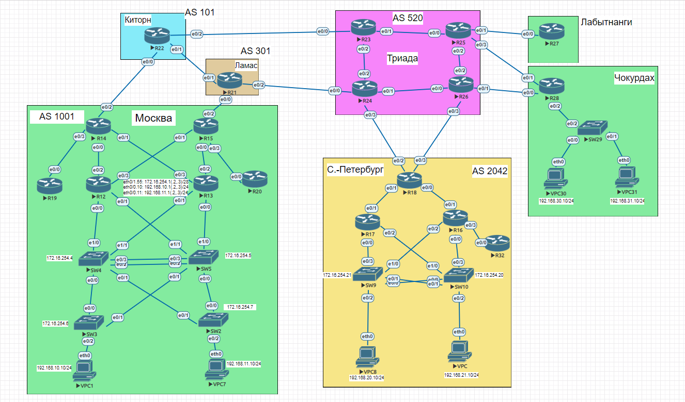
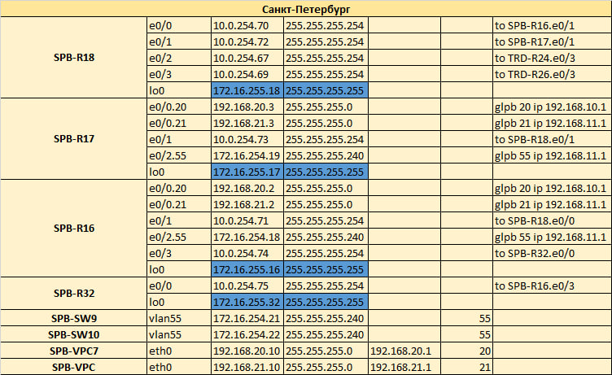
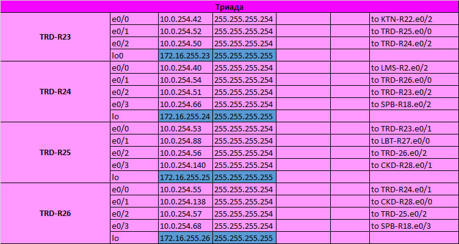
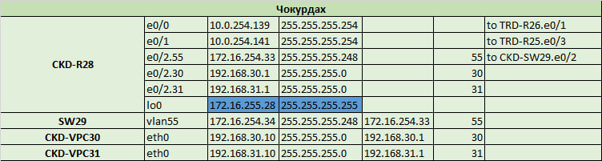
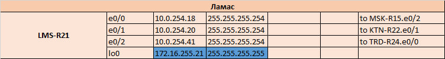
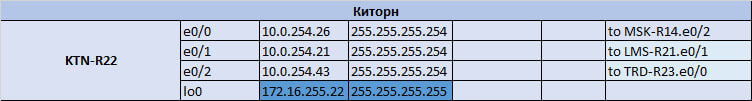
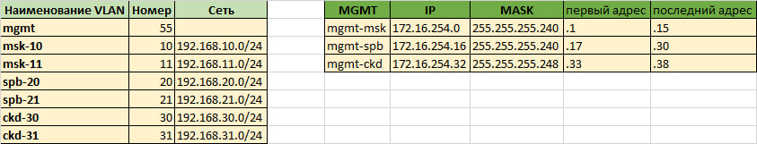

# Архитектура сети

## Схема лабораторной работы:

Экспорт лабораторной работы из EVE-NG:
- [LAB04_Planning.zip](export_zip/lab04_Planning.zip)

Excel-файл с планированием:
- [LAB04.xlsx](export_zip/LAB04.xlsx)
## Москва:
#### Суммирование транспортных сетей: 10.0.254.0/28 (.1-.14)

## Санкт-Петербург:
#### Суммирование транспортных сетей: 10.0.254.64/28 (.65-.78)

## Триада:
#### Суммирование транспортных сетей: 10.0.254.48/28 (.49-.62)

## Чокурдах:
#### Суммирование транспортных сетей: 10.0.254.136/28 (.129-.142)

## Ламас:
#### Суммирование транспортных сетей: 10.0.254.16/29 (.17-.22)

## Киторн:
#### Суммирование транспортных сетей: 10.0.254.24/29 (.25-.30)

## Лабытнаги:
#### Суммирование транспортных сетей: 10.0.254.80/28 (.81-.94)

## Сети MGMT и VLAN для VPC

## Конфигурации устройств:
### Москва:
- [MSK-R12](MSK-R12)
- [MSK-R13](MSK-R13)
- [MSK-R14](MSK-R14)
- [MSK-R15](MSK-R15)
- [MSK-R19](MSK-R19)
- [MSK-R20](MSK-R20)
- [MSK-SW2](MSK-SW2)
- [MSK-SW3](MSK-SW3)
- [MSK-SW4](MSK-SW4)
- [MSK-SW5](MSK-SW5)

### Cанкт-Петербург
- [SPB-R16](SPB-R16)
- [SPB-R17](SPB-R17)
- [SPB-R18](SPB-R18)
- [SPB-R32](SPB-R32)
- [SPB-SW9](SPB-SW9)
- [SPB-SW10](SPB-SW10)

### Чокурдах
- [CKD-R28](CKD-R28)
- [CKD-SW29](CKD-SW29)

### Триада
- [TRD-R23](TRD-R23)
- [TRD-R24](TRD-R24)
- [TRD-R25](TRD-R25)
- [TRD-R26](TRD-R26)

### Ламас
- [LMS-R22](LMS-R21)

### Киторн
- [KTN-R22](KTN-R22)

### Лабытнаги
- [LBT-R27](LBT-R27)