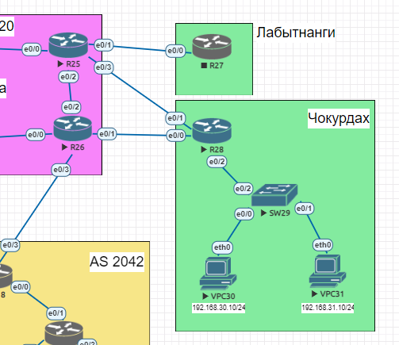

# PBR

## Схема лабораторной работы:


Экспорт лабораторной работы из EVE-NG:

- [PBR.zip](export_zip/lab05_PBR.zip)


### Цели:
- ##### Настроить политику маршрутизации в офисе Чокурдах
- ##### Распределить трафик между 2 линками


### Описание/Пошаговая инструкция выполнения домашнего задания:
- ##### Настроите политику маршрутизации для сетей офиса.
- ##### Распределите трафик между двумя линками с провайдером.
- ##### Настроите отслеживание линка через технологию IP SLA.(только для IPv4)
- ##### Настройте для офиса Лабытнанги маршрут по-умолчанию.
- ##### План работы и изменения зафиксированы в документации .
- ##### Документация оформлена на github. (желательно использовать markdown).
- ##### Если нужна помощь - пишите через ЛК с помощью кнопки "чат с преподавателем" или в канал в Telegram.

## Настройка PBR на CKD-R28:

Настройка ACL для сетей офиса:
```
ip access-list standard VLAN30
 permit 192.168.30.0 0.0.0.255
ip access-list standard VLAN31
 permit 192.168.31.0 0.0.0.255
!
```
Настройка IP SLA для отслеживания доступности next-hop TRD-R25 и  TRD-R26:  
```
ip sla 1
 icmp-echo 10.0.254.138 source-ip 10.0.254.139
 frequency 10
ip sla schedule 1 life forever start-time now
!
ip sla 2
 icmp-echo 10.0.254.140 source-ip 10.0.254.141
 frequency 10
ip sla schedule 2 life forever start-time now
```
Настройка track:
```
track 1 ip sla 1 reachability
 delay down 10 up 5
!
track 2 ip sla 2 reachability
 delay down 10 up 5
```
Настройка PBR:
```
route-map PBR permit 10
 match ip address VLAN30
 set ip next-hop verify-availability 10.0.254.138 10 track 1
 set ip next-hop verify-availability 10.0.254.140 20 track 2
!
route-map PBR permit 20
 match ip address VLAN31
 set ip next-hop verify-availability 10.0.254.140 10 track 2
 set ip next-hop verify-availability 10.0.254.138 20 track 1
!
route-map PBR deny 30
```
Привязывние PBR к интерфейсу:
```
interface Ethernet0/2.30
 encapsulation dot1Q 30
 ip address 192.168.30.1 255.255.255.0
 ip policy route-map PBR
!
interface Ethernet0/2.31
 encapsulation dot1Q 31
 ip address 192.168.31.1 255.255.255.0
 ip policy route-map PBR
```
Вывод sh ip  ro:
```
      10.0.0.0/8 is variably subnetted, 4 subnets, 2 masks
C        10.0.254.138/31 is directly connected, Ethernet0/0
L        10.0.254.139/32 is directly connected, Ethernet0/0
C        10.0.254.140/31 is directly connected, Ethernet0/1
L        10.0.254.141/32 is directly connected, Ethernet0/1
      172.16.0.0/16 is variably subnetted, 3 subnets, 2 masks
C        172.16.254.32/29 is directly connected, Ethernet0/2.55
L        172.16.254.33/32 is directly connected, Ethernet0/2.55
C        172.16.255.28/32 is directly connected, Loopback0
      192.168.30.0/24 is variably subnetted, 2 subnets, 2 masks
C        192.168.30.0/24 is directly connected, Ethernet0/2.30
L        192.168.30.1/32 is directly connected, Ethernet0/2.30
      192.168.31.0/24 is variably subnetted, 2 subnets, 2 masks
C        192.168.31.0/24 is directly connected, Ethernet0/2.31
L        192.168.31.1/32 is directly connected, Ethernet0/2.31
```

## Настройка Static Route Tracking на TRD-R26 и TRD-R25 для проверки отказоустойчивости, в случае падения линков до CKD-R28:
TRD-25:
```
ip sla 1
 icmp-echo 10.0.254.141 source-ip 10.0.254.140
 frequency 10
ip sla schedule 1 life forever start-time now
ip sla 2
 icmp-echo 10.0.254.138 source-ip 10.0.254.56
 frequency 10
ip sla schedule 2 life forever start-time now
```
Настроим треки с логическим "AND":
```
track 1 ip sla 1 reachability
 delay down 10 up 5
!
track 2 ip sla 2 reachability
 delay down 10 up 5
!
track 10 list boolean and
 object 1
 object 2
 delay down 10 up 5
!
track 11 list boolean and
 object 1
 object 2 not
 delay down 10 up 5
!
track 12 list boolean and
 object 1 not
 object 2
 delay down 10 up 5
```
Настройка маршрутов:
```
ip route 192.168.31.0 255.255.255.0 10.0.254.141 10 name "VLAN31 to CKD-R28 directly" track 10
ip route 192.168.30.0 255.255.255.0 10.0.254.57 10 name "VLAN30 through TRD-R26 " track 10
ip route 192.168.30.0 255.255.254.0 10.0.254.141 11 name "both through CKD-R28 directly if link to TRD-26 down" track 11
ip route 192.168.30.0 255.255.254.0 10.0.254.57 12 name "both through TRD-R26 if link to CKD-R28 down" track 12
ip route 10.0.254.68 255.255.255.254 10.0.254.57 name "for ICMP check" # Маршрут до интерфейса на TRD-R26 для проверки  отказоустойчивости, его будем пинговать
ip route 10.0.254.138 255.255.255.254 10.0.254.57 name "for IP SLA 2"
```
На TRD-R26 настройка похожа, за исключением маршрутов в сети .30.0/24 и .31.0/24:
```
ip sla 1
 icmp-echo 10.0.254.139 source-ip 10.0.254.138
 frequency 10
ip sla schedule 1 life forever start-time now
ip sla 2
 icmp-echo 10.0.254.140 source-ip 10.0.254.57
 frequency 10
ip sla schedule 2 life forever start-time now
!
track 1 ip sla 1 reachability
 delay down 10 up 5
!
track 2 ip sla 2 reachability
 delay down 10 up 5
!
track 10 list boolean and
 object 1
 object 2
 delay down 10 up 5
!
track 11 list boolean and
 object 1
 object 2 not
 delay down 10 up 5
!
track 12 list boolean and
 object 1 not
 object 2
 delay down 10 up 5
ip route 192.168.30.0 255.255.255.0 10.0.254.139 10 name "VLAN30 to CKD-R28 directly" track 10
ip route 192.168.31.0 255.255.255.0 10.0.254.56 10 name "VLAN31 through TRD-R25" track 10
ip route 192.168.30.0 255.255.254.0 10.0.254.139 11 name "both directly to CKD-R28" track 11
ip route 192.168.30.0 255.255.254.0 10.0.254.56 12 name "both to TRD-25 if direct link down" track 12
ip route 10.0.254.88 255.255.255.254 10.0.254.56 name "for check ICMP from CKD" # Маршрут до интерфейса на TRD-R25 для проверки  отказоустойчивости, его будем пинговать
ip route 10.0.254.140 255.255.255.254 10.0.254.56 name "for IP SLA 2"
```

В ситуации когда линки TRD-R25 и TRD-R26 в CKD-R28 вывод sh ip ro track-table выглядит следующим образом:
```
TRD-R25#sh ip ro track-table
 ip route 192.168.31.0 255.255.255.0 10.0.254.141 10 name VLAN31 to CKD-R28 directly track 10 state is [up]
 ip route 192.168.30.0 255.255.255.0 10.0.254.57 10 name VLAN30 through TRD-R26  track 10 state is [up]
 ip route 192.168.30.0 255.255.254.0 10.0.254.141 11 name both through CKD-R28 directly if link to TRD-26 down track 11 state is [down]
 ip route 192.168.30.0 255.255.254.0 10.0.254.57 12 name both through TRD-R26 if link to CKD-R28 down track 12 state is [down]
 
TRD-R25#sh ip ro
S     192.168.30.0/24 [10/0] via 10.0.254.57
S     192.168.31.0/24 [10/0] via 10.0.254.141

```
```
TRD-R26#sh ip ro track-table
 ip route 192.168.30.0 255.255.255.0 10.0.254.139 10 name VLAN30 to CKD-R28 directly track 10 state is [up]
 ip route 192.168.31.0 255.255.255.0 10.0.254.56 10 name VLAN31 through TRD-R25 track 10 state is [up]
 ip route 192.168.30.0 255.255.254.0 10.0.254.139 11 name both directly to CKD-R28 track 11 state is [down]
 ip route 192.168.30.0 255.255.254.0 10.0.254.56 12 name both to TRD-25 if direct link down track 12 state is [down]

TRD-R26#sh ip ro
S     192.168.30.0/24 [10/0] via 10.0.254.139
S     192.168.31.0/24 [10/0] via 10.0.254.56

```

## Проверка:

Все линки подключены (для проверки использованы адреса 10.0.254.68 и 10.0.254.88 на TRD-R26 и TRD-R27 соответственно):
```
VPC30> sh
NAME   IP/MASK              GATEWAY                             GATEWAY
VPC30  192.168.30.10/24     192.168.30.1
       fe80::250:79ff:fe66:681e/64

VPC30> ping 10.0.254.68
84 bytes from 10.0.254.68 icmp_seq=1 ttl=254 time=0.787 ms
84 bytes from 10.0.254.68 icmp_seq=2 ttl=254 time=0.821 ms

VPC30> ping 10.0.254.88
84 bytes from 10.0.254.88 icmp_seq=1 ttl=253 time=1.149 ms
84 bytes from 10.0.254.88 icmp_seq=2 ttl=253 time=1.122 ms

VPC31> sh
NAME   IP/MASK              GATEWAY                             GATEWAY
VPC31  192.168.31.10/24     192.168.31.1
       fe80::250:79ff:fe66:681f/64

VPC31>  ping 10.0.254.68
84 bytes from 10.0.254.68 icmp_seq=1 ttl=253 time=1.059 ms
84 bytes from 10.0.254.68 icmp_seq=2 ttl=253 time=1.191 ms

VPC31>  ping 10.0.254.88
84 bytes from 10.0.254.88 icmp_seq=1 ttl=254 time=0.817 ms
84 bytes from 10.0.254.88 icmp_seq=2 ttl=254 time=0.740 ms

```

Теперь отключим интерфейс e0/1 на TRD-R26:
```
TRD-R26(config-if)#
*Aug 14 16:27:46.468: %LINK-5-CHANGED: Interface Ethernet0/1, changed state to administratively down
*Aug 14 16:27:47.473: %LINEPROTO-5-UPDOWN: Line protocol on Interface Ethernet0/1, changed state to down
TRD-R26(config-if)#
*Aug 14 16:28:08.412: %TRACK-6-STATE: 1 ip sla 1 reachability Up -> Down
TRD-R26(config-if)#do sh ip ro
*Aug 14 16:28:13.533: %TRACK-6-STATE: 12 list boolean and Down -> Up

TRD-R26(config-if)#do sh ip ro trac
 ip route 192.168.30.0 255.255.255.0 10.0.254.139 10 name VLAN30 to CKD-R28 directly track 10 state is [down]
 ip route 192.168.31.0 255.255.255.0 10.0.254.56 10 name VLAN31 through TRD-R25 track 10 state is [down]
 ip route 192.168.30.0 255.255.254.0 10.0.254.139 11 name both directly to CKD-R28 track 11 state is [down]
 ip route 192.168.30.0 255.255.254.0 10.0.254.56 12 name both to TRD-25 if direct link down track 12 state is [up]
```
Видно, что в таблице маршрутизации запись изменилась, теперь сети .30.0/23 будут доступны через TRD-R25:
```
TRD-R26(config-if)#do sh ip ro
S     192.168.30.0/23 [12/0] via 10.0.254.56

```

Проверим, что происходит на TRD-R25:
```
TRD-R25(config)#
*Aug 14 16:28:06.530: %TRACK-6-STATE: 2 ip sla 2 reachability Up -> Down
TRD-R25(config)#
*Aug 14 16:28:12.208: %TRACK-6-STATE: 11 list boolean and Down -> Up
TRD-R25(config)#
*Aug 14 16:28:17.214: %TRACK-6-STATE: 10 list boolean and Up -> Down

TRD-R25(config)#do sh ip ro trac
 ip route 192.168.31.0 255.255.255.0 10.0.254.141 10 name VLAN31 to CKD-R28 directly track 10 state is [down]
 ip route 192.168.30.0 255.255.255.0 10.0.254.57 10 name VLAN30 through TRD-R26  track 10 state is [down]
 ip route 192.168.30.0 255.255.254.0 10.0.254.141 11 name both through CKD-R28 directly if link to TRD-26 down track 11 state is [up]
 ip route 192.168.30.0 255.255.254.0 10.0.254.57 12 name both through TRD-R26 if link to CKD-R28 down track 12 state is [down]

TRD-R25(config)#do sh ip ro
S     192.168.30.0/23 [11/0] via 10.0.254.141

```
На CKD-R28:
```
*Aug 14 16:28:10.890: %TRACK-6-STATE: 1 ip sla 1 reachability Up -> Down

```

Видно, что всё в сети офиса Чокурдах теперь идёт через e0/3 TRD-R25, проверим доступность:
```
VPC30> ping 10.0.254.68
84 bytes from 10.0.254.68 icmp_seq=1 ttl=254 time=0.787 ms
84 bytes from 10.0.254.68 icmp_seq=2 ttl=254 time=0.821 ms

VPC30> ping 10.0.254.88
84 bytes from 10.0.254.88 icmp_seq=1 ttl=253 time=1.149 ms
84 bytes from 10.0.254.88 icmp_seq=2 ttl=253 time=1.122 ms

VPC31>  ping 10.0.254.68
84 bytes from 10.0.254.68 icmp_seq=1 ttl=253 time=1.059 ms
84 bytes from 10.0.254.68 icmp_seq=2 ttl=253 time=1.191 ms

VPC31>  ping 10.0.254.88
84 bytes from 10.0.254.88 icmp_seq=1 ttl=254 time=0.817 ms
84 bytes from 10.0.254.88 icmp_seq=2 ttl=254 time=0.740 ms
```

При этом маршруты из PBR не отображаются в sh  ip ro и при этом CKD-SW29 не может пинговать адреса за пределами CKD-R28:
```
CKD-R28#sh ip ro
Gateway of last resort is not set

      10.0.0.0/8 is variably subnetted, 4 subnets, 2 masks
C        10.0.254.138/31 is directly connected, Ethernet0/0
L        10.0.254.139/32 is directly connected, Ethernet0/0
C        10.0.254.140/31 is directly connected, Ethernet0/1
L        10.0.254.141/32 is directly connected, Ethernet0/1
      172.16.0.0/16 is variably subnetted, 3 subnets, 2 masks
C        172.16.254.32/29 is directly connected, Ethernet0/2.55
L        172.16.254.33/32 is directly connected, Ethernet0/2.55
C        172.16.255.28/32 is directly connected, Loopback0
      192.168.30.0/24 is variably subnetted, 2 subnets, 2 masks
C        192.168.30.0/24 is directly connected, Ethernet0/2.30
L        192.168.30.1/32 is directly connected, Ethernet0/2.30
      192.168.31.0/24 is variably subnetted, 2 subnets, 2 masks
C        192.168.31.0/24 is directly connected, Ethernet0/2.31
L        192.168.31.1/32 is directly connected, Ethernet0/2.31

```
Видно, что маршрут по умолчанию не задан, значит коммутатор CKD-SW29 не может пинговать адреса .68 и .88:
```
CKD-SW29#ping 10.0.254.68
Type escape sequence to abort.
Sending 5, 100-byte ICMP Echos to 10.0.254.68, timeout is 2 seconds:
.....
Success rate is 0 percent (0/5)
CKD-SW29#ping 10.0.254.88
Type escape sequence to abort.
Sending 5, 100-byte ICMP Echos to 10.0.254.88, timeout is 2 seconds:
.....
Success rate is 0 percent (0/5)
```
Добавим маршруты по умолчанию на CKD-R28:
```
CKD-R28(config)#ip route 0.0.0.0 0.0.0.0 10.0.254.138 11 track 1
CKD-R28(config)#ip route 0.0.0.0 0.0.0.0 10.0.254.140 12 track 2

CKD-R28(config)#do sh ip ro trac
 ip route 0.0.0.0 0.0.0.0 10.0.254.138 11 track 1 state is [down]
 ip route 0.0.0.0 0.0.0.0 10.0.254.140 12 track 2 state is [up]

CKD-R28(config)#do sh ip ro
Gateway of last resort is 10.0.254.140 to network 0.0.0.0
S*    0.0.0.0/0 [12/0] via 10.0.254.140
```
Добавим маршуты для сети mgmt-ckd на TRD-R25 и TRD-R26:
```
ip route 172.16.254.32 255.255.255.248 10.0.254.57 12 name "MGMT through TRD-R26 if link to CKD-R28 down" track 2
ip route 172.16.254.32 255.255.255.248 10.0.254.141 10 name "MGMT direct to CKD-R28" track 1
```
```
ip route 172.16.254.32 255.255.255.248 10.0.254.56 12 name "MGMT through TRD-R25 if link to CKD-R28 down" track 2
ip route 172.16.254.32 255.255.255.248 10.0.254.139 10 name "MGMT direct to CKD-R28" track 1
```
Проверим, что теперь CKD-SW29 теперь может пинговать адреса .68 и .88:
```
CKD-SW29(config-if)#do ping 10.0.254.68
Type escape sequence to abort.
Sending 5, 100-byte ICMP Echos to 10.0.254.68, timeout is 2 seconds:
!!!!!
Success rate is 100 percent (5/5), round-trip min/avg/max = 1/1/2 ms
CKD-SW29(config-if)#do ping 10.0.254.88
Type escape sequence to abort.
Sending 5, 100-byte ICMP Echos to 10.0.254.88, timeout is 2 seconds:
!!!!!
Success rate is 100 percent (5/5), round-trip min/avg/max = 1/1/1 ms
```

### Итоговые конфигурации устройств: 
- [TRD-R25](TRD-R25)
- [TRD-R26](TRD-R26)
- [CKD-R28](CKD-R28)

