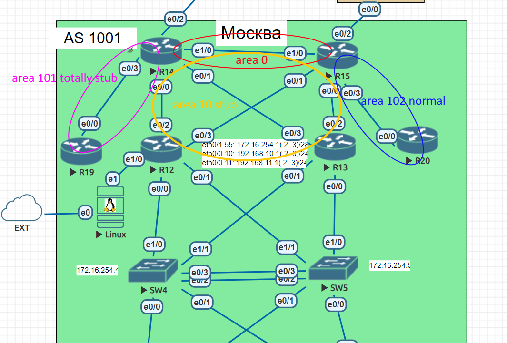
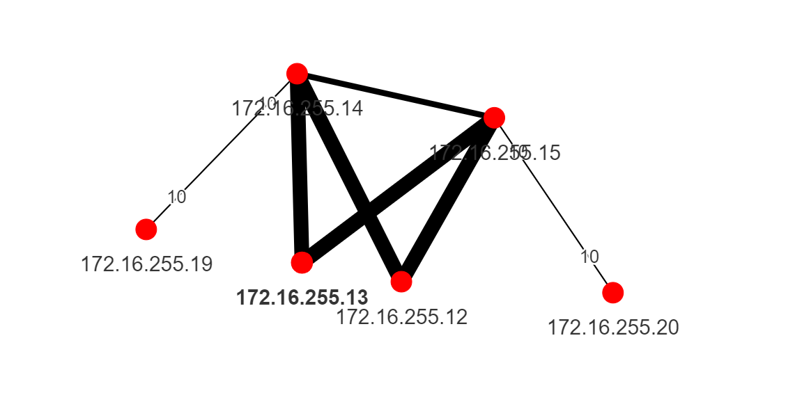

# OSPF

### Цели:
- ##### Настроить OSPF офисе Москва
- ##### Разделить сеть на зоны
- ##### Настроить фильтрацию между зонами

### Описание/Пошаговая инструкция выполнения домашнего задания:
- ##### Маршрутизаторы R14-R15 находятся в зоне 0 - backbone.
- ##### Маршрутизаторы R12-R13 находятся в зоне 10. Дополнительно к маршрутам должны получать маршрут по умолчанию.
- ##### Маршрутизатор R19 находится в зоне 101 и получает только маршрут по умолчанию.
- ##### Маршрутизатор R20 находится в зоне 102 и получает все маршруты, кроме маршрутов до сетей зоны 101.
- ##### Настройка для IPv6 повторяет логику IPv4.

### Схема лабораторной работы:


Экспорт лабораторной работы из EVE-NG:

- [OSPF.zip](export_zip/lab06_OSPF.zip)

Относительно предыдущей версии таблицы адресации: 
- Добавлены IPv6-адреса для p2p интерфейсов, интерфейсов сетей офиса, и Loopback-интерфейсов: FC00 для Loopback, FC02 для p2p транспортных сетей, FC10,FC11,FC55 для сетей офиса и MGMT сети соответственно;
- Для IPv6 адресов был настроен HSRP для сетей офиса Москвы, а для IPv4 был выбран VRRP;
- Было расширено адресное пространство для сетей Москвы, т.к. был добавлен линк между R14-R15, это повлекло незначительные изменения на KTN-R22 и LMS-R21;
- На схему добавлен линк R15.e1/0 <<=>> R14.e1/0 для связывания Area 0. Был так же проверен вариант 'склеивания' backbone area при помощи GRE-туннелей, т.к. OSPF Virtual Link не может быть прокинут через stub-area;
- Была добавлена Linux-машина, подключенная в R12 для работы с Ansible и Topolograph, т.к. Loopback интерфейсы маршрутизаторов включены в OSPF-домен, обращение к маршрутизаторам происходит по адресам Loopback-интерфейсов.

На маршрутизаторах MSK-R14 и MSK-R15 на интерфейсах Ethernet1/0 сконфигурирована area0 (также Loopback0 интерфейсы этих маршрутизаторов помещены в area0):
```сfg
# MSK-R14
interface Loopback0
 ip address 172.16.255.14 255.255.255.255
 ip ospf 1 area 0

interface Ethernet1/0
 description "to R15.e1/0 for OSPF"
 ip address 10.0.254.14 255.255.255.254
 ip ospf network point-to-point
 ip ospf 1 area 0
```
Далее интерфейсы в сторону MSK-R12 и MSK-R13 были настроены следующим образом в area 10:
```сfg
# MSK-R14
interface Ethernet0/0
 description "to R12.e0/2"
 ip address 10.0.254.12 255.255.255.254
 ip ospf 1 area 10
 ipv6 address FC02::12/127
 ospfv3 2 ipv6 area 10
!
interface Ethernet0/1
 description "to R13.e0/3"
 ip address 10.0.254.2 255.255.255.254
 ip ospf 1 area 10
 ip ospf cost 100
 ipv6 address FC02::2/127
 ospfv3 2 ipv6 area 10
 ospfv3 2 ipv6 cost 100
!
```
```cfg
# MSK-R15
interface Ethernet0/0
 description "to R13.e0/2"
 ip address 10.0.254.8 255.255.255.254
 ip ospf 1 area 10
 ip ospf cost 100
 ipv6 address FC02::8/127
 ospfv3 2 ipv6 area 10
 ospfv3 2 ipv6 cost 100
!
interface Ethernet0/1
 description "to R12.e0/3"
 ip address 10.0.254.6 255.255.255.254
 ip ospf 1 area 10
 ipv6 address FC02::6/127
 ospfv3 2 ipv6 area 10

```
Area 10 при этом будет stub:
```cfg
router ospf 1
 area 10 stub
```
COST на интерфейсах был расставлен таким образом, чтобы в таблицу маршрутизации участников домена помещался маршрут через R12, на котором согласно приоритетов HSRP и VRRP он является держателем Virtual IP.
Настройка на MSK-R12 и MSK-R13:
```cfg
# MSK-R12
interface Loopback0
 ip address 172.16.255.12 255.255.255.255
 ip ospf 1 area 10
 ipv6 address FC00::12/128
 ospfv3 2 ipv6 area 10
!
interface Ethernet0/0
 no ip address
!
interface Ethernet0/0.10
 encapsulation dot1Q 10
 ip address 192.168.10.2 255.255.255.0
 standby version 2
 standby 10 ipv6 FC10::1/104
 standby 10 preempt
 ip ospf 1 area 10
 ipv6 address FC10::2/104
 ospfv3 2 ipv6 area 10
 vrrp 10 ip 192.168.10.1
!
interface Ethernet0/0.11
 encapsulation dot1Q 11
 ip address 192.168.11.2 255.255.255.0
 standby version 2
 standby 11 ipv6 FC11::1/104
 standby 11 preempt
 ip ospf 1 area 10
 ipv6 address FC11::2/104
 ospfv3 2 ipv6 area 10
 vrrp 11 ip 192.168.11.1
!
interface Ethernet0/1
 no ip address
!
interface Ethernet0/1.55
 description MGMT
 encapsulation dot1Q 55
 ip address 172.16.254.2 255.255.255.240
 standby version 2
 standby 55 ipv6 FC55::1/104
 standby 55 preempt
 ip ospf 1 area 10
 ipv6 address FE55::2/104
 vrrp 55 ip 172.16.254.1
!
interface Ethernet0/2
 description "to R14.e0/0"
 ip address 10.0.254.13 255.255.255.254
 ip ospf 1 area 10
 ipv6 address FC02::13/127
 ospfv3 2 ipv6 area 10
!
interface Ethernet0/3
 description "to R15.e0/3"
 ip address 10.0.254.7 255.255.255.254
 ip ospf 1 area 10
 ipv6 address FC02::7/127
 ospfv3 2 ipv6 area 10

# MSK-R13
interface Loopback0
 ip address 172.16.255.13 255.255.255.255
 ip ospf 1 area 10
 ipv6 address FC00::13/127
 ospfv3 2 ipv6 area 10
!
interface Ethernet0/0
 no ip address
 ip ospf 1 area 0
!
interface Ethernet0/0.10
 encapsulation dot1Q 10
 ip address 192.168.10.3 255.255.255.0
 standby version 2
 standby 10 ipv6 FC10::1/104
 standby 10 priority 50
 ip ospf 1 area 10
 ipv6 address FC10::3/104
 ospfv3 2 ipv6 area 10
 vrrp 10 ip 192.168.10.1
 vrrp 10 priority 50
!
interface Ethernet0/0.11
 encapsulation dot1Q 11
 ip address 192.168.11.3 255.255.255.0
 standby version 2
 standby 11 ipv6 FC11::1/104
 standby 11 priority 50
 ip ospf 1 area 10
 ipv6 address FC11::3/104
 ospfv3 2 ipv6 area 10
 vrrp 11 ip 192.168.11.1
 vrrp 11 priority 50
!
interface Ethernet0/1
 no ip address
!
interface Ethernet0/1.55
 description MGMT
 encapsulation dot1Q 55
 ip address 172.16.254.3 255.255.255.240
 standby version 2
 standby 55 ipv6 FC55::1/104
 standby 55 priority 50
 ip ospf 1 area 10
 ipv6 address FC55::3/104
 ospfv3 2 ipv6 area 10
 vrrp 55 ip 172.16.254.1
 vrrp 55 priority 50
!
interface Ethernet0/2
 description "to R15.e0/0"
 ip address 10.0.254.9 255.255.255.254
 ip ospf 1 area 10
 ip ospf cost 100
 ipv6 address FC02::9/127
 ospfv3 2 ipv6 area 10
 ospfv3 2 ipv6 cost 100
!
interface Ethernet0/3
 description 'to R14.e0/1"
 ip address 10.0.254.3 255.255.255.254
 ip ospf 1 area 10
 ip ospf cost 100
 ipv6 address FC02::3/127
 ospfv3 2 ipv6 area 10
 ospfv3 2 ipv6 cost 100
```
Настройка area 101, которая по условиям задачи будет totally stub на MSK-R14 и MSK-R19:
 MSK-R14
```cfg
interface Ethernet0/3
 description "to R19.e0/0"
 ip address 10.0.254.4 255.255.255.254
 ip ospf network point-to-point
 ip ospf 1 area 101
 ipv6 address FC02::4/127
 ospfv3 network point-to-point
 ospfv3 2 ipv6 area 101
MSK-R19
```cfg
interface Loopback0
 ip address 172.16.255.19 255.255.255.255
 ip ospf 1 area 101
 ipv6 address FC00::19/127
 ospfv3 2 ipv6 area 101
!
interface Ethernet0/0
 description "to R14.e0/3"
 ip address 10.0.254.5 255.255.255.254
 ip ospf network point-to-point
 ip ospf 1 area 101
 ipv6 address FC02::5/127
 ospfv3 network point-to-point
 ospfv3 2 ipv6 area 101
!
router ospfv3 2
 router-id 172.16.255.19
 area 101 stub
 !
 address-family ipv6 unicast
 exit-address-family
!
router ospf 1
 router-id 172.16.255.19
 area 101 stub
```
Настройка area 102, которая по условиям задачи будет normal но с фильтрацией на ABR (MSK-R15) на MSK-R15 и MSK-R15:
```cfg
# MSK-R15
interface Ethernet0/3
 description "to MSK-R20"
 ip address 10.0.254.10 255.255.255.254
 ip ospf network point-to-point
 ip ospf 1 area 102
 ipv6 address FC02::10/127
 ospfv3 network point-to-point
 ospfv3 2 ipv6 area 102

router ospfv3 2
 area 10 stub
 !
 address-family ipv6 unicast
  area 102 filter-list prefix 6101 in
 exit-address-family
!
router ospf 1
 area 10 stub
 area 102 filter-list prefix 101 in
!
ip forward-protocol nd
!
!
no ip http server
no ip http secure-server
!
!
ip prefix-list 101 seq 5 deny 10.0.254.4/31
ip prefix-list 101 seq 10 deny 172.16.255.19/32
ip prefix-list 101 seq 15 permit 0.0.0.0/0 le 32
!
!
ipv6 prefix-list 6101 seq 5 deny FC02::4/127
ipv6 prefix-list 6101 seq 10 deny FC00::19/128
ipv6 prefix-list 6101 seq 15 permit ::/0 le 128
```

MSK-R19
```cfg
interface Loopback0
 ip address 172.16.255.20 255.255.255.255
 ip ospf 1 area 102
 ipv6 address FC00::20/128
 ospfv3 2 ipv6 area 102
!
interface Ethernet0/0
 description "to R15.e0/3"
 ip address 10.0.254.11 255.255.255.254
 ip ospf network point-to-point
 ip ospf 1 area 102
 ipv6 address FC02::11/127
 ospfv3 2 network point-to-point
 ospfv3 2 ipv6 area 102
!
router ospfv3 2
 !
 address-family ipv6 unicast
 exit-address-family
!
router ospf 1
```
### Фильтрация маршрутов в OSPF для IPv4 в area 102
Вывод sh ipv ro os до применения prefix-list filter на MSK-R20:
```cfg
      10.0.0.0/8 is variably subnetted, 9 subnets, 3 masks
O IA     10.0.254.2/31 [110/130] via 10.0.254.10, 01:14:07, Ethernet0/0
O IA     10.0.254.4/31 [110/30] via 10.0.254.10, 00:01:03, Ethernet0/0
O IA     10.0.254.6/31 [110/20] via 10.0.254.10, 01:14:52, Ethernet0/0
O IA     10.0.254.8/31 [110/110] via 10.0.254.10, 01:14:52, Ethernet0/0
O IA     10.0.254.12/31 [110/30] via 10.0.254.10, 01:14:52, Ethernet0/0
O IA     10.0.254.14/31 [110/20] via 10.0.254.10, 01:14:52, Ethernet0/0
O IA     10.255.255.0/30 [110/30] via 10.0.254.10, 01:14:17, Ethernet0/0
      172.16.0.0/16 is variably subnetted, 7 subnets, 2 masks
O IA     172.16.254.0/28 [110/30] via 10.0.254.10, 01:14:17, Ethernet0/0
O IA     172.16.255.12/32 [110/21] via 10.0.254.10, 01:14:17, Ethernet0/0
O IA     172.16.255.13/32 [110/111] via 10.0.254.10, 01:14:17, Ethernet0/0
O IA     172.16.255.14/32 [110/21] via 10.0.254.10, 01:14:52, Ethernet0/0
O IA     172.16.255.15/32 [110/11] via 10.0.254.10, 01:14:52, Ethernet0/0
O IA     172.16.255.19/32 [110/31] via 10.0.254.10, 00:01:03, Ethernet0/0
O IA  192.168.10.0/24 [110/30] via 10.0.254.10, 00:49:44, Ethernet0/0
O IA  192.168.11.0/24 [110/30] via 10.0.254.10, 01:14:17, Ethernet0/0

```
Вывод sh ipv ro os после применения prefix-list filter (видно отсутстивие маршрутов до 10.0.254.4/31 и 10.0.254.4/31):
```cfg
      10.0.0.0/8 is variably subnetted, 8 subnets, 3 masks
O IA     10.0.254.2/31 [110/130] via 10.0.254.10, 01:14:59, Ethernet0/0
O IA     10.0.254.6/31 [110/20] via 10.0.254.10, 01:15:44, Ethernet0/0
O IA     10.0.254.8/31 [110/110] via 10.0.254.10, 01:15:44, Ethernet0/0
O IA     10.0.254.12/31 [110/30] via 10.0.254.10, 01:15:44, Ethernet0/0
O IA     10.0.254.14/31 [110/20] via 10.0.254.10, 01:15:44, Ethernet0/0
O IA     10.255.255.0/30 [110/30] via 10.0.254.10, 01:15:09, Ethernet0/0
      172.16.0.0/16 is variably subnetted, 6 subnets, 2 masks
O IA     172.16.254.0/28 [110/30] via 10.0.254.10, 01:15:09, Ethernet0/0
O IA     172.16.255.12/32 [110/21] via 10.0.254.10, 01:15:09, Ethernet0/0
O IA     172.16.255.13/32 [110/111] via 10.0.254.10, 01:15:09, Ethernet0/0
O IA     172.16.255.14/32 [110/21] via 10.0.254.10, 01:15:44, Ethernet0/0
O IA     172.16.255.15/32 [110/11] via 10.0.254.10, 01:15:44, Ethernet0/0
O IA  192.168.10.0/24 [110/30] via 10.0.254.10, 00:50:36, Ethernet0/0
O IA  192.168.11.0/24 [110/30] via 10.0.254.10, 01:15:09, Ethernet0/0
```
### Фильтрация маршрутов в OSPFv3 для IPv6 в area 102
Вывод sh ipv6 ro os до применения prefix-list filter:
```cfg
OI  FC00::12/128 [110/20]
     via FE80::A8BB:CCFF:FE00:F030, Ethernet0/0
OI  FC00::13/128 [110/110]
     via FE80::A8BB:CCFF:FE00:F030, Ethernet0/0
OI  FC00::14/128 [110/20]
     via FE80::A8BB:CCFF:FE00:F030, Ethernet0/0
OI  FC00::15/128 [110/10]
     via FE80::A8BB:CCFF:FE00:F030, Ethernet0/0
OI  FC00::19/128 [110/30]
     via FE80::A8BB:CCFF:FE00:F030, Ethernet0/0
OI  FC02::2/127 [110/130]
     via FE80::A8BB:CCFF:FE00:F030, Ethernet0/0
OI  FC02::4/127 [110/30]
     via FE80::A8BB:CCFF:FE00:F030, Ethernet0/0
OI  FC02::6/127 [110/20]
     via FE80::A8BB:CCFF:FE00:F030, Ethernet0/0
OI  FC02::8/127 [110/110]
     via FE80::A8BB:CCFF:FE00:F030, Ethernet0/0
OI  FC02::12/127 [110/30]
     via FE80::A8BB:CCFF:FE00:F030, Ethernet0/0
OI  FC02::14/127 [110/20]
     via FE80::A8BB:CCFF:FE00:F030, Ethernet0/0
OI  FC10::/104 [110/30]
     via FE80::A8BB:CCFF:FE00:F030, Ethernet0/0
OI  FC11::/104 [110/30]
     via FE80::A8BB:CCFF:FE00:F030, Ethernet0/0
OI  FC55::/104 [110/30]
     via FE80::A8BB:CCFF:FE00:F030, Ethernet0/0
OI  FE55::/104 [110/30]
     via FE80::A8BB:CCFF:FE00:F030, Ethernet0/0

```
Вывод sh ipv6 ro os после применения prefix-list filter для OSPFv3 в IPv6 (видно отсутстивие маршрутов до FC02::4/127 и FC00::19):
```cfg
OI  FC00::12/128 [110/20]
     via FE80::A8BB:CCFF:FE00:F030, Ethernet0/0
OI  FC00::13/128 [110/110]
     via FE80::A8BB:CCFF:FE00:F030, Ethernet0/0
OI  FC00::14/128 [110/20]
     via FE80::A8BB:CCFF:FE00:F030, Ethernet0/0
OI  FC00::15/128 [110/10]
     via FE80::A8BB:CCFF:FE00:F030, Ethernet0/0
OI  FC02::2/127 [110/130]
     via FE80::A8BB:CCFF:FE00:F030, Ethernet0/0
OI  FC02::6/127 [110/20]
     via FE80::A8BB:CCFF:FE00:F030, Ethernet0/0
OI  FC02::8/127 [110/110]
     via FE80::A8BB:CCFF:FE00:F030, Ethernet0/0
OI  FC02::12/127 [110/30]
     via FE80::A8BB:CCFF:FE00:F030, Ethernet0/0
OI  FC02::14/127 [110/20]
     via FE80::A8BB:CCFF:FE00:F030, Ethernet0/0
OI  FC10::/104 [110/30]
     via FE80::A8BB:CCFF:FE00:F030, Ethernet0/0
OI  FC11::/104 [110/30]
     via FE80::A8BB:CCFF:FE00:F030, Ethernet0/0
OI  FC55::/104 [110/30]
     via FE80::A8BB:CCFF:FE00:F030, Ethernet0/0
OI  FE55::/104 [110/30]
     via FE80::A8BB:CCFF:FE00:F030, Ethernet0/0
```

### Итоговый граф построенный для OSPF IPv4 в Topolograph:


### Выгрузка маршрутов полученных по OSPF для IPv4 для всех маршрутизаторов Москвы:
```cfg
ok: [R12] => {
    "sh_ip_ro_os.stdout": [
        "Codes: L - local, C - connected, S - static, R - RIP, M - mobile, B - BGP
       D - EIGRP, EX - EIGRP external, O - OSPF, IA - OSPF inter area
       N1 - OSPF NSSA external type 1, N2 - OSPF NSSA external type 2
       E1 - OSPF external type 1, E2 - OSPF external type 2
       i - IS-IS, su - IS-IS summary, L1 - IS-IS level-1, L2 - IS-IS level-2
       ia - IS-IS inter area, * - candidate default, U - per-user static route
       o - ODR, P - periodic downloaded static route, H - NHRP, l - LISP
       a - application route
       + - replicated route, % - next hop override

Gateway of last resort is 10.0.254.12 to network 0.0.0.0

O*IA  0.0.0.0/0 [110/11] via 10.0.254.12, 01:30:27, Ethernet0/2
                [110/11] via 10.0.254.6, 01:30:37, Ethernet0/3
      10.0.0.0/8 is variably subnetted, 11 subnets, 3 masks
O        10.0.254.2/31 [110/110] via 10.0.254.12, 01:30:27, Ethernet0/2
O IA     10.0.254.4/31 [110/20] via 10.0.254.12, 01:30:27, Ethernet0/2
O        10.0.254.8/31 [110/110] via 10.0.254.6, 01:30:37, Ethernet0/3
O IA     10.0.254.10/31 [110/20] via 10.0.254.6, 01:30:37, Ethernet0/3
O IA     10.0.254.14/31 [110/20] via 10.0.254.12, 01:30:27, Ethernet0/2
                        [110/20] via 10.0.254.6, 01:30:37, Ethernet0/3
      172.16.0.0/16 is variably subnetted, 8 subnets, 2 masks
O        172.16.255.13/32 [110/111] via 10.0.254.12, 01:30:27, Ethernet0/2
                          [110/111] via 10.0.254.6, 01:30:37, Ethernet0/3
O IA     172.16.255.14/32 [110/11] via 10.0.254.12, 01:30:27, Ethernet0/2
O IA     172.16.255.15/32 [110/11] via 10.0.254.6, 01:30:37, Ethernet0/3
O IA     172.16.255.19/32 [110/21] via 10.0.254.12, 01:30:27, Ethernet0/2
O IA     172.16.255.20/32 [110/21] via 10.0.254.6, 01:30:37, Ethernet0/3"
    ]
}
ok: [R14] => {
    "sh_ip_ro_os.stdout": [
        "Codes: L - local, C - connected, S - static, R - RIP, M - mobile, B - BGP
       D - EIGRP, EX - EIGRP external, O - OSPF, IA - OSPF inter area
       N1 - OSPF NSSA external type 1, N2 - OSPF NSSA external type 2
       E1 - OSPF external type 1, E2 - OSPF external type 2
       i - IS-IS, su - IS-IS summary, L1 - IS-IS level-1, L2 - IS-IS level-2
       ia - IS-IS inter area, * - candidate default, U - per-user static route
       o - ODR, P - periodic downloaded static route, H - NHRP, l - LISP
       a - application route
       + - replicated route, % - next hop override

Gateway of last resort is not set

      10.0.0.0/8 is variably subnetted, 14 subnets, 3 masks
O        10.0.254.6/31 [110/20] via 10.0.254.13, 01:30:37, Ethernet0/0
O        10.0.254.8/31 [110/120] via 10.0.254.13, 01:30:37, Ethernet0/0
O IA     10.0.254.10/31 [110/20] via 10.0.254.15, 01:31:12, Ethernet1/0
O        10.255.255.0/30 [110/20] via 10.0.254.13, 01:30:37, Ethernet0/0
      172.16.0.0/16 is variably subnetted, 7 subnets, 2 masks
O        172.16.254.0/28 [110/20] via 10.0.254.13, 01:30:37, Ethernet0/0
O        172.16.255.12/32 [110/11] via 10.0.254.13, 01:30:37, Ethernet0/0
O        172.16.255.13/32 [110/101] via 10.0.254.3, 01:30:37, Ethernet0/1
O        172.16.255.15/32 [110/11] via 10.0.254.15, 01:31:12, Ethernet1/0
O        172.16.255.19/32 [110/11] via 10.0.254.5, 01:31:12, Ethernet0/3
O IA     172.16.255.20/32 [110/21] via 10.0.254.15, 01:31:12, Ethernet1/0
O     192.168.10.0/24 [110/20] via 10.0.254.13, 01:06:05, Ethernet0/0
O     192.168.11.0/24 [110/20] via 10.0.254.13, 01:30:37, Ethernet0/0"
    ]
}
ok: [R19] => {
    "sh_ip_ro_os.stdout": [
        "Codes: L - local, C - connected, S - static, R - RIP, M - mobile, B - BGP
       D - EIGRP, EX - EIGRP external, O - OSPF, IA - OSPF inter area
       N1 - OSPF NSSA external type 1, N2 - OSPF NSSA external type 2
       E1 - OSPF external type 1, E2 - OSPF external type 2
       i - IS-IS, su - IS-IS summary, L1 - IS-IS level-1, L2 - IS-IS level-2
       ia - IS-IS inter area, * - candidate default, U - per-user static route
       o - ODR, P - periodic downloaded static route, H - NHRP, l - LISP
       a - application route
       + - replicated route, % - next hop override

Gateway of last resort is 10.0.254.12 to network 0.0.0.0

O*IA  0.0.0.0/0 [110/11] via 10.0.254.12, 01:30:27, Ethernet0/2
                [110/11] via 10.0.254.6, 01:30:37, Ethernet0/3
      10.0.0.0/8 is variably subnetted, 11 subnets, 3 masks
O        10.0.254.2/31 [110/110] via 10.0.254.12, 01:30:27, Ethernet0/2
O IA     10.0.254.4/31 [110/20] via 10.0.254.12, 01:30:27, Ethernet0/2
O        10.0.254.8/31 [110/110] via 10.0.254.6, 01:30:37, Ethernet0/3
O IA     10.0.254.10/31 [110/20] via 10.0.254.6, 01:30:37, Ethernet0/3
O IA     10.0.254.14/31 [110/20] via 10.0.254.12, 01:30:27, Ethernet0/2
                        [110/20] via 10.0.254.6, 01:30:37, Ethernet0/3
      172.16.0.0/16 is variably subnetted, 8 subnets, 2 masks
O        172.16.255.13/32 [110/111] via 10.0.254.12, 01:30:27, Ethernet0/2
                          [110/111] via 10.0.254.6, 01:30:37, Ethernet0/3
O IA     172.16.255.14/32 [110/11] via 10.0.254.12, 01:30:27, Ethernet0/2
O IA     172.16.255.15/32 [110/11] via 10.0.254.6, 01:30:37, Ethernet0/3
O IA     172.16.255.19/32 [110/21] via 10.0.254.12, 01:30:27, Ethernet0/2
O IA     172.16.255.20/32 [110/21] via 10.0.254.6, 01:30:37, Ethernet0/3"
    ]
}
ok: [R13] => {
    "sh_ip_ro_os.stdout": [
        "Codes: L - local, C - connected, S - static, R - RIP, M - mobile, B - BGP
       D - EIGRP, EX - EIGRP external, O - OSPF, IA - OSPF inter area
       N1 - OSPF NSSA external type 1, N2 - OSPF NSSA external type 2
       E1 - OSPF external type 1, E2 - OSPF external type 2
       i - IS-IS, su - IS-IS summary, L1 - IS-IS level-1, L2 - IS-IS level-2
       ia - IS-IS inter area, * - candidate default, U - per-user static route
       o - ODR, P - periodic downloaded static route, H - NHRP, l - LISP
       a - application route
       + - replicated route, % - next hop override

Gateway of last resort is 10.0.254.8 to network 0.0.0.0

O*IA  0.0.0.0/0 [110/101] via 10.0.254.8, 01:30:37, Ethernet0/2
                [110/101] via 10.0.254.2, 01:30:27, Ethernet0/3
      10.0.0.0/8 is variably subnetted, 10 subnets, 3 masks
O IA     10.0.254.4/31 [110/110] via 10.0.254.2, 01:30:27, Ethernet0/3
O        10.0.254.6/31 [110/110] via 10.0.254.8, 01:30:37, Ethernet0/2
O IA     10.0.254.10/31 [110/110] via 10.0.254.8, 01:30:37, Ethernet0/2
O        10.0.254.12/31 [110/110] via 10.0.254.2, 01:30:27, Ethernet0/3
O IA     10.0.254.14/31 [110/110] via 10.0.254.8, 01:30:37, Ethernet0/2
                        [110/110] via 10.0.254.2, 01:30:27, Ethernet0/3
O        10.255.255.0/30 [110/120] via 10.0.254.8, 01:30:37, Ethernet0/2
                         [110/120] via 10.0.254.2, 01:30:27, Ethernet0/3
      172.16.0.0/16 is variably subnetted, 8 subnets, 2 masks
O        172.16.255.12/32 [110/111] via 10.0.254.8, 01:30:37, Ethernet0/2
                          [110/111] via 10.0.254.2, 01:30:27, Ethernet0/3
O IA     172.16.255.14/32 [110/101] via 10.0.254.2, 01:30:27, Ethernet0/3
O IA     172.16.255.15/32 [110/101] via 10.0.254.8, 01:30:37, Ethernet0/2
O IA     172.16.255.19/32 [110/111] via 10.0.254.2, 01:30:27, Ethernet0/3
O IA     172.16.255.20/32 [110/111] via 10.0.254.8, 01:30:37, Ethernet0/2"
    ]
}
ok: [R15] => {
    "sh_ip_ro_os.stdout": [
        "Codes: L - local, C - connected, S - static, R - RIP, M - mobile, B - BGP
       D - EIGRP, EX - EIGRP external, O - OSPF, IA - OSPF inter area
       N1 - OSPF NSSA external type 1, N2 - OSPF NSSA external type 2
       E1 - OSPF external type 1, E2 - OSPF external type 2
       i - IS-IS, su - IS-IS summary, L1 - IS-IS level-1, L2 - IS-IS level-2
       ia - IS-IS inter area, * - candidate default, U - per-user static route
       o - ODR, P - periodic downloaded static route, H - NHRP, l - LISP
       a - application route
       + - replicated route, % - next hop override

Gateway of last resort is not set

      10.0.0.0/8 is variably subnetted, 14 subnets, 3 masks
O        10.0.254.2/31 [110/120] via 10.0.254.7, 01:30:27, Ethernet0/1
O IA     10.0.254.4/31 [110/20] via 10.0.254.14, 01:31:12, Ethernet1/0
O        10.0.254.12/31 [110/20] via 10.0.254.7, 01:30:27, Ethernet0/1
O        10.255.255.0/30 [110/20] via 10.0.254.7, 01:30:37, Ethernet0/1
      172.16.0.0/16 is variably subnetted, 7 subnets, 2 masks
O        172.16.254.0/28 [110/20] via 10.0.254.7, 01:30:37, Ethernet0/1
O        172.16.255.12/32 [110/11] via 10.0.254.7, 01:30:37, Ethernet0/1
O        172.16.255.13/32 [110/101] via 10.0.254.9, 01:30:37, Ethernet0/0
O        172.16.255.14/32 [110/11] via 10.0.254.14, 01:31:12, Ethernet1/0
O IA     172.16.255.19/32 [110/21] via 10.0.254.14, 01:31:12, Ethernet1/0
O        172.16.255.20/32 [110/11] via 10.0.254.11, 01:31:12, Ethernet0/3
O     192.168.10.0/24 [110/20] via 10.0.254.7, 01:06:04, Ethernet0/1
O     192.168.11.0/24 [110/20] via 10.0.254.7, 01:30:37, Ethernet0/1"
    ]
}
ok: [R20] => {
    "sh_ip_ro_os.stdout": [
        "Codes: L - local, C - connected, S - static, R - RIP, M - mobile, B - BGP
       D - EIGRP, EX - EIGRP external, O - OSPF, IA - OSPF inter area
       N1 - OSPF NSSA external type 1, N2 - OSPF NSSA external type 2
       E1 - OSPF external type 1, E2 - OSPF external type 2
       i - IS-IS, su - IS-IS summary, L1 - IS-IS level-1, L2 - IS-IS level-2
       ia - IS-IS inter area, * - candidate default, U - per-user static route
       o - ODR, P - periodic downloaded static route, H - NHRP, l - LISP
       a - application route
       + - replicated route, % - next hop override

Gateway of last resort is 10.0.254.8 to network 0.0.0.0

O*IA  0.0.0.0/0 [110/101] via 10.0.254.8, 01:30:39, Ethernet0/2
                [110/101] via 10.0.254.2, 01:30:29, Ethernet0/3
      10.0.0.0/8 is variably subnetted, 10 subnets, 3 masks
O IA     10.0.254.4/31 [110/110] via 10.0.254.2, 01:30:29, Ethernet0/3
O        10.0.254.6/31 [110/110] via 10.0.254.8, 01:30:39, Ethernet0/2
O IA     10.0.254.10/31 [110/110] via 10.0.254.8, 01:30:39, Ethernet0/2
O        10.0.254.12/31 [110/110] via 10.0.254.2, 01:30:29, Ethernet0/3
O IA     10.0.254.14/31 [110/110] via 10.0.254.8, 01:30:39, Ethernet0/2
                        [110/110] via 10.0.254.2, 01:30:29, Ethernet0/3
O        10.255.255.0/30 [110/120] via 10.0.254.8, 01:30:39, Ethernet0/2
                         [110/120] via 10.0.254.2, 01:30:29, Ethernet0/3
      172.16.0.0/16 is variably subnetted, 8 subnets, 2 masks
O        172.16.255.12/32 [110/111] via 10.0.254.8, 01:30:39, Ethernet0/2
                          [110/111] via 10.0.254.2, 01:30:29, Ethernet0/3
O IA     172.16.255.14/32 [110/101] via 10.0.254.2, 01:30:29, Ethernet0/3
O IA     172.16.255.15/32 [110/101] via 10.0.254.8, 01:30:39, Ethernet0/2
O IA     172.16.255.19/32 [110/111] via 10.0.254.2, 01:30:29, Ethernet0/3
O IA     172.16.255.20/32 [110/111] via 10.0.254.8, 01:30:39, Ethernet0/2"
    ]
}
```
### Выгрузка маршрутов полученных по OSPFv3 для IPv6 для всех маршрутизаторов Москвы:
```сfg
ok: [R12] => {
    "sh_ipv6_ro_os.stdout": [
        "IPv6 Routing Table - default - 27 entries
Codes: C - Connected, L - Local, S - Static, U - Per-user Static route
       B - BGP, HA - Home Agent, MR - Mobile Router, R - RIP
       H - NHRP, I1 - ISIS L1, I2 - ISIS L2, IA - ISIS interarea
       IS - ISIS summary, D - EIGRP, EX - EIGRP external, NM - NEMO
       ND - ND Default, NDp - ND Prefix, DCE - Destination, NDr - Redirect
       O - OSPF Intra, OI - OSPF Inter, OE1 - OSPF ext 1, OE2 - OSPF ext 2
       ON1 - OSPF NSSA ext 1, ON2 - OSPF NSSA ext 2, la - LISP alt
       lr - LISP site-registrations, ld - LISP dyn-eid, a - Application
OI  ::/0 [110/11]
     via FE80::A8BB:CCFF:FE00:F010, Ethernet0/3
     via FE80::A8BB:CCFF:FE00:E000, Ethernet0/2
O   FC00::13/128 [110/110]
     via FE80::A8BB:CCFF:FE00:F010, Ethernet0/3
     via FE80::A8BB:CCFF:FE00:E000, Ethernet0/2
OI  FC00::14/128 [110/10]
     via FE80::A8BB:CCFF:FE00:E000, Ethernet0/2
OI  FC00::15/128 [110/10]
     via FE80::A8BB:CCFF:FE00:F010, Ethernet0/3
OI  FC00::19/128 [110/20]
     via FE80::A8BB:CCFF:FE00:E000, Ethernet0/2
OI  FC00::20/128 [110/20]
     via FE80::A8BB:CCFF:FE00:F010, Ethernet0/3
O   FC02::2/127 [110/110]
     via FE80::A8BB:CCFF:FE00:E000, Ethernet0/2
OI  FC02::4/127 [110/20]
     via FE80::A8BB:CCFF:FE00:E000, Ethernet0/2
O   FC02::8/127 [110/110]
     via FE80::A8BB:CCFF:FE00:F010, Ethernet0/3
OI  FC02::10/127 [110/20]
     via FE80::A8BB:CCFF:FE00:F010, Ethernet0/3
OI  FC02::14/127 [110/20]
     via FE80::A8BB:CCFF:FE00:F010, Ethernet0/3
     via FE80::A8BB:CCFF:FE00:E000, Ethernet0/2"
    ]
}
ok: [R19] => {
    "sh_ipv6_ro_os.stdout": [
        "IPv6 Routing Table - default - 27 entries
Codes: C - Connected, L - Local, S - Static, U - Per-user Static route
       B - BGP, HA - Home Agent, MR - Mobile Router, R - RIP
       H - NHRP, I1 - ISIS L1, I2 - ISIS L2, IA - ISIS interarea
       IS - ISIS summary, D - EIGRP, EX - EIGRP external, NM - NEMO
       ND - ND Default, NDp - ND Prefix, DCE - Destination, NDr - Redirect
       O - OSPF Intra, OI - OSPF Inter, OE1 - OSPF ext 1, OE2 - OSPF ext 2
       ON1 - OSPF NSSA ext 1, ON2 - OSPF NSSA ext 2, la - LISP alt
       lr - LISP site-registrations, ld - LISP dyn-eid, a - Application
OI  ::/0 [110/11]
     via FE80::A8BB:CCFF:FE00:F010, Ethernet0/3
     via FE80::A8BB:CCFF:FE00:E000, Ethernet0/2
O   FC00::13/128 [110/110]
     via FE80::A8BB:CCFF:FE00:F010, Ethernet0/3
     via FE80::A8BB:CCFF:FE00:E000, Ethernet0/2
OI  FC00::14/128 [110/10]
     via FE80::A8BB:CCFF:FE00:E000, Ethernet0/2
OI  FC00::15/128 [110/10]
     via FE80::A8BB:CCFF:FE00:F010, Ethernet0/3
OI  FC00::19/128 [110/20]
     via FE80::A8BB:CCFF:FE00:E000, Ethernet0/2
OI  FC00::20/128 [110/20]
     via FE80::A8BB:CCFF:FE00:F010, Ethernet0/3
O   FC02::2/127 [110/110]
     via FE80::A8BB:CCFF:FE00:E000, Ethernet0/2
OI  FC02::4/127 [110/20]
     via FE80::A8BB:CCFF:FE00:E000, Ethernet0/2
O   FC02::8/127 [110/110]
     via FE80::A8BB:CCFF:FE00:F010, Ethernet0/3
OI  FC02::10/127 [110/20]
     via FE80::A8BB:CCFF:FE00:F010, Ethernet0/3
OI  FC02::14/127 [110/20]
     via FE80::A8BB:CCFF:FE00:F010, Ethernet0/3
     via FE80::A8BB:CCFF:FE00:E000, Ethernet0/2"
    ]
}
ok: [R15] => {
    "sh_ipv6_ro_os.stdout": [
        "IPv6 Routing Table - default - 24 entries
Codes: C - Connected, L - Local, S - Static, U - Per-user Static route
       B - BGP, HA - Home Agent, MR - Mobile Router, R - RIP
       H - NHRP, I1 - ISIS L1, I2 - ISIS L2, IA - ISIS interarea
       IS - ISIS summary, D - EIGRP, EX - EIGRP external, NM - NEMO
       ND - ND Default, NDp - ND Prefix, DCE - Destination, NDr - Redirect
       O - OSPF Intra, OI - OSPF Inter, OE1 - OSPF ext 1, OE2 - OSPF ext 2
       ON1 - OSPF NSSA ext 1, ON2 - OSPF NSSA ext 2, la - LISP alt
       lr - LISP site-registrations, ld - LISP dyn-eid, a - Application
O   FC00::12/128 [110/10]
     via FE80::A8BB:CCFF:FE00:C030, Ethernet0/1
O   FC00::13/128 [110/100]
     via FE80::A8BB:CCFF:FE00:D020, Ethernet0/0
O   FC00::14/128 [110/10]
     via FE80::A8BB:CCFF:FE00:E001, Ethernet1/0
OI  FC00::19/128 [110/20]
     via FE80::A8BB:CCFF:FE00:E001, Ethernet1/0
O   FC00::20/128 [110/10]
     via FE80::A8BB:CCFF:FE01:4000, Ethernet0/3
O   FC02::2/127 [110/120]
     via FE80::A8BB:CCFF:FE00:C030, Ethernet0/1
OI  FC02::4/127 [110/20]
     via FE80::A8BB:CCFF:FE00:E001, Ethernet1/0
O   FC02::12/127 [110/20]
     via FE80::A8BB:CCFF:FE00:C030, Ethernet0/1
O   FC10::/104 [110/20]
     via FE80::A8BB:CCFF:FE00:C030, Ethernet0/1
O   FC11::/104 [110/20]
     via FE80::A8BB:CCFF:FE00:C030, Ethernet0/1
O   FC55::/104 [110/20]
     via FE80::A8BB:CCFF:FE00:C030, Ethernet0/1
O   FE55::/104 [110/20]
     via FE80::A8BB:CCFF:FE00:C030, Ethernet0/1"
    ]
}
ok: [R14] => {
    "sh_ipv6_ro_os.stdout": [
        "IPv6 Routing Table - default - 24 entries
Codes: C - Connected, L - Local, S - Static, U - Per-user Static route
       B - BGP, HA - Home Agent, MR - Mobile Router, R - RIP
       H - NHRP, I1 - ISIS L1, I2 - ISIS L2, IA - ISIS interarea
       IS - ISIS summary, D - EIGRP, EX - EIGRP external, NM - NEMO
       ND - ND Default, NDp - ND Prefix, DCE - Destination, NDr - Redirect
       O - OSPF Intra, OI - OSPF Inter, OE1 - OSPF ext 1, OE2 - OSPF ext 2
       ON1 - OSPF NSSA ext 1, ON2 - OSPF NSSA ext 2, la - LISP alt
       lr - LISP site-registrations, ld - LISP dyn-eid, a - Application
O   FC00::12/128 [110/10]
     via FE80::A8BB:CCFF:FE00:C020, Ethernet0/0
O   FC00::13/128 [110/100]
     via FE80::A8BB:CCFF:FE00:D030, Ethernet0/1
O   FC00::15/128 [110/10]
     via FE80::A8BB:CCFF:FE00:F001, Ethernet1/0
O   FC00::19/128 [110/10]
     via FE80::A8BB:CCFF:FE01:3000, Ethernet0/3
OI  FC00::20/128 [110/20]
     via FE80::A8BB:CCFF:FE00:F001, Ethernet1/0
O   FC02::6/127 [110/20]
     via FE80::A8BB:CCFF:FE00:C020, Ethernet0/0
O   FC02::8/127 [110/120]
     via FE80::A8BB:CCFF:FE00:C020, Ethernet0/0
OI  FC02::10/127 [110/20]
     via FE80::A8BB:CCFF:FE00:F001, Ethernet1/0
O   FC10::/104 [110/20]
     via FE80::A8BB:CCFF:FE00:C020, Ethernet0/0
O   FC11::/104 [110/20]
     via FE80::A8BB:CCFF:FE00:C020, Ethernet0/0
O   FC55::/104 [110/20]
     via FE80::A8BB:CCFF:FE00:C020, Ethernet0/0
O   FE55::/104 [110/20]
     via FE80::A8BB:CCFF:FE00:C020, Ethernet0/0"
    ]
}
ok: [R13] => {
    "sh_ipv6_ro_os.stdout": [
        "IPv6 Routing Table - default - 25 entries
Codes: C - Connected, L - Local, S - Static, U - Per-user Static route
       B - BGP, HA - Home Agent, MR - Mobile Router, R - RIP
       H - NHRP, I1 - ISIS L1, I2 - ISIS L2, IA - ISIS interarea
       IS - ISIS summary, D - EIGRP, EX - EIGRP external, NM - NEMO
       ND - ND Default, NDp - ND Prefix, DCE - Destination, NDr - Redirect
       O - OSPF Intra, OI - OSPF Inter, OE1 - OSPF ext 1, OE2 - OSPF ext 2
       ON1 - OSPF NSSA ext 1, ON2 - OSPF NSSA ext 2, la - LISP alt
       lr - LISP site-registrations, ld - LISP dyn-eid, a - Application
OI  ::/0 [110/101]
     via FE80::A8BB:CCFF:FE00:F000, Ethernet0/2
     via FE80::A8BB:CCFF:FE00:E010, Ethernet0/3
O   FC00::12/128 [110/110]
     via FE80::A8BB:CCFF:FE00:F000, Ethernet0/2
     via FE80::A8BB:CCFF:FE00:E010, Ethernet0/3
OI  FC00::14/128 [110/100]
     via FE80::A8BB:CCFF:FE00:E010, Ethernet0/3
OI  FC00::15/128 [110/100]
     via FE80::A8BB:CCFF:FE00:F000, Ethernet0/2
OI  FC00::19/128 [110/110]
     via FE80::A8BB:CCFF:FE00:E010, Ethernet0/3
OI  FC00::20/128 [110/110]
     via FE80::A8BB:CCFF:FE00:F000, Ethernet0/2
OI  FC02::4/127 [110/110]
     via FE80::A8BB:CCFF:FE00:E010, Ethernet0/3
O   FC02::6/127 [110/110]
     via FE80::A8BB:CCFF:FE00:F000, Ethernet0/2
OI  FC02::10/127 [110/110]
     via FE80::A8BB:CCFF:FE00:F000, Ethernet0/2
O   FC02::12/127 [110/110]
     via FE80::A8BB:CCFF:FE00:E010, Ethernet0/3
OI  FC02::14/127 [110/110]
     via FE80::A8BB:CCFF:FE00:F000, Ethernet0/2
     via FE80::A8BB:CCFF:FE00:E010, Ethernet0/3
O   FE55::/104 [110/120]
     via FE80::A8BB:CCFF:FE00:F000, Ethernet0/2
     via FE80::A8BB:CCFF:FE00:E010, Ethernet0/3"
    ]
}
ok: [R20] => {
    "sh_ipv6_ro_os.stdout": [
        "IPv6 Routing Table - default - 25 entries
Codes: C - Connected, L - Local, S - Static, U - Per-user Static route
       B - BGP, HA - Home Agent, MR - Mobile Router, R - RIP
       H - NHRP, I1 - ISIS L1, I2 - ISIS L2, IA - ISIS interarea
       IS - ISIS summary, D - EIGRP, EX - EIGRP external, NM - NEMO
       ND - ND Default, NDp - ND Prefix, DCE - Destination, NDr - Redirect
       O - OSPF Intra, OI - OSPF Inter, OE1 - OSPF ext 1, OE2 - OSPF ext 2
       ON1 - OSPF NSSA ext 1, ON2 - OSPF NSSA ext 2, la - LISP alt
       lr - LISP site-registrations, ld - LISP dyn-eid, a - Application
OI  ::/0 [110/101]
     via FE80::A8BB:CCFF:FE00:F000, Ethernet0/2
     via FE80::A8BB:CCFF:FE00:E010, Ethernet0/3
O   FC00::12/128 [110/110]
     via FE80::A8BB:CCFF:FE00:F000, Ethernet0/2
     via FE80::A8BB:CCFF:FE00:E010, Ethernet0/3
OI  FC00::14/128 [110/100]
     via FE80::A8BB:CCFF:FE00:E010, Ethernet0/3
OI  FC00::15/128 [110/100]
     via FE80::A8BB:CCFF:FE00:F000, Ethernet0/2
OI  FC00::19/128 [110/110]
     via FE80::A8BB:CCFF:FE00:E010, Ethernet0/3
OI  FC00::20/128 [110/110]
     via FE80::A8BB:CCFF:FE00:F000, Ethernet0/2
OI  FC02::4/127 [110/110]
     via FE80::A8BB:CCFF:FE00:E010, Ethernet0/3
O   FC02::6/127 [110/110]
     via FE80::A8BB:CCFF:FE00:F000, Ethernet0/2
OI  FC02::10/127 [110/110]
     via FE80::A8BB:CCFF:FE00:F000, Ethernet0/2
O   FC02::12/127 [110/110]
     via FE80::A8BB:CCFF:FE00:E010, Ethernet0/3
OI  FC02::14/127 [110/110]
     via FE80::A8BB:CCFF:FE00:F000, Ethernet0/2
     via FE80::A8BB:CCFF:FE00:E010, Ethernet0/3
O   FE55::/104 [110/120]
     via FE80::A8BB:CCFF:FE00:F000, Ethernet0/2
     via FE80::A8BB:CCFF:FE00:E010, Ethernet0/3"
    ]
}
```

### Конфиги устройств:
- [R12](R12.txt)
- [R13](R13.txt)
- [R14](R14.txt)
- [R15](R15.txt)
- [R19](R19.txt)
- [R20](R20.txt)
- [SW2](SW2.txt)
- [SW3](SW3.txt)
- [SW3](SW4.txt)
- [SW5](SW5.txt)