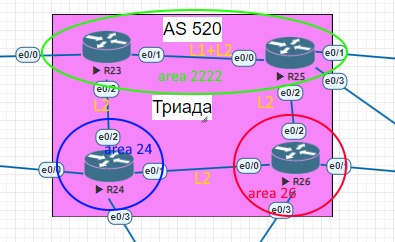

# ISIS

### Цели:
- ##### Настроить IS-IS офисе Триада

### Описание/Пошаговая инструкция выполнения домашнего задания:
- ##### R23 и R25 находятся в зоне 2222;
- ##### R24 находится в зоне 24;
- ##### R26 находится в зоне 26;
- ##### Настройка осуществляется одновременно для IPv4 и IPv6;


### Схема лабораторной работы:


Экспорт лабораторной работы из EVE-NG:

- [ISIS.zip](export_zip/lab07_ISIS.zip)

На маршрутизаторах TRD-R23 и TRD-R25 сконфигурирована зона 2222:
```сfg
#TRD-R23

router isis 1
 net 49.2222.0000.0000.0023.00

interface Loopback0
 ip address 172.16.255.23 255.255.255.255
 ip router isis 1
 ipv6 address FC00::23/128
 ipv6 router isis 1
!
interface Ethernet0/1
 description "to TRD-R25.e0/0"
 ip address 10.0.254.52 255.255.255.254
 ip router isis 1
 ipv6 address FC02::52/127
 ipv6 router isis 1
!
interface Ethernet0/2
 description "to TRD-R24.e0/2"
 ip address 10.0.254.50 255.255.255.254
 ip router isis 1
 ipv6 address FC02::50/127
 ipv6 router isis 1

#TRD-25

router isis 1
 net 49.2222.0000.0000.0025.00

interface Loopback0
 ip address 172.16.255.25 255.255.255.255
 ip router isis 1
 ipv6 address FC00::25/128
 ipv6 router isis 1
!
interface Ethernet0/0
 description "to TRD-R23.e0/1"
 ip address 10.0.254.53 255.255.255.254
 ip router isis 1
 ipv6 address FC02::53/127
 ipv6 router isis 1
!
interface Ethernet0/2
 description "to TRD-26.e0/2"
 ip address 10.0.254.56 255.255.255.254
 ip router isis 1
 ipv6 address FC02::56/127
 ipv6 router isis 1
!
```
Далее cконфигрурируем TRD-R24 в area 24:
```сfg
# TRD-R24

router isis 1
 net 49.0024.0000.0000.0024.00

interface Loopback0
 ip address 172.16.255.24 255.255.255.255
 ip router isis 1
 ipv6 address FC00::24/128
 ipv6 router isis 1
!
interface Ethernet0/1
 description "to TRD-R26.e0/0"
 ip address 10.0.254.54 255.255.255.254
 ip router isis 1
 ipv6 address FC02::54/127
 ipv6 router isis 1
!
interface Ethernet0/2
 description "to TRD-R23.e0/2"
 ip address 10.0.254.51 255.255.255.254
 ip router isis 1
 ipv6 address FC02::51/127
 ipv6 router isis 1
```
Далее cконфигрурируем TRD-R26 в area 26:
```cfg
# TRD-R26

router isis 1
 net 49.0026.0000.0000.0026.00
 
interface Loopback0
 ip address 172.16.255.26 255.255.255.255
 ip router isis 1
 ipv6 address FC00::26/128
 ipv6 router isis 1
!
interface Ethernet0/0
 description "to TRD-R24.e0/1"
 ip address 10.0.254.55 255.255.255.254
 ip router isis 1
 ipv6 address FC02::55/127
 ipv6 router isis 1
!
interface Ethernet0/2
 description "to TRD-25.e0/2"
 ip address 10.0.254.57 255.255.255.254
 ip router isis 1
 ipv6 address FC02::57/127
 ipv6 router isis 1
!
```
Выводы neighbors, topology, database с маршрутизаторов:
```cfg
#TRD-R23

TRD-R23(config)#do sh isis neighbors

Tag 1:
System Id      Type Interface   IP Address      State Holdtime Circuit Id
TRD-R24        L2   Et0/2       10.0.254.51     UP    7        TRD-R24.02
TRD-R25        L1   Et0/1       10.0.254.53     UP    8        TRD-R25.01
TRD-R25        L2   Et0/1       10.0.254.53     UP    8        TRD-R25.01

Tag null:
TRD-R23(config)#do sh isis topology

Tag 1:
IS-IS TID 0 paths to level-1 routers
System Id            Metric     Next-Hop             Interface   SNPA
TRD-R23              --
TRD-R25              10         TRD-R25              Et0/1       aabb.cc01.9000

IS-IS TID 0 paths to level-2 routers
System Id            Metric     Next-Hop             Interface   SNPA
TRD-R23              --
TRD-R24              10         TRD-R24              Et0/2       aabb.cc01.8020
TRD-R25              10         TRD-R25              Et0/1       aabb.cc01.9000
TRD-R26              20         TRD-R24              Et0/2       aabb.cc01.8020
                                TRD-R25              Et0/1       aabb.cc01.9000

Tag null:
TRD-R23(config)#do sh isis database

Tag 1:
IS-IS Level-1 Link State Database:
LSPID                 LSP Seq Num  LSP Checksum  LSP Holdtime      ATT/P/OL
TRD-R23.00-00       * 0x0000000B   0x0994        1059              1/0/0
TRD-R25.00-00         0x0000000A   0x483D        914               1/0/0
TRD-R25.01-00         0x00000007   0x9A48        1130              0/0/0
IS-IS Level-2 Link State Database:
LSPID                 LSP Seq Num  LSP Checksum  LSP Holdtime      ATT/P/OL
TRD-R23.00-00       * 0x0000000B   0x5A69        408               0/0/0
TRD-R24.00-00         0x0000000B   0x8776        1004              0/0/0
TRD-R24.02-00         0x00000007   0x1D4F        1185              0/0/0
TRD-R25.00-00         0x0000000A   0x6654        471               0/0/0
TRD-R25.01-00         0x00000007   0x2A41        1166              0/0/0
TRD-R26.00-00         0x0000000A   0x6A78        892               0/0/0
TRD-R26.01-00         0x00000007   0x491F        1088              0/0/0
TRD-R26.02-00         0x00000006   0x5D0A        396               0/0/0
```

```cfg
#TRD-R24

TRD-R24(config)#do sh isis ne

Tag 1:
System Id      Type Interface   IP Address      State Holdtime Circuit Id
TRD-R23        L2   Et0/2       10.0.254.50     UP    23       TRD-R24.02
TRD-R26        L2   Et0/1       10.0.254.55     UP    9        TRD-R26.01
TRD-R24(config)#do sh isis topo

Tag 1:
IS-IS TID 0 paths to level-1 routers
System Id            Metric     Next-Hop             Interface   SNPA
TRD-R24              --

IS-IS TID 0 paths to level-2 routers
System Id            Metric     Next-Hop             Interface   SNPA
TRD-R23              10         TRD-R23              Et0/2       aabb.cc01.7020
TRD-R24              --
TRD-R25              20         TRD-R23              Et0/2       aabb.cc01.7020
                                TRD-R26              Et0/1       aabb.cc01.a000
TRD-R26              10         TRD-R26              Et0/1       aabb.cc01.a000
TRD-R24(config)#do sh isis da
TRD-R24(config)#do sh isis database

Tag 1:
IS-IS Level-1 Link State Database:
LSPID                 LSP Seq Num  LSP Checksum  LSP Holdtime      ATT/P/OL
TRD-R24.00-00       * 0x0000000A   0x660A        1138              1/0/0
IS-IS Level-2 Link State Database:
LSPID                 LSP Seq Num  LSP Checksum  LSP Holdtime      ATT/P/OL
TRD-R23.00-00         0x0000000B   0x5A69        322               0/0/0
TRD-R24.00-00       * 0x0000000B   0x8776        921               0/0/0
TRD-R24.02-00       * 0x00000007   0x1D4F        1103              0/0/0
TRD-R25.00-00         0x0000000B   0x6455        1149              0/0/0
TRD-R25.01-00         0x00000007   0x2A41        1080              0/0/0
TRD-R26.00-00         0x0000000A   0x6A78        810               0/0/0
TRD-R26.01-00         0x00000007   0x491F        1006              0/0/0
TRD-R26.02-00         0x00000007   0x5B0B        1190              0/0/0
```

```cfg
#TRD-R25

TRD-R25#sh isis ne

Tag 1:
System Id      Type Interface   IP Address      State Holdtime Circuit Id
TRD-R23        L1   Et0/0       10.0.254.52     UP    22       TRD-R25.01
TRD-R23        L2   Et0/0       10.0.254.52     UP    26       TRD-R25.01
TRD-R26        L2   Et0/2       10.0.254.57     UP    9        TRD-R26.02
TRD-R25#sh isis topo

Tag 1:
IS-IS TID 0 paths to level-1 routers
System Id            Metric     Next-Hop             Interface   SNPA
TRD-R23              10         TRD-R23              Et0/0       aabb.cc01.7010
TRD-R25              --

IS-IS TID 0 paths to level-2 routers
System Id            Metric     Next-Hop             Interface   SNPA
TRD-R23              10         TRD-R23              Et0/0       aabb.cc01.7010
TRD-R24              20         TRD-R23              Et0/0       aabb.cc01.7010
                                TRD-R26              Et0/2       aabb.cc01.a020
TRD-R25              --
TRD-R26              10         TRD-R26              Et0/2       aabb.cc01.a020
TRD-R25#sh isis da
TRD-R25#sh isis database

Tag 1:
IS-IS Level-1 Link State Database:
LSPID                 LSP Seq Num  LSP Checksum  LSP Holdtime      ATT/P/OL
TRD-R23.00-00         0x0000000B   0x0994        921               1/0/0
TRD-R25.00-00       * 0x0000000A   0x483D        780               1/0/0
TRD-R25.01-00       * 0x00000007   0x9A48        996               0/0/0
IS-IS Level-2 Link State Database:
LSPID                 LSP Seq Num  LSP Checksum  LSP Holdtime      ATT/P/OL
TRD-R23.00-00         0x0000000C   0x586A        1169              0/0/0
TRD-R24.00-00         0x0000000B   0x8776        866               0/0/0
TRD-R24.02-00         0x00000007   0x1D4F        1047              0/0/0
TRD-R25.00-00       * 0x0000000B   0x6455        1102              0/0/0
TRD-R25.01-00       * 0x00000007   0x2A41        1032              0/0/0
TRD-R26.00-00         0x0000000A   0x6A78        758               0/0/0
TRD-R26.01-00         0x00000007   0x491F        954               0/0/0
TRD-R26.02-00         0x00000007   0x5B0B        1138              0/0/0
```

```cfg
#TRD-R26

TRD-R26#sh isis ne

Tag 1:
System Id      Type Interface   IP Address      State Holdtime Circuit Id
TRD-R24        L2   Et0/0       10.0.254.54     UP    28       TRD-R26.01
TRD-R25        L2   Et0/2       10.0.254.56     UP    22       TRD-R26.02
TRD-R26#sh isis topo

Tag 1:
IS-IS TID 0 paths to level-1 routers
System Id            Metric     Next-Hop             Interface   SNPA
TRD-R26              --

IS-IS TID 0 paths to level-2 routers
System Id            Metric     Next-Hop             Interface   SNPA
TRD-R23              20         TRD-R24              Et0/0       aabb.cc01.8010
                                TRD-R25              Et0/2       aabb.cc01.9020
TRD-R24              10         TRD-R24              Et0/0       aabb.cc01.8010
TRD-R25              10         TRD-R25              Et0/2       aabb.cc01.9020
TRD-R26              --
TRD-R26#sh isis da
TRD-R26#sh isis database

Tag 1:
IS-IS Level-1 Link State Database:
LSPID                 LSP Seq Num  LSP Checksum  LSP Holdtime      ATT/P/OL
TRD-R26.00-00       * 0x00000009   0xB3A2        1005              1/0/0
IS-IS Level-2 Link State Database:
LSPID                 LSP Seq Num  LSP Checksum  LSP Holdtime      ATT/P/OL
TRD-R23.00-00         0x0000000C   0x586A        1123              0/0/0
TRD-R24.00-00         0x0000000B   0x8776        824               0/0/0
TRD-R24.02-00         0x00000007   0x1D4F        1005              0/0/0
TRD-R25.00-00         0x0000000B   0x6455        1056              0/0/0
TRD-R25.01-00         0x00000007   0x2A41        986               0/0/0
TRD-R26.00-00       * 0x0000000A   0x6A78        716               0/0/0
TRD-R26.01-00       * 0x00000007   0x491F        912               0/0/0
TRD-R26.02-00       * 0x00000007   0x5B0B        1096              0/0/0
```
Вывод ip sh ro isis со всех маршрутизаторов:
```cfg
#TRD-R23
TRD-R23(config)#do sh ip ro isis
Gateway of last resort is not set
      10.0.0.0/8 is variably subnetted, 8 subnets, 2 masks
i L2     10.0.254.54/31 [115/20] via 10.0.254.51, 01:24:42, Ethernet0/2
i L1     10.0.254.56/31 [115/20] via 10.0.254.53, 01:24:22, Ethernet0/1
      172.16.0.0/32 is subnetted, 4 subnets
i L2     172.16.255.24 [115/20] via 10.0.254.51, 01:24:42, Ethernet0/2
i L1     172.16.255.25 [115/20] via 10.0.254.53, 01:24:22, Ethernet0/1
i L2     172.16.255.26 [115/30] via 10.0.254.53, 01:24:19, Ethernet0/1
                       [115/30] via 10.0.254.51, 01:24:19, Ethernet0/2

TRD-R23(config)#do sh ipv6 ro isis
IPv6 Routing Table - default - 13 entries
I2  FC00::24/128 [115/20]
     via FE80::A8BB:CCFF:FE01:8020, Ethernet0/2
I1  FC00::25/128 [115/20]
     via FE80::A8BB:CCFF:FE01:9000, Ethernet0/1
I2  FC00::26/128 [115/30]
     via FE80::A8BB:CCFF:FE01:8020, Ethernet0/2
     via FE80::A8BB:CCFF:FE01:9000, Ethernet0/1
I2  FC02::54/127 [115/20]
     via FE80::A8BB:CCFF:FE01:8020, Ethernet0/2
I1  FC02::56/127 [115/20]
     via FE80::A8BB:CCFF:FE01:9000, Ethernet0/1

#TRD-R24

TRD-R24(config)#do sh ip ro isis
Gateway of last resort is not set
      10.0.0.0/8 is variably subnetted, 10 subnets, 2 masks
i L2     10.0.254.52/31 [115/20] via 10.0.254.50, 01:26:10, Ethernet0/2
i L2     10.0.254.56/31 [115/20] via 10.0.254.55, 01:25:58, Ethernet0/1
      172.16.0.0/32 is subnetted, 4 subnets
i L2     172.16.255.23 [115/20] via 10.0.254.50, 01:26:10, Ethernet0/2
i L2     172.16.255.25 [115/30] via 10.0.254.55, 01:25:48, Ethernet0/1
                       [115/30] via 10.0.254.50, 01:25:48, Ethernet0/2
i L2     172.16.255.26 [115/20] via 10.0.254.55, 01:25:58, Ethernet0/1

TRD-R24(config)#do sh ipv6 ro isis
IPv6 Routing Table - default - 15 entries
I2  FC00::23/128 [115/20]
     via FE80::A8BB:CCFF:FE01:7020, Ethernet0/2
I2  FC00::25/128 [115/30]
     via FE80::A8BB:CCFF:FE01:7020, Ethernet0/2
     via FE80::A8BB:CCFF:FE01:A000, Ethernet0/1
I2  FC00::26/128 [115/20]
     via FE80::A8BB:CCFF:FE01:A000, Ethernet0/1
I2  FC02::52/127 [115/20]
     via FE80::A8BB:CCFF:FE01:7020, Ethernet0/2
I2  FC02::56/127 [115/20]
     via FE80::A8BB:CCFF:FE01:A000, Ethernet0/1

#TRD-R25

TRD-R25#sh ip ro isis
Gateway of last resort is not set
      10.0.0.0/8 is variably subnetted, 12 subnets, 2 masks
i L1     10.0.254.50/31 [115/20] via 10.0.254.52, 01:26:15, Ethernet0/0
i L2     10.0.254.54/31 [115/20] via 10.0.254.57, 01:26:35, Ethernet0/2
      172.16.0.0/32 is subnetted, 4 subnets
i L1     172.16.255.23 [115/20] via 10.0.254.52, 01:26:15, Ethernet0/0
i L2     172.16.255.24 [115/30] via 10.0.254.57, 01:26:24, Ethernet0/2
                       [115/30] via 10.0.254.52, 01:26:24, Ethernet0/0
i L2     172.16.255.26 [115/20] via 10.0.254.57, 01:26:35, Ethernet0/2

TRD-R25#sh ipv6 ro isis
IPv6 Routing Table - default - 15 entries

I1  FC00::23/128 [115/20]
     via FE80::A8BB:CCFF:FE01:7010, Ethernet0/0
I2  FC00::24/128 [115/30]
     via FE80::A8BB:CCFF:FE01:7010, Ethernet0/0
     via FE80::A8BB:CCFF:FE01:A020, Ethernet0/2
I2  FC00::26/128 [115/20]
     via FE80::A8BB:CCFF:FE01:A020, Ethernet0/2
I1  FC02::50/127 [115/20]
     via FE80::A8BB:CCFF:FE01:7010, Ethernet0/0
I2  FC02::54/127 [115/20]
     via FE80::A8BB:CCFF:FE01:A020, Ethernet0/2

#TRD-R26
TRD-R26#sh ip ro isis
Gateway of last resort is not set

      10.0.0.0/8 is variably subnetted, 10 subnets, 2 masks
i L2     10.0.254.50/31 [115/20] via 10.0.254.54, 01:23:55, Ethernet0/0
i L2     10.0.254.52/31 [115/20] via 10.0.254.56, 01:24:06, Ethernet0/2
      172.16.0.0/16 is variably subnetted, 5 subnets, 2 masks
i L2     172.16.255.23/32 [115/30] via 10.0.254.56, 01:23:44, Ethernet0/2
                          [115/30] via 10.0.254.54, 01:23:44, Ethernet0/0
i L2     172.16.255.24/32 [115/20] via 10.0.254.54, 01:23:55, Ethernet0/0
i L2     172.16.255.25/32 [115/20] via 10.0.254.56, 01:24:06, Ethernet0/2

TRD-R26#sh ipv6 ro isis
IPv6 Routing Table - default - 13 entries

I2  FC00::23/128 [115/30]
     via FE80::A8BB:CCFF:FE01:8010, Ethernet0/0
     via FE80::A8BB:CCFF:FE01:9020, Ethernet0/2
I2  FC00::24/128 [115/20]
     via FE80::A8BB:CCFF:FE01:8010, Ethernet0/0
I2  FC00::25/128 [115/20]
     via FE80::A8BB:CCFF:FE01:9020, Ethernet0/2
I2  FC02::50/127 [115/20]
     via FE80::A8BB:CCFF:FE01:8010, Ethernet0/0
I2  FC02::52/127 [115/20]
     via FE80::A8BB:CCFF:FE01:9020, Ethernet0/2
```
Как видно из выводов маршруты до всех Loopback интерфейсов есть у каждого из маршрутизаторов. Между R23 и R25 есть связи L1 и L2, между R23 и R24 - L2, между R25 и R26 - L2, между R24 и R26 - L2.

### Конфиги устройств:
- [R23](R23)
- [R24](R24)
- [R25](R25)
- [R26](R26)