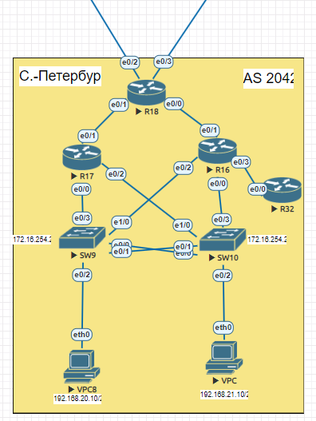

# EIGRP

### Цели:
- ##### Настроить EIGRP в С.-Петербург
- ##### Использовать named EIGRP

### Описание/Пошаговая инструкция выполнения домашнего задания:
- ##### В офисе С.-Петербург настроить EIGRP.
- ##### R32 получает только маршрут по умолчанию.
- ##### R16-17 анонсируют только суммарные префиксы.
- ##### Использовать EIGRP named-mode для настройки сети.
- ##### Настройка осуществляется одновременно для IPv4 и IPv6.

### Схема лабораторной работы:


Экспорт лабораторной работы из EVE-NG:

- [EIGRP.zip](export_zip/lab08_EIGRP.zip)

GLBP для IPv4 и HSRP для IPv6 был настроен таким образом, чтобы адрес шлюза был на R17. Так же на R16 был изменен параметр bandwidth на интерфейсе в сторону R18, чтобы в таблицу маршрутизации R18 был помещен маршрут в сети доступа филиала через R17.

Настройка отдачи суммарных префиксов на R16 и R17 в сторону R18:
```cfg
router eigrp SPB
 !
 address-family ipv4 unicast autonomous-system 78
  !
  af-interface Ethernet0/1
   summary-address 192.168.20.0 255.255.254.0
  exit-af-interface
  !
  af-interface Ethernet0/0.21
   passive-interface
  exit-af-interface
  !
  af-interface Ethernet0/0.20
   passive-interface
  exit-af-interface
  !
  af-interface Ethernet0/2.55
   passive-interface
  exit-af-interface
  !
  exit-address-family
 !
 address-family ipv6 unicast autonomous-system 78
  !
  af-interface Ethernet0/1
   summary-address FC00::20:0/111
  exit-af-interface
  !
  af-interface Ethernet0/0.21
   passive-interface
  exit-af-interface
  !
  af-interface Ethernet0/0.20
   passive-interface
  exit-af-interface
  !
  af-interface Ethernet0/2.55
   passive-interface
  exit-af-interface
  !
 exit-address-family
```

Настройка отдачи в сторону SPB-R32 только маршрута по умолчанию:
```cfg
router eigrp SPB
 !
 address-family ipv4 unicast autonomous-system 78
  !
  af-interface Ethernet0/3
   summary-address 0.0.0.0 0.0.0.0
  exit-af-interface
 
 address-family ipv6 unicast autonomous-system 78
  !
  af-interface Ethernet0/3
   summary-address ::/0
  exit-af-interface

```

Вывод маршрутов IPv6 на SPB-R32 до и после конфигурирования SPB-R16 для отдачи соседу только маршрута по умолчанию:
```cfg
SPB-R32(config-router-af)#do sh ip ro
Codes: L - local, C - connected, S - static, R - RIP, M - mobile, B - BGP
       D - EIGRP, EX - EIGRP external, O - OSPF, IA - OSPF inter area
       N1 - OSPF NSSA external type 1, N2 - OSPF NSSA external type 2
       E1 - OSPF external type 1, E2 - OSPF external type 2
       i - IS-IS, su - IS-IS summary, L1 - IS-IS level-1, L2 - IS-IS level-2
       ia - IS-IS inter area, * - candidate default, U - per-user static route
       o - ODR, P - periodic downloaded static route, H - NHRP, l - LISP
       a - application route
       + - replicated route, % - next hop override

Gateway of last resort is 10.0.254.74 to network 0.0.0.0

D*    0.0.0.0/0 [90/1536512] via 10.0.254.74, 00:00:01, Ethernet0/0
      10.0.0.0/8 is variably subnetted, 6 subnets, 2 masks
D        10.0.254.66/31 [90/2048000] via 10.0.254.74, 00:00:01, Ethernet0/0
D        10.0.254.68/31 [90/2048000] via 10.0.254.74, 00:00:01, Ethernet0/0
D        10.0.254.70/31 [90/1536000] via 10.0.254.74, 00:00:03, Ethernet0/0
D        10.0.254.72/31 [90/2048000] via 10.0.254.74, 00:00:01, Ethernet0/0
C        10.0.254.74/31 is directly connected, Ethernet0/0
L        10.0.254.75/32 is directly connected, Ethernet0/0
      172.16.0.0/16 is variably subnetted, 5 subnets, 2 masks
D        172.16.254.16/28 [90/1536000] via 10.0.254.74, 00:00:03, Ethernet0/0
D        172.16.255.16/32 [90/1024640] via 10.0.254.74, 00:00:03, Ethernet0/0
D        172.16.255.17/32 [90/1536640] via 10.0.254.74, 00:00:03, Ethernet0/0
D        172.16.255.18/32 [90/1536640] via 10.0.254.74, 00:00:01, Ethernet0/0
C        172.16.255.32/32 is directly connected, Loopback0
D     192.168.20.0/24 [90/1536000] via 10.0.254.74, 00:00:03, Ethernet0/0
D     192.168.21.0/24 [90/1536000] via 10.0.254.74, 00:00:03, Ethernet0/0
```
```cfg
*Sep 12 16:40:52.388: %DUAL-5-NBRCHANGE: EIGRP-IPv4 78: Neighbor 10.0.254.74 (Ethernet0/0) is resync: peer graceful-restart
SPB-R32(config-router-af)#
*Sep 12 16:41:22.813: %DUAL-5-NBRCHANGE: EIGRP-IPv4 78: Neighbor 10.0.254.74 (Ethernet0/0) is resync: peer graceful-restart
SPB-R32(config-router-af)#do sh ip ro
Codes: L - local, C - connected, S - static, R - RIP, M - mobile, B - BGP
       D - EIGRP, EX - EIGRP external, O - OSPF, IA - OSPF inter area
       N1 - OSPF NSSA external type 1, N2 - OSPF NSSA external type 2
       E1 - OSPF external type 1, E2 - OSPF external type 2
       i - IS-IS, su - IS-IS summary, L1 - IS-IS level-1, L2 - IS-IS level-2
       ia - IS-IS inter area, * - candidate default, U - per-user static route
       o - ODR, P - periodic downloaded static route, H - NHRP, l - LISP
       a - application route
       + - replicated route, % - next hop override

Gateway of last resort is 10.0.254.74 to network 0.0.0.0

D*    0.0.0.0/0 [90/1024640] via 10.0.254.74, 00:00:06, Ethernet0/0
      10.0.0.0/8 is variably subnetted, 2 subnets, 2 masks
C        10.0.254.74/31 is directly connected, Ethernet0/0
L        10.0.254.75/32 is directly connected, Ethernet0/0
      172.16.0.0/32 is subnetted, 1 subnets
C        172.16.255.32 is directly connected, Loopback0

```
Вывод маршрутов IPv6 на SPB-R32 до и после конфигурирования SPB-R16 для отдачи соседу только маршрута по умолчанию:
```cfg
SPB-R32(config-router-af)#do sh ipv6 ro
IPv6 Routing Table - default - 12 entries
Codes: C - Connected, L - Local, S - Static, U - Per-user Static route
       B - BGP, HA - Home Agent, MR - Mobile Router, R - RIP
       H - NHRP, I1 - ISIS L1, I2 - ISIS L2, IA - ISIS interarea
       IS - ISIS summary, D - EIGRP, EX - EIGRP external, NM - NEMO
       ND - ND Default, NDp - ND Prefix, DCE - Destination, NDr - Redirect
       O - OSPF Intra, OI - OSPF Inter, OE1 - OSPF ext 1, OE2 - OSPF ext 2
       ON1 - OSPF NSSA ext 1, ON2 - OSPF NSSA ext 2, la - LISP alt
       lr - LISP site-registrations, ld - LISP dyn-eid, a - Application
EX  ::/0 [170/1536512]
     via FE80::A8BB:CCFF:FE01:30, Ethernet0/0
D   FC00::16/128 [90/1024640]
     via FE80::A8BB:CCFF:FE01:30, Ethernet0/0
D   FC00::17/128 [90/2048640]
     via FE80::A8BB:CCFF:FE01:30, Ethernet0/0
D   FC00::18/128 [90/1536640]
     via FE80::A8BB:CCFF:FE01:30, Ethernet0/0
LC  FC00::32/128 [0/0]
     via Loopback0, receive
D   FC02::66/127 [90/2048000]
     via FE80::A8BB:CCFF:FE01:30, Ethernet0/0
D   FC02::68/127 [90/2048000]
     via FE80::A8BB:CCFF:FE01:30, Ethernet0/0
D   FC02::70/127 [90/1536000]
     via FE80::A8BB:CCFF:FE01:30, Ethernet0/0
D   FC02::72/127 [90/2048000]
     via FE80::A8BB:CCFF:FE01:30, Ethernet0/0
C   FC02::74/127 [0/0]
     via Ethernet0/0, directly connected
L   FC02::75/128 [0/0]
     via Ethernet0/0, receive
L   FF00::/8 [0/0]
     via Null0, receive
```
```cfg
*Sep 12 16:44:20.420: %DUAL-5-NBRCHANGE: EIGRP-IPv6 78: Neighbor FE80::A8BB:CCFF:FE01:30 (Ethernet0/0) is up: new adjacency
SPB-R32(config-router-af)#
*Sep 12 16:45:30.078: %DUAL-5-NBRCHANGE: EIGRP-IPv6 78: Neighbor FE80::A8BB:CCFF:FE01:30 (Ethernet0/0) is resync: peer graceful-restart
SPB-R32(config-router-af)#do sh ipv6 ro
IPv6 Routing Table - default - 5 entries
Codes: C - Connected, L - Local, S - Static, U - Per-user Static route
       B - BGP, HA - Home Agent, MR - Mobile Router, R - RIP
       H - NHRP, I1 - ISIS L1, I2 - ISIS L2, IA - ISIS interarea
       IS - ISIS summary, D - EIGRP, EX - EIGRP external, NM - NEMO
       ND - ND Default, NDp - ND Prefix, DCE - Destination, NDr - Redirect
       O - OSPF Intra, OI - OSPF Inter, OE1 - OSPF ext 1, OE2 - OSPF ext 2
       ON1 - OSPF NSSA ext 1, ON2 - OSPF NSSA ext 2, la - LISP alt
       lr - LISP site-registrations, ld - LISP dyn-eid, a - Application
D   ::/0 [90/1024640]
     via FE80::A8BB:CCFF:FE01:30, Ethernet0/0
LC  FC00::32/128 [0/0]
     via Loopback0, receive
C   FC02::74/127 [0/0]
     via Ethernet0/0, directly connected
L   FC02::75/128 [0/0]
     via Ethernet0/0, receive
L   FF00::/8 [0/0]
     via Null0, receive
```

Выводы sh ip ro и sh ipv6 ro со всех устройств филиала:
```cfg
#SPB-R18
SPB-R18#sh ip ro
Codes: L - local, C - connected, S - static, R - RIP, M - mobile, B - BGP
       D - EIGRP, EX - EIGRP external, O - OSPF, IA - OSPF inter area
       N1 - OSPF NSSA external type 1, N2 - OSPF NSSA external type 2
       E1 - OSPF external type 1, E2 - OSPF external type 2
       i - IS-IS, su - IS-IS summary, L1 - IS-IS level-1, L2 - IS-IS level-2
       ia - IS-IS inter area, * - candidate default, U - per-user static route
       o - ODR, P - periodic downloaded static route, H - NHRP, l - LISP
       a - application route
       + - replicated route, % - next hop override

Gateway of last resort is 0.0.0.0 to network 0.0.0.0

S*    0.0.0.0/0 is directly connected, Null0
      10.0.0.0/8 is variably subnetted, 9 subnets, 2 masks
C        10.0.254.66/31 is directly connected, Ethernet0/2
L        10.0.254.67/32 is directly connected, Ethernet0/2
C        10.0.254.68/31 is directly connected, Ethernet0/3
L        10.0.254.69/32 is directly connected, Ethernet0/3
C        10.0.254.70/31 is directly connected, Ethernet0/0
L        10.0.254.70/32 is directly connected, Ethernet0/0
C        10.0.254.72/31 is directly connected, Ethernet0/1
L        10.0.254.72/32 is directly connected, Ethernet0/1
D        10.0.254.74/31 [90/2048000] via 10.0.254.71, 00:05:51, Ethernet0/0
      172.16.0.0/16 is variably subnetted, 5 subnets, 2 masks
D        172.16.254.16/28 [90/1536000] via 10.0.254.73, 00:05:51, Ethernet0/1
D        172.16.255.16/32 [90/1536640] via 10.0.254.71, 00:05:51, Ethernet0/0
D        172.16.255.17/32 [90/1024640] via 10.0.254.73, 00:05:53, Ethernet0/1
C        172.16.255.18/32 is directly connected, Loopback0
D        172.16.255.32/32 [90/2048640] via 10.0.254.71, 00:05:51, Ethernet0/0
D     192.168.20.0/23 [90/1536000] via 10.0.254.73, 00:05:51, Ethernet0/1

SPB-R18#sh ipv6 ro
IPv6 Routing Table - default - 17 entries
Codes: C - Connected, L - Local, S - Static, U - Per-user Static route
       B - BGP, HA - Home Agent, MR - Mobile Router, R - RIP
       H - NHRP, I1 - ISIS L1, I2 - ISIS L2, IA - ISIS interarea
       IS - ISIS summary, D - EIGRP, EX - EIGRP external, NM - NEMO
       ND - ND Default, NDp - ND Prefix, DCE - Destination, NDr - Redirect
       O - OSPF Intra, OI - OSPF Inter, OE1 - OSPF ext 1, OE2 - OSPF ext 2
       ON1 - OSPF NSSA ext 1, ON2 - OSPF NSSA ext 2, la - LISP alt
       lr - LISP site-registrations, ld - LISP dyn-eid, a - Application
S   ::/0 [1/0]
     via Null0, directly connected
D   FC00::16/128 [90/1536640]
     via FE80::A8BB:CCFF:FE01:10, Ethernet0/0
D   FC00::17/128 [90/1024640]
     via FE80::A8BB:CCFF:FE01:1010, Ethernet0/1
LC  FC00::18/128 [0/0]
     via Loopback0, receive
D   FC00::32/128 [90/2048640]
     via FE80::A8BB:CCFF:FE01:10, Ethernet0/0
D   FC00::20:0/111 [90/1536000]
     via FE80::A8BB:CCFF:FE01:1010, Ethernet0/1
D   FC00::55:10/124 [90/1536000]
     via FE80::A8BB:CCFF:FE01:1010, Ethernet0/1
C   FC02::66/127 [0/0]
     via Ethernet0/2, directly connected
L   FC02::67/128 [0/0]
     via Ethernet0/2, receive
C   FC02::68/127 [0/0]
     via Ethernet0/3, directly connected
L   FC02::69/128 [0/0]
     via Ethernet0/3, receive
C   FC02::70/127 [0/0]
     via Ethernet0/0, directly connected
L   FC02::70/128 [0/0]
     via Ethernet0/0, receive
C   FC02::72/127 [0/0]
     via Ethernet0/1, directly connected
L   FC02::72/128 [0/0]
     via Ethernet0/1, receive
D   FC02::74/127 [90/2048000]
     via FE80::A8BB:CCFF:FE01:10, Ethernet0/0
L   FF00::/8 [0/0]
     via Null0, receive
```
```cfg
#SPB-R16
SPB-R16#sh ip ro
Codes: L - local, C - connected, S - static, R - RIP, M - mobile, B - BGP
       D - EIGRP, EX - EIGRP external, O - OSPF, IA - OSPF inter area
       N1 - OSPF NSSA external type 1, N2 - OSPF NSSA external type 2
       E1 - OSPF external type 1, E2 - OSPF external type 2
       i - IS-IS, su - IS-IS summary, L1 - IS-IS level-1, L2 - IS-IS level-2
       ia - IS-IS inter area, * - candidate default, U - per-user static route
       o - ODR, P - periodic downloaded static route, H - NHRP, l - LISP
       a - application route
       + - replicated route, % - next hop override

Gateway of last resort is 0.0.0.0 to network 0.0.0.0

D*    0.0.0.0/0 is a summary, 00:11:57, Null0
      10.0.0.0/8 is variably subnetted, 7 subnets, 2 masks
D        10.0.254.66/31 [90/2048000] via 10.0.254.70, 00:11:57, Ethernet0/1
D        10.0.254.68/31 [90/2048000] via 10.0.254.70, 00:11:57, Ethernet0/1
C        10.0.254.70/31 is directly connected, Ethernet0/1
L        10.0.254.71/32 is directly connected, Ethernet0/1
D        10.0.254.72/31 [90/2048000] via 10.0.254.70, 00:11:57, Ethernet0/1
C        10.0.254.74/31 is directly connected, Ethernet0/3
L        10.0.254.74/32 is directly connected, Ethernet0/3
      172.16.0.0/16 is variably subnetted, 6 subnets, 2 masks
C        172.16.254.16/28 is directly connected, Ethernet0/2.55
L        172.16.254.18/32 is directly connected, Ethernet0/2.55
C        172.16.255.16/32 is directly connected, Loopback0
D        172.16.255.17/32 [90/2048640] via 10.0.254.70, 00:11:57, Ethernet0/1
D        172.16.255.18/32 [90/1536640] via 10.0.254.70, 00:11:57, Ethernet0/1
D        172.16.255.32/32 [90/1024640] via 10.0.254.75, 01:35:06, Ethernet0/3
D     192.168.20.0/23 is a summary, 00:11:57, Null0
      192.168.20.0/24 is variably subnetted, 2 subnets, 2 masks
C        192.168.20.0/24 is directly connected, Ethernet0/0.20
L        192.168.20.2/32 is directly connected, Ethernet0/0.20
      192.168.21.0/24 is variably subnetted, 2 subnets, 2 masks
C        192.168.21.0/24 is directly connected, Ethernet0/0.21
L        192.168.21.2/32 is directly connected, Ethernet0/0.21

SPB-R16#sh ipv6 ro
IPv6 Routing Table - default - 20 entries
Codes: C - Connected, L - Local, S - Static, U - Per-user Static route
       B - BGP, HA - Home Agent, MR - Mobile Router, R - RIP
       H - NHRP, I1 - ISIS L1, I2 - ISIS L2, IA - ISIS interarea
       IS - ISIS summary, D - EIGRP, EX - EIGRP external, NM - NEMO
       ND - ND Default, NDp - ND Prefix, DCE - Destination, NDr - Redirect
       O - OSPF Intra, OI - OSPF Inter, OE1 - OSPF ext 1, OE2 - OSPF ext 2
       ON1 - OSPF NSSA ext 1, ON2 - OSPF NSSA ext 2, la - LISP alt
       lr - LISP site-registrations, ld - LISP dyn-eid, a - Application
EX  ::/0 [170/1536512]
     via FE80::A8BB:CCFF:FE01:2000, Ethernet0/1
LC  FC00::16/128 [0/0]
     via Loopback0, receive
D   FC00::17/128 [90/2048640]
     via FE80::A8BB:CCFF:FE01:2000, Ethernet0/1
D   FC00::18/128 [90/1536640]
     via FE80::A8BB:CCFF:FE01:2000, Ethernet0/1
D   FC00::32/128 [90/1024640]
     via FE80::A8BB:CCFF:FE02:0, Ethernet0/3
D   FC00::20:0/111 [5/1024000]
     via Null0, directly connected
C   FC00::20:0/112 [0/0]
     via Ethernet0/0.20, directly connected
L   FC00::20:2/128 [0/0]
     via Ethernet0/0.20, receive
C   FC00::21:0/112 [0/0]
     via Ethernet0/0.21, directly connected
L   FC00::21:2/128 [0/0]
     via Ethernet0/0.21, receive
C   FC00::55:10/124 [0/0]
     via Ethernet0/2.55, directly connected
L   FC00::55:18/128 [0/0]
     via Ethernet0/2.55, receive
D   FC02::66/127 [90/2048000]
     via FE80::A8BB:CCFF:FE01:2000, Ethernet0/1
D   FC02::68/127 [90/2048000]
     via FE80::A8BB:CCFF:FE01:2000, Ethernet0/1
C   FC02::70/127 [0/0]
     via Ethernet0/1, directly connected
L   FC02::71/128 [0/0]
     via Ethernet0/1, receive
D   FC02::72/127 [90/2048000]
     via FE80::A8BB:CCFF:FE01:2000, Ethernet0/1
C   FC02::74/127 [0/0]
     via Ethernet0/3, directly connected
L   FC02::74/128 [0/0]
     via Ethernet0/3, receive
L   FF00::/8 [0/0]
     via Null0, receive
```
```cfg
#SPB-R17

SPB-R17#sh ip ro
Codes: L - local, C - connected, S - static, R - RIP, M - mobile, B - BGP
       D - EIGRP, EX - EIGRP external, O - OSPF, IA - OSPF inter area
       N1 - OSPF NSSA external type 1, N2 - OSPF NSSA external type 2
       E1 - OSPF external type 1, E2 - OSPF external type 2
       i - IS-IS, su - IS-IS summary, L1 - IS-IS level-1, L2 - IS-IS level-2
       ia - IS-IS inter area, * - candidate default, U - per-user static route
       o - ODR, P - periodic downloaded static route, H - NHRP, l - LISP
       a - application route
       + - replicated route, % - next hop override

Gateway of last resort is 10.0.254.72 to network 0.0.0.0

D*    0.0.0.0/0 [90/1024512] via 10.0.254.72, 00:12:30, Ethernet0/1
      10.0.0.0/8 is variably subnetted, 6 subnets, 2 masks
D        10.0.254.66/31 [90/1536000] via 10.0.254.72, 00:12:30, Ethernet0/1
D        10.0.254.68/31 [90/1536000] via 10.0.254.72, 00:12:30, Ethernet0/1
D        10.0.254.70/31 [90/2048000] via 10.0.254.72, 00:12:30, Ethernet0/1
C        10.0.254.72/31 is directly connected, Ethernet0/1
L        10.0.254.73/32 is directly connected, Ethernet0/1
D        10.0.254.74/31 [90/2560000] via 10.0.254.72, 00:12:28, Ethernet0/1
      172.16.0.0/16 is variably subnetted, 6 subnets, 2 masks
C        172.16.254.16/28 is directly connected, Ethernet0/2.55
L        172.16.254.19/32 is directly connected, Ethernet0/2.55
D        172.16.255.16/32 [90/2048640] via 10.0.254.72, 00:12:28, Ethernet0/1
C        172.16.255.17/32 is directly connected, Loopback0
D        172.16.255.18/32 [90/1024640] via 10.0.254.72, 00:12:30, Ethernet0/1
D        172.16.255.32/32 [90/2560640] via 10.0.254.72, 00:12:28, Ethernet0/1
D     192.168.20.0/23 is a summary, 01:10:47, Null0
      192.168.20.0/24 is variably subnetted, 2 subnets, 2 masks
C        192.168.20.0/24 is directly connected, Ethernet0/0.20
L        192.168.20.3/32 is directly connected, Ethernet0/0.20
      192.168.21.0/24 is variably subnetted, 2 subnets, 2 masks
C        192.168.21.0/24 is directly connected, Ethernet0/0.21
L        192.168.21.3/32 is directly connected, Ethernet0/0.21
SPB-R17#sh ipv6 ro
IPv6 Routing Table - default - 22 entries
Codes: C - Connected, L - Local, S - Static, U - Per-user Static route
       B - BGP, HA - Home Agent, MR - Mobile Router, R - RIP
       H - NHRP, I1 - ISIS L1, I2 - ISIS L2, IA - ISIS interarea
       IS - ISIS summary, D - EIGRP, EX - EIGRP external, NM - NEMO
       ND - ND Default, NDp - ND Prefix, DCE - Destination, NDr - Redirect
       O - OSPF Intra, OI - OSPF Inter, OE1 - OSPF ext 1, OE2 - OSPF ext 2
       ON1 - OSPF NSSA ext 1, ON2 - OSPF NSSA ext 2, la - LISP alt
       lr - LISP site-registrations, ld - LISP dyn-eid, a - Application
EX  ::/0 [170/1024512]
     via FE80::A8BB:CCFF:FE01:2010, Ethernet0/1
D   FC00::16/128 [90/2048640]
     via FE80::A8BB:CCFF:FE01:2010, Ethernet0/1
LC  FC00::17/128 [0/0]
     via Loopback0, receive
D   FC00::18/128 [90/1024640]
     via FE80::A8BB:CCFF:FE01:2010, Ethernet0/1
D   FC00::32/128 [90/2560640]
     via FE80::A8BB:CCFF:FE01:2010, Ethernet0/1
D   FC00::20:0/111 [5/1024000]
     via Null0, directly connected
C   FC00::20:0/112 [0/0]
     via Ethernet0/0.20, directly connected
L   FC00::20:1/128 [0/0]
     via Ethernet0/0.20, receive
L   FC00::20:3/128 [0/0]
     via Ethernet0/0.20, receive
C   FC00::21:0/112 [0/0]
     via Ethernet0/0.21, directly connected
L   FC00::21:1/128 [0/0]
     via Ethernet0/0.21, receive
L   FC00::21:3/128 [0/0]
     via Ethernet0/0.21, receive
C   FC00::55:10/124 [0/0]
     via Ethernet0/2.55, directly connected
L   FC00::55:17/128 [0/0]
     via Ethernet0/2.55, receive
L   FC00::55:19/128 [0/0]
     via Ethernet0/2.55, receive
D   FC02::66/127 [90/1536000]
     via FE80::A8BB:CCFF:FE01:2010, Ethernet0/1
D   FC02::68/127 [90/1536000]
     via FE80::A8BB:CCFF:FE01:2010, Ethernet0/1
D   FC02::70/127 [90/2048000]
     via FE80::A8BB:CCFF:FE01:2010, Ethernet0/1
C   FC02::72/127 [0/0]
     via Ethernet0/1, directly connected
L   FC02::73/128 [0/0]
     via Ethernet0/1, receive
D   FC02::74/127 [90/2560000]
     via FE80::A8BB:CCFF:FE01:2010, Ethernet0/1
L   FF00::/8 [0/0]
     via Null0, receive
```
```cfg
#SPB-R32

SPB-R32#sh ip ro
Codes: L - local, C - connected, S - static, R - RIP, M - mobile, B - BGP
       D - EIGRP, EX - EIGRP external, O - OSPF, IA - OSPF inter area
       N1 - OSPF NSSA external type 1, N2 - OSPF NSSA external type 2
       E1 - OSPF external type 1, E2 - OSPF external type 2
       i - IS-IS, su - IS-IS summary, L1 - IS-IS level-1, L2 - IS-IS level-2
       ia - IS-IS inter area, * - candidate default, U - per-user static route
       o - ODR, P - periodic downloaded static route, H - NHRP, l - LISP
       a - application route
       + - replicated route, % - next hop override

Gateway of last resort is 10.0.254.74 to network 0.0.0.0

D*    0.0.0.0/0 [90/1024640] via 10.0.254.74, 01:34:38, Ethernet0/0
      10.0.0.0/8 is variably subnetted, 2 subnets, 2 masks
C        10.0.254.74/31 is directly connected, Ethernet0/0
L        10.0.254.75/32 is directly connected, Ethernet0/0
      172.16.0.0/32 is subnetted, 1 subnets
C        172.16.255.32 is directly connected, Loopback0
SPB-R32#sh ipv6 ro
IPv6 Routing Table - default - 5 entries
Codes: C - Connected, L - Local, S - Static, U - Per-user Static route
       B - BGP, HA - Home Agent, MR - Mobile Router, R - RIP
       H - NHRP, I1 - ISIS L1, I2 - ISIS L2, IA - ISIS interarea
       IS - ISIS summary, D - EIGRP, EX - EIGRP external, NM - NEMO
       ND - ND Default, NDp - ND Prefix, DCE - Destination, NDr - Redirect
       O - OSPF Intra, OI - OSPF Inter, OE1 - OSPF ext 1, OE2 - OSPF ext 2
       ON1 - OSPF NSSA ext 1, ON2 - OSPF NSSA ext 2, la - LISP alt
       lr - LISP site-registrations, ld - LISP dyn-eid, a - Application
EX  ::/0 [170/2048512]
     via FE80::A8BB:CCFF:FE01:30, Ethernet0/0
LC  FC00::32/128 [0/0]
     via Loopback0, receive
C   FC02::74/127 [0/0]
     via Ethernet0/0, directly connected
L   FC02::75/128 [0/0]
     via Ethernet0/0, receive
L   FF00::/8 [0/0]
     via Null0, receive
```

Вывод информации по EIGRP со всех устройств:
```cfg
#SPB-R18
SPB-R18#sh ip eigrp interfaces
EIGRP-IPv4 VR(SPB) Address-Family Interfaces for AS(78)
                              Xmit Queue   PeerQ        Mean   Pacing Time   Multicast    Pending
Interface              Peers  Un/Reliable  Un/Reliable  SRTT   Un/Reliable   Flow Timer   Routes
Et0/0                    1        0/0       0/0           6       0/4           50           0
Et0/1                    1        0/0       0/0           9       0/2           50           0
Et0/2                    0        0/0       0/0           0       0/0            0           0
Et0/3                    0        0/0       0/0           0       0/0            0           0
Lo0                      0        0/0       0/0           0       0/0            0           0
SPB-R18#sh ip eigrp ne
SPB-R18#sh ip eigrp neighbors
EIGRP-IPv4 VR(SPB) Address-Family Neighbors for AS(78)
H   Address                 Interface              Hold Uptime   SRTT   RTO  Q  Seq
                                                   (sec)         (ms)       Cnt Num
1   10.0.254.71             Et0/0                    11 00:14:29    6   100  0  196
0   10.0.254.73             Et0/1                    12 00:14:30    9   100  0  131
SPB-R18#sh ip eigrp top
SPB-R18#sh ip eigrp topology
EIGRP-IPv4 VR(SPB) Topology Table for AS(78)/ID(172.16.255.18)
Codes: P - Passive, A - Active, U - Update, Q - Query, R - Reply,
       r - reply Status, s - sia Status

P 10.0.254.72/31, 1 successors, FD is 131072000
        via Connected, Ethernet0/1
P 172.16.255.17/32, 1 successors, FD is 131153920
        via 10.0.254.73 (131153920/163840), Ethernet0/1
P 172.16.255.16/32, 1 successors, FD is 196689920
        via 10.0.254.71 (196689920/163840), Ethernet0/0
P 172.16.255.32/32, 1 successors, FD is 262225920
        via 10.0.254.71 (262225920/131153920), Ethernet0/0
P 10.0.254.68/31, 1 successors, FD is 131072000
        via Connected, Ethernet0/3
P 10.0.254.74/31, 1 successors, FD is 262144000
        via 10.0.254.71 (262144000/131072000), Ethernet0/0
P 172.16.254.16/28, 1 successors, FD is 196608000
        via 10.0.254.73 (196608000/131072000), Ethernet0/1
        via 10.0.254.71 (262144000/131072000), Ethernet0/0
P 0.0.0.0/0, 1 successors, FD is 131072
        via Rstatic (131072/0)
P 172.16.255.18/32, 1 successors, FD is 163840
        via Connected, Loopback0
P 10.0.254.66/31, 1 successors, FD is 131072000
        via Connected, Ethernet0/2
P 10.0.254.70/31, 1 successors, FD is 196608000
        via Connected, Ethernet0/0
P 192.168.20.0/23, 1 successors, FD is 196608000
        via 10.0.254.73 (196608000/131072000), Ethernet0/1
        via 10.0.254.71 (262144000/131072000), Ethernet0/0
```
```cfg
#SPB-R16
SPB-R16#sh ip eigrp int
EIGRP-IPv4 VR(SPB) Address-Family Interfaces for AS(78)
                              Xmit Queue   PeerQ        Mean   Pacing Time   Multicast    Pending
Interface              Peers  Un/Reliable  Un/Reliable  SRTT   Un/Reliable   Flow Timer   Routes
Et0/1                    1        0/0       0/0          14       0/4           60           0
Et0/3                    1        0/0       0/0           6       0/2           50           0
Lo0                      0        0/0       0/0           0       0/0            0           0
SPB-R16#sh ip eigrp ne
EIGRP-IPv4 VR(SPB) Address-Family Neighbors for AS(78)
H   Address                 Interface              Hold Uptime   SRTT   RTO  Q  Seq
                                                   (sec)         (ms)       Cnt Num
0   10.0.254.70             Et0/1                    12 00:15:05   14   100  0  73
2   10.0.254.75             Et0/3                    13 01:38:14    6   100  0  31
SPB-R16#sh ip eigrp top
EIGRP-IPv4 VR(SPB) Topology Table for AS(78)/ID(172.16.255.16)
Codes: P - Passive, A - Active, U - Update, Q - Query, R - Reply,
       r - reply Status, s - sia Status

P 10.0.254.72/31, 1 successors, FD is 262144000
        via 10.0.254.70 (262144000/131072000), Ethernet0/1
P 172.16.255.17/32, 1 successors, FD is 262225920
        via 10.0.254.70 (262225920/131153920), Ethernet0/1
P 192.168.21.0/24, 1 successors, FD is 131072000
        via Connected, Ethernet0/0.21
P 172.16.255.16/32, 1 successors, FD is 163840
        via Connected, Loopback0
P 172.16.255.32/32, 1 successors, FD is 131153920
        via 10.0.254.75 (131153920/163840), Ethernet0/3
P 10.0.254.68/31, 1 successors, FD is 262144000
        via 10.0.254.70 (262144000/131072000), Ethernet0/1
P 10.0.254.74/31, 1 successors, FD is 131072000
        via Connected, Ethernet0/3
P 172.16.254.16/28, 1 successors, FD is 131072000
        via Connected, Ethernet0/2.55
P 0.0.0.0/0, 1 successors, FD is 163840
        via Summary (163840/0), Null0
        via 10.0.254.70 (196673536/131072), Ethernet0/1
P 172.16.255.18/32, 1 successors, FD is 196689920
        via 10.0.254.70 (196689920/163840), Ethernet0/1
P 10.0.254.66/31, 1 successors, FD is 262144000
        via 10.0.254.70 (262144000/131072000), Ethernet0/1
P 10.0.254.70/31, 1 successors, FD is 196608000
        via Connected, Ethernet0/1
P 192.168.20.0/24, 1 successors, FD is 131072000
        via Connected, Ethernet0/0.20
P 192.168.20.0/23, 1 successors, FD is 131072000
        via Summary (131072000/0), Null0
```
```cfg
#SPB-R17
SPB-R17#sh ip eigrp int
EIGRP-IPv4 VR(SPB) Address-Family Interfaces for AS(78)
                              Xmit Queue   PeerQ        Mean   Pacing Time   Multicast    Pending
Interface              Peers  Un/Reliable  Un/Reliable  SRTT   Un/Reliable   Flow Timer   Routes
Et0/1                    1        0/0       0/0          14       0/2           60           0
Lo0                      0        0/0       0/0           0       0/0            0           0
SPB-R17#sh ip eigrp ne
EIGRP-IPv4 VR(SPB) Address-Family Neighbors for AS(78)
H   Address                 Interface              Hold Uptime   SRTT   RTO  Q  Seq
                                                   (sec)         (ms)       Cnt Num
0   10.0.254.72             Et0/1                    11 00:15:32   14   100  0  72
SPB-R17#sh ip eigrp topo
EIGRP-IPv4 VR(SPB) Topology Table for AS(78)/ID(172.16.255.17)
Codes: P - Passive, A - Active, U - Update, Q - Query, R - Reply,
       r - reply Status, s - sia Status

P 10.0.254.72/31, 1 successors, FD is 131072000
        via Connected, Ethernet0/1
P 172.16.255.17/32, 1 successors, FD is 163840
        via Connected, Loopback0
P 192.168.21.0/24, 1 successors, FD is 131072000
        via Connected, Ethernet0/0.21
P 172.16.255.16/32, 1 successors, FD is 262225920
        via 10.0.254.72 (262225920/196689920), Ethernet0/1
P 172.16.255.32/32, 1 successors, FD is 327761920
        via 10.0.254.72 (327761920/262225920), Ethernet0/1
P 10.0.254.68/31, 1 successors, FD is 196608000
        via 10.0.254.72 (196608000/131072000), Ethernet0/1
P 10.0.254.74/31, 1 successors, FD is 327680000
        via 10.0.254.72 (327680000/262144000), Ethernet0/1
P 172.16.254.16/28, 1 successors, FD is 131072000
        via Connected, Ethernet0/2.55
P 0.0.0.0/0, 1 successors, FD is 131137536
        via 10.0.254.72 (131137536/131072), Ethernet0/1
P 172.16.255.18/32, 1 successors, FD is 131153920
        via 10.0.254.72 (131153920/163840), Ethernet0/1
P 10.0.254.66/31, 1 successors, FD is 196608000
        via 10.0.254.72 (196608000/131072000), Ethernet0/1
P 10.0.254.70/31, 1 successors, FD is 262144000
        via 10.0.254.72 (262144000/196608000), Ethernet0/1
P 192.168.20.0/23, 1 successors, FD is 131072000
        via Summary (131072000/0), Null0
P 192.168.20.0/24, 1 successors, FD is 131072000
        via Connected, Ethernet0/0.20
```
```cfg
#SPB-R32
SPB-R32#sh ip eigrp int
EIGRP-IPv4 VR(SPB) Address-Family Interfaces for AS(78)
                              Xmit Queue   PeerQ        Mean   Pacing Time   Multicast    Pending
Interface              Peers  Un/Reliable  Un/Reliable  SRTT   Un/Reliable   Flow Timer   Routes
Et0/0                    1        0/0       0/0           3       0/2           50           0
Lo0                      0        0/0       0/0           0       0/0            0           0
SPB-R32#sh ip eigrp ne
EIGRP-IPv4 VR(SPB) Address-Family Neighbors for AS(78)
H   Address                 Interface              Hold Uptime   SRTT   RTO  Q  Seq
                                                   (sec)         (ms)       Cnt Num
0   10.0.254.74             Et0/0                    10 01:39:24    3   100  0  192
SPB-R32#sh ip eigrp topo
EIGRP-IPv4 VR(SPB) Topology Table for AS(78)/ID(172.16.255.32)
Codes: P - Passive, A - Active, U - Update, Q - Query, R - Reply,
       r - reply Status, s - sia Status

P 172.16.255.32/32, 1 successors, FD is 163840
        via Connected, Loopback0
P 10.0.254.74/31, 1 successors, FD is 131072000
        via Connected, Ethernet0/0
P 0.0.0.0/0, 1 successors, FD is 131153920
        via 10.0.254.74 (131153920/163840), Ethernet0/0, serno 53
```

### Конфиги устройств:
- [R18](R18)
- [R16](R16)
- [R17](R17)
- [R32](R32)