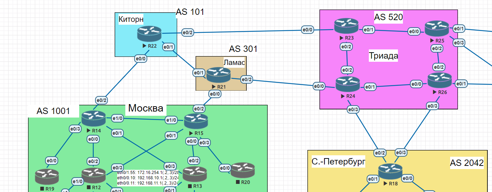

# BGP

### Цели:
- ##### Настроить BGP между автономными системами
- ##### Организовать доступность между офисами Москва и С.-Петербург

### Описание/Пошаговая инструкция выполнения домашнего задания:
- ##### Настроите eBGP между офисом Москва и двумя провайдерами - Киторн и Ламас.
- ##### Настроите eBGP между провайдерами Киторн и Ламас.
- ##### Настроите eBGP между Ламас и Триада.
- ##### Настроите eBGP между офисом С.-Петербург и провайдером Триада.
- ##### Организуете IP доступность между пограничным роутерами офисами Москва и С.-Петербург.

### Схема лабораторной работы:


Экспорт лабораторной работы из EVE-NG:

- [BGP.zip](export_zip/lab09_BGP.zip)

Настройка BGP на R14:
```cfg
router bgp 1001
 bgp router-id 172.16.255.14
 bgp log-neighbor-changes
 network 10.0.254.16 mask 255.255.255.254
 network 172.16.255.14 mask 255.255.255.255
 neighbor 10.0.254.16 remote-as 101
```

Настройка BGP на R15:
```cfg
router bgp 1001
 bgp router-id 172.16.255.15
 bgp log-neighbor-changes
 network 10.0.254.18 mask 255.255.255.254
 network 172.16.255.15 mask 255.255.255.255
 neighbor 10.0.254.18 remote-as 301
```

Настройка BGP на R21:
```cfg
LMS-R21#sh run | sec bgp
router bgp 301
 bgp router-id 172.16.255.21
 bgp log-neighbor-changes
 network 172.16.255.21 mask 255.255.255.255
 neighbor 10.0.254.19 remote-as 1001
 neighbor 10.0.254.21 remote-as 101
 neighbor 10.0.254.40 remote-as 520
```

Настройка BGP на R22:
```cfg
KTN-R22#sh run | sec bgp
router bgp 101
 bgp router-id 172.16.255.22
 bgp log-neighbor-changes
 network 172.16.255.22 mask 255.255.255.255
 neighbor 10.0.254.17 remote-as 1001
 neighbor 10.0.254.20 remote-as 301
 neighbor 10.0.254.42 remote-as 520
```

Настройка BGP на R23:
```cfg
TRD-R23#sh run | sec bgp
router bgp 520
 bgp log-neighbor-changes
 network 172.16.255.23 mask 255.255.255.255
 neighbor 10.0.254.43 remote-as 101
```

Настройка BGP на R24:
```cfg
TRD-R24#sh run | sec bgp
router bgp 520
 bgp log-neighbor-changes
 network 172.16.255.24 mask 255.255.255.255
 neighbor 10.0.254.41 remote-as 301
 neighbor 10.0.254.67 remote-as 2042

```

Настройка BGP на R26:
```cfg
TRD-R26#sh run | sec bgp
router bgp 520
 bgp log-neighbor-changes
 network 172.16.255.26 mask 255.255.255.255
 neighbor 10.0.254.69 remote-as 2042
```

Настройка BGP на R18:
```cfg
SPB-R18#sh run | sec bgp
router bgp 2042
 bgp log-neighbor-changes
 network 10.0.254.66 mask 255.255.255.254
 network 10.0.254.68 mask 255.255.255.254
 network 172.16.255.18 mask 255.255.255.255
 neighbor 10.0.254.66 remote-as 520
 neighbor 10.0.254.68 remote-as 520
```

Проверка доступности между пограничными роутерами Москвы с пограничным роутером СПБ:
```cfg
MSK-R14#sh ip int br
Interface                  IP-Address      OK? Method Status                Protocol
Ethernet0/0                10.0.254.12     YES NVRAM  up                    up
Ethernet0/1                10.0.254.2      YES NVRAM  up                    up
Ethernet0/2                10.0.254.17     YES NVRAM  up                    up
Ethernet0/3                10.0.254.4      YES NVRAM  up                    up
Ethernet1/0                10.0.254.14     YES NVRAM  up                    up
Ethernet1/1                unassigned      YES NVRAM  administratively down down
Ethernet1/2                unassigned      YES NVRAM  administratively down down
Ethernet1/3                unassigned      YES NVRAM  administratively down down
Loopback0                  172.16.255.14   YES NVRAM  up                    up

MSK-R15#sh ip int br
Interface                  IP-Address      OK? Method Status                Protocol
Ethernet0/0                10.0.254.8      YES NVRAM  up                    up
Ethernet0/1                10.0.254.6      YES NVRAM  up                    up
Ethernet0/2                10.0.254.19     YES NVRAM  up                    up
Ethernet0/3                10.0.254.10     YES NVRAM  up                    up
Ethernet1/0                10.0.254.15     YES NVRAM  up                    up
Ethernet1/1                unassigned      YES NVRAM  administratively down down
Ethernet1/2                unassigned      YES NVRAM  administratively down down
Ethernet1/3                unassigned      YES NVRAM  administratively down down
Loopback0                  172.16.255.15   YES NVRAM  up                    up

SPB-R18#sh ip int br
Interface                  IP-Address      OK? Method Status                Protocol
Ethernet0/0                10.0.254.70     YES NVRAM  up                    up
Ethernet0/1                10.0.254.72     YES NVRAM  up                    up
Ethernet0/2                10.0.254.67     YES NVRAM  up                    up
Ethernet0/3                10.0.254.69     YES NVRAM  up                    up
Loopback0                  172.16.255.18   YES NVRAM  up                    up

MSK-R14#sh ip bgp
BGP table version is 10, local router ID is 172.16.255.14
Status codes: s suppressed, d damped, h history, * valid, > best, i - internal,
              r RIB-failure, S Stale, m multipath, b backup-path, f RT-Filter,
              x best-external, a additional-path, c RIB-compressed,
Origin codes: i - IGP, e - EGP, ? - incomplete
RPKI validation codes: V valid, I invalid, N Not found

     Network          Next Hop            Metric LocPrf Weight Path
 *>  10.0.254.16/31   0.0.0.0                  0         32768 i
 *>  10.0.254.66/31   10.0.254.16                            0 101 301 520 2042 i
 *>  10.0.254.68/31   10.0.254.16                            0 101 301 520 2042 i
 *>  172.16.255.14/32 0.0.0.0                  0         32768 i
 *>  172.16.255.18/32 10.0.254.16                            0 101 301 520 2042 i
 *>  172.16.255.21/32 10.0.254.16                            0 101 301 i
 *>  172.16.255.22/32 10.0.254.16              0             0 101 i
 *>  172.16.255.23/32 10.0.254.16                            0 101 520 i
 *>  172.16.255.24/32 10.0.254.16                            0 101 301 520 i

MSK-R15#sh ip bgp
BGP table version is 10, local router ID is 172.16.255.15
Status codes: s suppressed, d damped, h history, * valid, > best, i - internal,
              r RIB-failure, S Stale, m multipath, b backup-path, f RT-Filter,
              x best-external, a additional-path, c RIB-compressed,
Origin codes: i - IGP, e - EGP, ? - incomplete
RPKI validation codes: V valid, I invalid, N Not found

     Network          Next Hop            Metric LocPrf Weight Path
 *>  10.0.254.18/31   0.0.0.0                  0         32768 i
 *>  10.0.254.66/31   10.0.254.18                            0 301 520 2042 i
 *>  10.0.254.68/31   10.0.254.18                            0 301 520 2042 i
 *>  172.16.255.15/32 0.0.0.0                  0         32768 i
 *>  172.16.255.18/32 10.0.254.18                            0 301 520 2042 i
 *>  172.16.255.21/32 10.0.254.18              0             0 301 i
 *>  172.16.255.22/32 10.0.254.18                            0 301 101 i
 *>  172.16.255.23/32 10.0.254.18                            0 301 101 520 i
 *>  172.16.255.24/32 10.0.254.18                            0 301 520 i

SPB-R18#sh ip bgp
BGP table version is 12, local router ID is 172.16.255.18
Status codes: s suppressed, d damped, h history, * valid, > best, i - internal,
              r RIB-failure, S Stale, m multipath, b backup-path, f RT-Filter,
              x best-external, a additional-path, c RIB-compressed,
Origin codes: i - IGP, e - EGP, ? - incomplete
RPKI validation codes: V valid, I invalid, N Not found

     Network          Next Hop            Metric LocPrf Weight Path
 *>  10.0.254.16/31   10.0.254.66                            0 520 301 101 1001 i
 *>  10.0.254.18/31   10.0.254.66                            0 520 301 1001 i
 *>  10.0.254.66/31   0.0.0.0                  0         32768 i
 *>  10.0.254.68/31   0.0.0.0                  0         32768 i
 *>  172.16.255.14/32 10.0.254.66                            0 520 301 101 1001 i
 *>  172.16.255.15/32 10.0.254.66                            0 520 301 1001 i
 *>  172.16.255.18/32 0.0.0.0                  0         32768 i
 *>  172.16.255.21/32 10.0.254.66                            0 520 301 i
 *>  172.16.255.22/32 10.0.254.66                            0 520 301 101 i
 *>  172.16.255.24/32 10.0.254.66              0             0 520 i
 *>  172.16.255.26/32 10.0.254.68              0             0 520 i
```

cfg```
MSK-R14#ping 10.0.254.67
Type escape sequence to abort.
Sending 5, 100-byte ICMP Echos to 10.0.254.67, timeout is 2 seconds:
!!!!!
Success rate is 100 percent (5/5), round-trip min/avg/max = 1/1/2 ms
MSK-R14#ping 10.0.254.69
Type escape sequence to abort.
Sending 5, 100-byte ICMP Echos to 10.0.254.69, timeout is 2 seconds:
!!!!!
Success rate is 100 percent (5/5), round-trip min/avg/max = 1/1/2 ms
MSK-R14#ping 172.16.255.18
Type escape sequence to abort.
Sending 5, 100-byte ICMP Echos to 172.16.255.18, timeout is 2 seconds:
!!!!!
Success rate is 100 percent (5/5), round-trip min/avg/max = 1/1/1 ms

MSK-R15#ping 10.0.254.67
Type escape sequence to abort.
Sending 5, 100-byte ICMP Echos to 10.0.254.67, timeout is 2 seconds:
!!!!!
Success rate is 100 percent (5/5), round-trip min/avg/max = 1/1/2 ms
MSK-R15#ping 10.0.254.69
Type escape sequence to abort.
Sending 5, 100-byte ICMP Echos to 10.0.254.69, timeout is 2 seconds:
!!!!!
Success rate is 100 percent (5/5), round-trip min/avg/max = 1/1/1 ms
MSK-R15#ping 172.16.255.18
Type escape sequence to abort.
Sending 5, 100-byte ICMP Echos to 172.16.255.18, timeout is 2 seconds:
!!!!!
Success rate is 100 percent (5/5), round-trip min/avg/max = 1/1/2 ms

SPB-R18#ping 10.0.254.17
Type escape sequence to abort.
Sending 5, 100-byte ICMP Echos to 10.0.254.17, timeout is 2 seconds:
!!!!!
Success rate is 100 percent (5/5), round-trip min/avg/max = 1/1/2 ms
SPB-R18#ping 10.0.254.19
Type escape sequence to abort.
Sending 5, 100-byte ICMP Echos to 10.0.254.19, timeout is 2 seconds:
!!!!!
Success rate is 100 percent (5/5), round-trip min/avg/max = 1/1/2 ms
SPB-R18#ping 172.16.255.14
Type escape sequence to abort.
Sending 5, 100-byte ICMP Echos to 172.16.255.14, timeout is 2 seconds:
!!!!!
Success rate is 100 percent (5/5), round-trip min/avg/max = 1/1/2 ms
SPB-R18#ping 172.16.255.15
Type escape sequence to abort.
Sending 5, 100-byte ICMP Echos to 172.16.255.15, timeout is 2 seconds:
!!!!!
Success rate is 100 percent (5/5), round-trip min/avg/max = 1/1/2 ms
```

### Конфиги устройств:
- [R14](R14)
- [R15](R15)
- [R21](R21)
- [R22](R22)
- [R23](R23)
- [R24](R24)
- [R26](R26)
- [R18](R18)