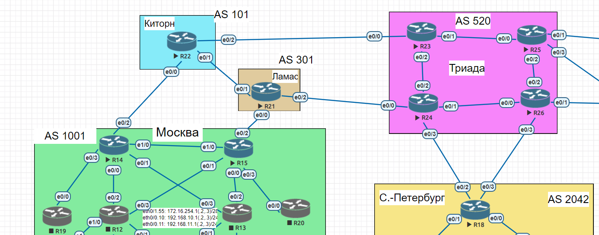

# iBGP + Атрибуты

### Цели:
- ##### Настроить iBGP в офисе Москва
- ##### Настроить iBGP в сети провайдера Триада
- ##### Организовать полную IP связанность всех сетей

### Описание/Пошаговая инструкция выполнения домашнего задания:
- ##### Настройте iBGP в офисе Москва между маршрутизаторами R14 и R15.
- ##### Настройте iBGP в провайдере Триада, с использованием RR.
- ##### Настройте офис Москва так, чтобы приоритетным провайдером стал Ламас.
- ##### Настройте офиса С.-Петербург так, чтобы трафик до любого офиса распределялся по двум линкам одновременно.
- ##### Все сети в лабораторной работе должны иметь IP связность.


### Схема лабораторной работы:


Экспорт лабораторной работы из EVE-NG:

- [iBGP.zip](export_zip/lab10_iBGP.zip)

##### Настройте iBGP в офисом Москва между маршрутизаторами R14 и R15.
Настройка iBGP на R14:
<pre>
router bgp 1001
 bgp router-id 172.16.255.14
 bgp log-neighbor-changes
 network 10.0.254.14 mask 255.255.255.254
 network 10.0.254.16 mask 255.255.255.254
 network 172.16.255.14 mask 255.255.255.255
 neighbor 10.0.254.16 remote-as 101
<b> neighbor 172.16.255.15 remote-as 1001
 neighbor 172.16.255.15 update-source Loopback0 </b>
</pre>

Настройка iBGP на R15:
<pre>
router bgp 1001
 bgp router-id 172.16.255.15
 bgp log-neighbor-changes
 network 10.0.254.14 mask 255.255.255.254
 network 10.0.254.18 mask 255.255.255.254
 network 172.16.255.15 mask 255.255.255.255
 neighbor 10.0.254.18 remote-as 301
<b> neighbor 172.16.255.14 remote-as 1001
 neighbor 172.16.255.14 update-source Loopback0 </b>
</pre>

##### Настройте iBGP в провайдере Триада, с использованием RR.
Настройка iBGP в AS 520 следующим образом: в качестве RR в AS был выбран TRD-R23, на нём настроена peer-group AS520 с перечеслением настроек, далее все они применены к остальным соседям в AS520;
<pre>
router bgp 520
 bgp router-id 172.16.255.23
 bgp log-neighbor-changes
 network 172.16.255.23 mask 255.255.255.255
 <b> neighbor AS520 peer-group
 neighbor AS520 remote-as 520
 neighbor AS520 update-source Loopback0
 neighbor AS520 route-reflector-client
 neighbor AS520 next-hop-self </b>
 neighbor 10.0.254.43 remote-as 101
<b> neighbor 172.16.255.24 peer-group AS520
 neighbor 172.16.255.25 peer-group AS520
 neighbor 172.16.255.26 peer-group AS520 </b>
</pre>

Настройка на TRD-R26 выглядит следующим образом:
<pre>
router bgp 520
 bgp router-id 172.16.255.26
 bgp log-neighbor-changes
 network 172.16.255.26 mask 255.255.255.255
 neighbor 10.0.254.69 remote-as 2042
 <b>neighbor 172.16.255.23 remote-as 520
 neighbor 172.16.255.23 update-source Loopback0
 neighbor 172.16.255.23 next-hop-self</b>
</pre>

##### Настройте офис Москва так, чтобы приоритетным провайдером стал Ламас.
Для этого на R15 настроим route-map, в котором будет изменять LOCAL_PREF на 150:
```cfg
route-map AS301-IN permit 10
 set local-preference 150
```
И применим его на соседа из AS301:
<pre>
router bgp 1001
 bgp router-id 172.16.255.15
 bgp log-neighbor-changes
 network 10.0.254.14 mask 255.255.255.254
 network 10.0.254.18 mask 255.255.255.254
 network 172.16.255.15 mask 255.255.255.255
 neighbor 10.0.254.18 remote-as 301
<b> neighbor 10.0.254.18 route-map AS301-IN in</b>
 neighbor 172.16.255.14 remote-as 1001
 neighbor 172.16.255.14 update-source Loopback0
</pre>

Проверка на R14 (теперь будет выходить через MSK-R15 AS301):
```cfg
MSK-R14#traceroute 10.0.254.67
Type escape sequence to abort.
Tracing the route to 10.0.254.67
VRF info: (vrf in name/id, vrf out name/id)
  1 10.0.254.15 0 msec 1 msec 0 msec
  2 10.0.254.18 0 msec 1 msec 0 msec
  3 10.0.254.40 1 msec 1 msec 0 msec
  4 10.0.254.67 [AS 2042] 1 msec *  1 msec
MSK-R14#sh ip ro bgp
Codes: L - local, C - connected, S - static, R - RIP, M - mobile, B - BGP
       D - EIGRP, EX - EIGRP external, O - OSPF, IA - OSPF inter area
       N1 - OSPF NSSA external type 1, N2 - OSPF NSSA external type 2
       E1 - OSPF external type 1, E2 - OSPF external type 2
       i - IS-IS, su - IS-IS summary, L1 - IS-IS level-1, L2 - IS-IS level-2
       ia - IS-IS inter area, * - candidate default, U - per-user static route
       o - ODR, P - periodic downloaded static route, H - NHRP, l - LISP
       a - application route
       + - replicated route, % - next hop override

Gateway of last resort is not set

      10.0.0.0/8 is variably subnetted, 17 subnets, 3 masks
B        10.0.254.18/31 [200/0] via 172.16.255.15, 01:03:20
B        10.0.254.66/31 [200/0] via 10.0.254.18, 00:32:44
B        10.0.254.68/31 [200/0] via 10.0.254.18, 00:32:44
      172.16.0.0/16 is variably subnetted, 14 subnets, 2 masks
B        172.16.255.18/32 [200/0] via 10.0.254.18, 00:32:44
B        172.16.255.21/32 [200/0] via 10.0.254.18, 00:32:44
B        172.16.255.22/32 [200/0] via 10.0.254.18, 00:32:44
B        172.16.255.23/32 [200/0] via 10.0.254.18, 00:32:44
B        172.16.255.24/32 [200/0] via 10.0.254.18, 00:32:44
B        172.16.255.25/32 [200/0] via 10.0.254.18, 00:32:44
B        172.16.255.26/32 [200/0] via 10.0.254.18, 00:32:44
MSK-R14#sh ip bgp 10.0.254.66/31
BGP routing table entry for 10.0.254.66/31, version 23
Paths: (2 available, best #1, table default)
  Advertised to update-groups:
     1
  Refresh Epoch 6
  301 520 2042
    10.0.254.18 (metric 11) from 172.16.255.15 (172.16.255.15)
      Origin IGP, metric 0, localpref 150, valid, internal, best
      rx pathid: 0, tx pathid: 0x0
  Refresh Epoch 2
  101 520 2042
    10.0.254.16 from 10.0.254.16 (172.16.255.22)
      Origin IGP, localpref 100, valid, external
      rx pathid: 0, tx pathid: 0
MSK-R14#sh ip bgp
BGP table version is 32, local router ID is 172.16.255.14
Status codes: s suppressed, d damped, h history, * valid, > best, i - internal,
              r RIB-failure, S Stale, m multipath, b backup-path, f RT-Filter,
              x best-external, a additional-path, c RIB-compressed,
Origin codes: i - IGP, e - EGP, ? - incomplete
RPKI validation codes: V valid, I invalid, N Not found

     Network          Next Hop            Metric LocPrf Weight Path
 * i 10.0.254.14/31   172.16.255.15            0    100      0 i
 *>                   0.0.0.0                  0         32768 i
 *>  10.0.254.16/31   0.0.0.0                  0         32768 i
 *>i 10.0.254.18/31   172.16.255.15            0    100      0 i
 *>i 10.0.254.66/31   10.0.254.18              0    150      0 301 520 2042 i
 *                    10.0.254.16                            0 101 520 2042 i
 *>i 10.0.254.68/31   10.0.254.18              0    150      0 301 520 2042 i
 *                    10.0.254.16                            0 101 520 2042 i
 *>  172.16.255.14/32 0.0.0.0                  0         32768 i
 r>i 172.16.255.15/32 172.16.255.15            0    100      0 i
 *>i 172.16.255.18/32 10.0.254.18              0    150      0 301 520 2042 i
 *                    10.0.254.16                            0 101 520 2042 i
 *>i 172.16.255.21/32 10.0.254.18              0    150      0 301 i
 *                    10.0.254.16                            0 101 301 i
     Network          Next Hop            Metric LocPrf Weight Path
 *>i 172.16.255.22/32 10.0.254.18              0    150      0 301 101 i
 *                    10.0.254.16              0             0 101 i
 *>i 172.16.255.23/32 10.0.254.18              0    150      0 301 520 i
 *                    10.0.254.16                            0 101 520 i
 *>i 172.16.255.24/32 10.0.254.18              0    150      0 301 520 i
 *                    10.0.254.16                            0 101 520 i
 *>i 172.16.255.25/32 10.0.254.18              0    150      0 301 520 i
 *                    10.0.254.16                            0 101 520 i
 *>i 172.16.255.26/32 10.0.254.18              0    150      0 301 520 i
 *                    10.0.254.16                            0 101 520 i
MSK-R14#
```
Проверка на R15:
```cfg
MSK-R15#traceroute 10.0.254.67
Type escape sequence to abort.
Tracing the route to 10.0.254.67
VRF info: (vrf in name/id, vrf out name/id)
  1 10.0.254.18 1 msec 0 msec 0 msec
  2 10.0.254.40 1 msec 0 msec 0 msec
  3 10.0.254.67 [AS 2042] 1 msec *  1 msec
MSK-R15#sh ip ro bgp
Codes: L - local, C - connected, S - static, R - RIP, M - mobile, B - BGP
       D - EIGRP, EX - EIGRP external, O - OSPF, IA - OSPF inter area
       N1 - OSPF NSSA external type 1, N2 - OSPF NSSA external type 2
       E1 - OSPF external type 1, E2 - OSPF external type 2
       i - IS-IS, su - IS-IS summary, L1 - IS-IS level-1, L2 - IS-IS level-2
       ia - IS-IS inter area, * - candidate default, U - per-user static route
       o - ODR, P - periodic downloaded static route, H - NHRP, l - LISP
       a - application route
       + - replicated route, % - next hop override

Gateway of last resort is not set

      10.0.0.0/8 is variably subnetted, 17 subnets, 3 masks
B        10.0.254.16/31 [200/0] via 172.16.255.14, 01:06:25
B        10.0.254.66/31 [20/0] via 10.0.254.18, 00:35:49
B        10.0.254.68/31 [20/0] via 10.0.254.18, 00:35:49
      172.16.0.0/16 is variably subnetted, 14 subnets, 2 masks
B        172.16.255.18/32 [20/0] via 10.0.254.18, 00:35:49
B        172.16.255.21/32 [20/0] via 10.0.254.18, 00:35:49
B        172.16.255.22/32 [20/0] via 10.0.254.18, 00:35:49
B        172.16.255.23/32 [20/0] via 10.0.254.18, 00:35:49
B        172.16.255.24/32 [20/0] via 10.0.254.18, 00:35:49
B        172.16.255.25/32 [20/0] via 10.0.254.18, 00:35:49
B        172.16.255.26/32 [20/0] via 10.0.254.18, 00:35:49
MSK-R15#sh ip bgp
BGP table version is 60, local router ID is 172.16.255.15
Status codes: s suppressed, d damped, h history, * valid, > best, i - internal,
              r RIB-failure, S Stale, m multipath, b backup-path, f RT-Filter,
              x best-external, a additional-path, c RIB-compressed,
Origin codes: i - IGP, e - EGP, ? - incomplete
RPKI validation codes: V valid, I invalid, N Not found

     Network          Next Hop            Metric LocPrf Weight Path
 *>  10.0.254.14/31   0.0.0.0                  0         32768 i
 * i                  172.16.255.14            0    100      0 i
 *>i 10.0.254.16/31   172.16.255.14            0    100      0 i
 *>  10.0.254.18/31   0.0.0.0                  0         32768 i
 *>  10.0.254.66/31   10.0.254.18                   150      0 301 520 2042 i
 *>  10.0.254.68/31   10.0.254.18                   150      0 301 520 2042 i
 r>i 172.16.255.14/32 172.16.255.14            0    100      0 i
 *>  172.16.255.15/32 0.0.0.0                  0         32768 i
 *>  172.16.255.18/32 10.0.254.18                   150      0 301 520 2042 i
 *>  172.16.255.21/32 10.0.254.18              0    150      0 301 i
 *>  172.16.255.22/32 10.0.254.18                   150      0 301 101 i
 *>  172.16.255.23/32 10.0.254.18                   150      0 301 520 i
 *>  172.16.255.24/32 10.0.254.18                   150      0 301 520 i
 *>  172.16.255.25/32 10.0.254.18                   150      0 301 520 i
     Network          Next Hop            Metric LocPrf Weight Path
 *>  172.16.255.26/32 10.0.254.18                   150      0 301 520 i
```
##### Настройте офиса С.-Петербург так, чтобы трафик до любого офиса распределялся по двум линкам одновременно.
Для этого настроим multipath в процессе BGP A2042 на SPB-R18:
<pre>
router bgp 2042
 bgp log-neighbor-changes
 <b>bgp bestpath as-path multipath-relax</b>
 network 10.0.254.66 mask 255.255.255.254
 network 10.0.254.68 mask 255.255.255.254
 network 172.16.255.18 mask 255.255.255.255
 neighbor 10.0.254.66 remote-as 520
 neighbor 10.0.254.68 remote-as 520
 <b>maximum-paths 2</b>
</pre>
До изменений: 
```cfg
SPB-R18(config-router)#do sh ip bgp 10.0.254.16/31
BGP routing table entry for 10.0.254.16/31, version 20
Paths: (2 available, best #2, table default)
Multipath: eBGP
  Advertised to update-groups:
     1
  Refresh Epoch 1
  520 101 1001
    10.0.254.68 from 10.0.254.68 (172.16.255.26)
      Origin IGP, localpref 100, valid, external
      rx pathid: 0, tx pathid: 0
  Refresh Epoch 1
  520 301 1001
    10.0.254.66 from 10.0.254.66 (172.16.255.24)
      Origin IGP, localpref 100, valid, external, best
      rx pathid: 0, tx pathid: 0x0
```
После: 
```cfg
SPB-R18(config-router)#do sh ip bgp 10.0.254.16/31
BGP routing table entry for 10.0.254.16/31, version 31
Paths: (2 available, best #2, table default)
Multipath: eBGP
  Advertised to update-groups:
     1
  Refresh Epoch 2
  520 101 1001
    10.0.254.68 from 10.0.254.68 (172.16.255.26)
      Origin IGP, localpref 100, valid, external, multipath(oldest)
      rx pathid: 0, tx pathid: 0
  Refresh Epoch 2
  520 301 1001
    10.0.254.66 from 10.0.254.66 (172.16.255.24)
      Origin IGP, localpref 100, valid, external, multipath, best
      rx pathid: 0, tx pathid: 0x0

SPB-R18(config-router)#do sh ip ro bgp
Codes: L - local, C - connected, S - static, R - RIP, M - mobile, B - BGP
       D - EIGRP, EX - EIGRP external, O - OSPF, IA - OSPF inter area
       N1 - OSPF NSSA external type 1, N2 - OSPF NSSA external type 2
       E1 - OSPF external type 1, E2 - OSPF external type 2
       i - IS-IS, su - IS-IS summary, L1 - IS-IS level-1, L2 - IS-IS level-2
       ia - IS-IS inter area, * - candidate default, U - per-user static route
       o - ODR, P - periodic downloaded static route, H - NHRP, l - LISP
       a - application route
       + - replicated route, % - next hop override

Gateway of last resort is 0.0.0.0 to network 0.0.0.0

      10.0.0.0/8 is variably subnetted, 11 subnets, 2 masks
B        10.0.254.14/31 [20/0] via 10.0.254.68, 00:00:10
                        [20/0] via 10.0.254.66, 00:00:10
B        10.0.254.16/31 [20/0] via 10.0.254.68, 00:00:10
                        [20/0] via 10.0.254.66, 00:00:10
B        10.0.254.18/31 [20/0] via 10.0.254.68, 00:00:10
                        [20/0] via 10.0.254.66, 00:00:10
      172.16.0.0/32 is subnetted, 9 subnets
B        172.16.255.14 [20/0] via 10.0.254.68, 00:00:10
                       [20/0] via 10.0.254.66, 00:00:10
B        172.16.255.15 [20/0] via 10.0.254.68, 00:00:10
                       [20/0] via 10.0.254.66, 00:00:10
B        172.16.255.21 [20/0] via 10.0.254.68, 00:00:10
                       [20/0] via 10.0.254.66, 00:00:10
B        172.16.255.22 [20/0] via 10.0.254.68, 00:00:10
                       [20/0] via 10.0.254.66, 00:00:10
B        172.16.255.23 [20/0] via 10.0.254.68, 00:00:10
                       [20/0] via 10.0.254.66, 00:00:10
B        172.16.255.24 [20/0] via 10.0.254.68, 00:00:10
                       [20/0] via 10.0.254.66, 00:00:10
B        172.16.255.25 [20/0] via 10.0.254.68, 00:00:10
                       [20/0] via 10.0.254.66, 00:00:10
B        172.16.255.26 [20/0] via 10.0.254.68, 00:00:10
                       [20/0] via 10.0.254.66, 00:00:10
```

- ##### Все сети в лабораторной работе должны иметь IP связность
Для этого в филиалах необходимо включить редистрибуцию IGP (OSPF,OSPFv3,EIGRP, ISIS) протоколов в BGP, а так же статических маршрутов на TRD-26 и TRD-25:

После этого вывод команды sh ip bgp на MSK-R14 выглядит следующим образом:
```cfg
MSK-R14(config-router)#do sh ip bgp
BGP table version is 69, local router ID is 172.16.255.14
Status codes: s suppressed, d damped, h history, * valid, > best, i - internal,
              r RIB-failure, S Stale, m multipath, b backup-path, f RT-Filter,
              x best-external, a additional-path, c RIB-compressed,
Origin codes: i - IGP, e - EGP, ? - incomplete
RPKI validation codes: V valid, I invalid, N Not found

     Network          Next Hop            Metric LocPrf Weight Path
 * i 10.0.254.2/31    10.0.254.7             120    100      0 ?
 *>                   0.0.0.0                  0         32768 ?
 *>  10.0.254.4/31    0.0.0.0                  0         32768 ?
 * i 10.0.254.6/31    172.16.255.15            0    100      0 ?
 *>                   10.0.254.13             20         32768 ?
 * i 10.0.254.8/31    172.16.255.15            0    100      0 ?
 *>                   10.0.254.13            120         32768 ?
 * i 10.0.254.10/31   172.16.255.15            0    100      0 ?
 *>                   10.0.254.15             20         32768 ?
 * i 10.0.254.12/31   10.0.254.7              20    100      0 ?
 *>                   0.0.0.0                  0         32768 ?
 * i 10.0.254.14/31   172.16.255.15            0    100      0 i
 *>                   0.0.0.0                  0         32768 i
 *>  10.0.254.16/31   0.0.0.0                  0         32768 i
     Network          Next Hop            Metric LocPrf Weight Path
 *>i 10.0.254.18/31   172.16.255.15            0    100      0 i
 *   10.0.254.50/31   10.0.254.16                            0 101 520 ?
 *>i                  10.0.254.18              0    150      0 301 520 ?
 *   10.0.254.52/31   10.0.254.16                            0 101 520 ?
 *>i                  10.0.254.18              0    150      0 301 520 ?
 *>i 10.0.254.54/31   10.0.254.18              0    150      0 301 520 ?
 *                    10.0.254.16                            0 101 520 ?
 *   10.0.254.56/31   10.0.254.16                            0 101 520 ?
 *>i                  10.0.254.18              0    150      0 301 520 ?
 *>i 10.0.254.66/31   10.0.254.18              0    150      0 301 520 2042 i
 *                    10.0.254.16                            0 101 520 2042 i
 *>i 10.0.254.68/31   10.0.254.18              0    150      0 301 520 ?
 *                    10.0.254.16                            0 101 520 ?
 *   10.0.254.70/31   10.0.254.16                            0 101 520 2042 ?
 *>i                  10.0.254.18              0    150      0 301 520 2042 ?
 *   10.0.254.72/31   10.0.254.16                            0 101 520 2042 ?
 *>i                  10.0.254.18              0    150      0 301 520 2042 ?
 *   10.0.254.74/31   10.0.254.16                            0 101 520 2042 ?
 *>i                  10.0.254.18              0    150      0 301 520 2042 ?
 *   10.0.254.88/31   10.0.254.16                            0 101 520 ?
 *>i                  10.0.254.18              0    150      0 301 520 ?
 *   10.0.254.138/31  10.0.254.16                            0 101 520 ?
     Network          Next Hop            Metric LocPrf Weight Path
 *>i                  10.0.254.18              0    150      0 301 520 ?
 *   10.0.254.140/31  10.0.254.16                            0 101 520 ?
 *>i                  10.0.254.18              0    150      0 301 520 ?
 * i 10.255.255.0/30  10.0.254.7              20    100      0 ?
 *>                   10.0.254.13             20         32768 ?
 * i 172.16.254.0/28  10.0.254.7              20    100      0 ?
 *>                   10.0.254.13             20         32768 ?
 *   172.16.254.16/28 10.0.254.16                            0 101 520 2042 ?
 *>i                  10.0.254.18              0    150      0 301 520 2042 ?
 *   172.16.254.32/29 10.0.254.16                            0 101 520 ?
 *>i                  10.0.254.18              0    150      0 301 520 ?
 * i 172.16.255.12/32 10.0.254.7              11    100      0 ?
 *>                   10.0.254.13             11         32768 ?
 * i 172.16.255.13/32 10.0.254.9             101    100      0 ?
 *>                   10.0.254.3             101         32768 ?
 *>  172.16.255.14/32 0.0.0.0                  0         32768 i
 *>  172.16.255.15/32 10.0.254.15             11         32768 ?
 * i                  172.16.255.15            0    100      0 i
 *   172.16.255.16/32 10.0.254.16                            0 101 520 2042 ?
 *>i                  10.0.254.18              0    150      0 301 520 2042 ?
 *   172.16.255.17/32 10.0.254.16                            0 101 520 2042 ?
 *>i                  10.0.254.18              0    150      0 301 520 2042 ?
     Network          Next Hop            Metric LocPrf Weight Path
 *>i 172.16.255.18/32 10.0.254.18              0    150      0 301 520 2042 i
 *                    10.0.254.16                            0 101 520 2042 i
 *>  172.16.255.19/32 10.0.254.5              11         32768 ?
 * i 172.16.255.20/32 10.0.254.11             11    100      0 ?
 *>                   10.0.254.15             21         32768 ?
 *>i 172.16.255.21/32 10.0.254.18              0    150      0 301 i
 *                    10.0.254.16                            0 101 301 i
 *>i 172.16.255.22/32 10.0.254.18              0    150      0 301 101 i
 *                    10.0.254.16              0             0 101 i
 *>i 172.16.255.23/32 10.0.254.18              0    150      0 301 520 ?
 *                    10.0.254.16                            0 101 520 i
 *>i 172.16.255.24/32 10.0.254.18              0    150      0 301 520 i
 *                    10.0.254.16                            0 101 520 ?
 *>i 172.16.255.25/32 10.0.254.18              0    150      0 301 520 ?
 *                    10.0.254.16                            0 101 520 i
 *>i 172.16.255.26/32 10.0.254.18              0    150      0 301 520 ?
 *                    10.0.254.16                            0 101 520 ?
 *>i 172.16.255.32/32 10.0.254.18              0    150      0 301 520 2042 ?
 * i 192.168.10.0     10.0.254.7              20    100      0 ?
 *>                   10.0.254.13             20         32768 ?
 * i 192.168.11.0     10.0.254.7              20    100      0 ?
 *>                   10.0.254.13             20         32768 ?
     Network          Next Hop            Metric LocPrf Weight Path
 *   192.168.20.0/23  10.0.254.16                            0 101 520 2042 ?
 *>i                  10.0.254.18              0    150      0 301 520 2042 ?
 *   192.168.30.0/23  10.0.254.16                            0 101 520 ?
 *>i                  10.0.254.18              0    150      0 301 520 ?
```
С рабочей станции в Московском офисе есть доступность до рабочих станций в других филиалах:
```cfg
MSK-VPC1> ping 192.168.21.10

84 bytes from 192.168.21.10 icmp_seq=1 ttl=56 time=5.058 ms
84 bytes from 192.168.21.10 icmp_seq=2 ttl=56 time=3.106 ms
^C
MSK-VPC1> ping 192.168.20.10

84 bytes from 192.168.20.10 icmp_seq=1 ttl=57 time=4.134 ms
84 bytes from 192.168.20.10 icmp_seq=2 ttl=57 time=3.390 ms
^C
MSK-VPC1> ping 192.168.30.10

84 bytes from 192.168.30.10 icmp_seq=1 ttl=58 time=3.587 ms
84 bytes from 192.168.30.10 icmp_seq=2 ttl=58 time=3.319 ms
^C
MSK-VPC1> ping 192.168.31.10

84 bytes from 192.168.31.10 icmp_seq=1 ttl=58 time=3.701 ms
84 bytes from 192.168.31.10 icmp_seq=2 ttl=58 time=2.651 ms
^C
MSK-VPC1>
```

### Конфиги устройств:
- [R14](R14)
- [R15](R15)
- [R25](R25)
- [R23](R23)
- [R24](R24)
- [R26](R26)
- [R18](R18)