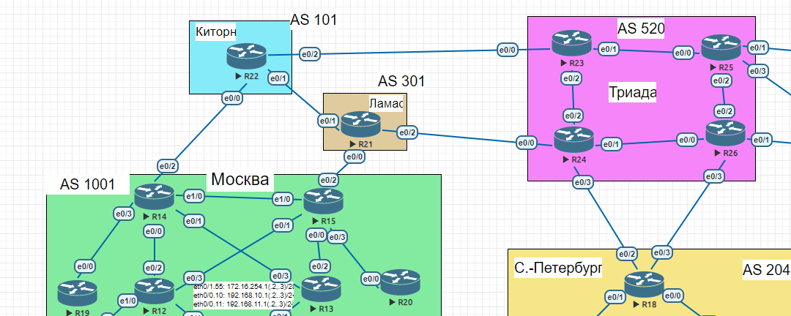

# iBGP + Атрибуты

### Цели:
- ##### Настроить iBGP в офисе Москва
- ##### Настроить iBGP в сети провайдера Триада
- ##### Организовать полную IP связанность всех сетей

### Описание/Пошаговая инструкция выполнения домашнего задания:
- ##### Настройте iBGP в офисе Москва между маршрутизаторами R14 и R15.
- ##### Настройте iBGP в провайдере Триада, с использованием RR.
- ##### Настройте офис Москва так, чтобы приоритетным провайдером стал Ламас.
- ##### Настройте офиса С.-Петербург так, чтобы трафик до любого офиса распределялся по двум линкам одновременно.
- ##### Все сети в лабораторной работе должны иметь IP связность.

### Схема лабораторной работы:

Экспорт лабораторной работы из EVE-NG:

- [iBGP.zip](export_zip/lab10_iBGP.zip)

##### Настройте iBGP в офисом Москва между маршрутизаторами R14 и R15.

### Конфиги устройств:
- [R14](R14)
- [R15](R15)
- [R21](R21)
- [R22](R22)
- [R23](R23)
- [R24](R24)
- [R26](R26)
- [R18](R18)