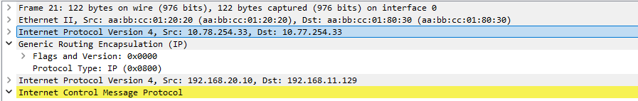

# DMVPN

### Цели:
- ##### Настроить GRE между офисами Москва и С.-Петербург
- ##### Настроить DMVPN между офисами Москва и Чокурдах, Лабытнанги

### Описание/Пошаговая инструкция выполнения домашнего задания:
- ##### Настройте GRE между офисами Москва и С.-Петербург.
- ##### Настройте DMVMN между Москва и Чокурдах, Лабытнанги.


Экспорт лабораторной работы из EVE-NG:

- [DMVPN.zip](export_zip/lab13_DMVPN.zip)

- ##### Настройте GRE между офисами Москва и С.-Петербург

MSK-R15:
```cfg
interface Tunnel100
 ip address 10.77.78.0 255.255.255.254
 ip mtu 1400
 ip tcp adjust-mss 1360
 tunnel source 10.77.254.33
 tunnel destination 10.78.254.33
 
ip route 192.168.20.0 255.255.254.0 Tunnel101
```

SPB-R18
```cfg
interface Tunnel100
 ip address 10.77.78.1 255.255.255.254
 ip mtu 1400
 ip tcp adjust-mss 1360
 tunnel source 10.78.254.33
 tunnel destination 10.77.254.33

interface Tunnel101
 ip address 10.77.78.3 255.255.255.254
 ip mtu 1400
 ip tcp adjust-mss 1360
 tunnel source 10.78.254.1
 tunnel destination 10.77.254.1


ip route 172.16.254.0 255.255.255.240 Tunnel100 10.77.78.0 
ip route 172.16.254.32 255.255.255.248 Tunnel100 10.77.78.0 # для дальнейшей связи с офисом Чокурдах
ip route 192.168.10.0 255.255.254.0 Tunnel100 10.77.78.0 
ip route 192.168.30.0 255.255.254.0 Tunnel100 10.77.78.0 # для дальнейшей связи с офисом Чокурдах

```
Проверка:
```cfg
SPB-VPC8> ping 192.168.10.129

84 bytes from 192.168.10.129 icmp_seq=1 ttl=60 time=2.810 ms
84 bytes from 192.168.10.129 icmp_seq=2 ttl=60 time=2.878 ms
84 bytes from 192.168.10.129 icmp_seq=3 ttl=60 time=2.703 ms
^C
SPB-VPC8> ping 192.168.11.129

84 bytes from 192.168.11.129 icmp_seq=1 ttl=60 time=4.055 ms
84 bytes from 192.168.11.129 icmp_seq=2 ttl=60 time=2.866 ms
84 bytes from 192.168.11.129 icmp_seq=3 ttl=60 time=3.208 ms
^C
SPB-VPC8>

SPB-VPC8> trace 192.168.11.129
trace to 192.168.11.129, 8 hops max, press Ctrl+C to stop
 1     *192.168.20.2   0.899 ms  0.659 ms
 2   10.0.254.70   1.037 ms  0.937 ms  0.730 ms
 3   10.77.78.0   1.740 ms  1.736 ms  1.506 ms
 4   10.0.254.7   1.724 ms  2.487 ms  2.327 ms
 5   *192.168.11.129   3.815 ms (ICMP type:3, code:3, Destination port unreachable)

SPB-VPC8> trace 192.168.10.129
trace to 192.168.10.129, 8 hops max, press Ctrl+C to stop
 1   192.168.20.2   0.918 ms  0.707 ms  0.634 ms
 2   10.0.254.70   0.922 ms  0.712 ms  0.727 ms
 3   10.77.78.0   1.634 ms  1.621 ms  2.117 ms
 4   10.0.254.7   2.313 ms  1.764 ms  1.729 ms
 5   *192.168.10.129   3.636 ms (ICMP type:3, code:3, Destination port unreachable)

MSK-VPC1> ping 192.168.20.10

84 bytes from 192.168.20.10 icmp_seq=1 ttl=60 time=2.868 ms
84 bytes from 192.168.20.10 icmp_seq=2 ttl=60 time=3.545 ms
84 bytes from 192.168.20.10 icmp_seq=3 ttl=60 time=3.677 ms
84 bytes from 192.168.20.10 icmp_seq=4 ttl=60 time=2.616 ms
84 bytes from 192.168.20.10 icmp_seq=5 ttl=60 time=2.772 ms

MSK-VPC1> ping 192.168.20.10

84 bytes from 192.168.20.10 icmp_seq=1 ttl=60 time=3.686 ms
84 bytes from 192.168.20.10 icmp_seq=2 ttl=60 time=2.676 ms
84 bytes from 192.168.20.10 icmp_seq=3 ttl=60 time=2.826 ms
^C
MSK-VPC1> trace 192.168.20.10
trace to 192.168.20.10, 8 hops max, press Ctrl+C to stop
 1   192.168.10.3   1.143 ms  0.930 ms  1.032 ms
 2   10.0.254.2   1.295 ms  1.400 ms  1.177 ms
 3   10.0.254.15   1.584 ms  1.285 ms  1.389 ms
 4   10.77.78.1   2.213 ms  1.986 ms  2.153 ms
 5   10.0.254.73   2.291 ms  2.136 ms  2.302 ms
 6   *192.168.20.10   2.842 ms (ICMP type:3, code:3, Destination port unreachable)

MSK-VPC1> trace 192.168.21.10
trace to 192.168.21.10, 8 hops max, press Ctrl+C to stop
 1   192.168.10.3   1.305 ms  0.950 ms  0.957 ms
 2   10.0.254.8   1.456 ms  1.473 ms  1.212 ms
 3   10.77.78.1   2.093 ms  1.885 ms  1.777 ms
 4   10.0.254.73   2.897 ms  2.033 ms  2.367 ms
 5   *192.168.21.10   3.153 ms (ICMP type:3, code:3, Destination port unreachable)

```



- ##### Настроить DMVPN между офисами Москва и Чокурдах, Лабытнанги
SPB-R15:
```cfg
interface Tunnel150
 ip address 10.77.0.1 255.255.255.0
 no ip redirects
 ip mtu 1400
 no ip next-hop-self eigrp 77
 no ip split-horizon eigrp 77
 ip nhrp authentication OTUS
 ip nhrp map multicast dynamic
 ip nhrp network-id 150
 ip tcp adjust-mss 1360
 tunnel source Ethernet0/2
 tunnel mode gre multipoint

router eigrp 77
 network 10.77.0.0 0.0.0.255
 network 172.16.254.0 0.0.0.15
 network 192.168.10.0 0.0.1.255
```

CKD-R28:
```cfg
interface Tunnel150
 ip address 10.77.0.3 255.255.255.0
 no ip redirects
 ip mtu 1400
 no ip next-hop-self eigrp 77
 no ip split-horizon eigrp 77
 ip nhrp authentication OTUS
 ip nhrp map multicast 10.77.254.33
 ip nhrp map 10.77.0.1 10.77.254.33
 ip nhrp network-id 150
 ip nhrp nhs 10.77.0.1
 ip nhrp registration no-unique
 ip tcp adjust-mss 1360
 tunnel source Ethernet0/1
 tunnel mode gre multipoint

router eigrp 77
 network 10.77.0.0 0.0.0.255
 network 172.16.254.32 0.0.0.7
 network 192.168.30.0 0.0.1.255
```

LBT-R27:
```cfg
interface Tunnel150
 ip address 10.77.0.2 255.255.255.0
 no ip redirects
 ip mtu 1400
 no ip next-hop-self eigrp 77
 no ip split-horizon eigrp 77
 ip nhrp authentication OTUS
 ip nhrp map multicast 10.77.254.33
 ip nhrp map 10.77.0.1 10.77.254.33
 ip nhrp network-id 150
 ip nhrp nhs 10.77.0.1
 ip tcp adjust-mss 1360
 tunnel source Ethernet0/0
 tunnel mode gre multipoint

router eigrp 77
 network 10.77.0.0 0.0.0.255
 network 172.16.255.27 0.0.0.0
```

Проверка:
```cfg

MSK-R15(config-router)#do sh dmvpn
Legend: Attrb --> S - Static, D - Dynamic, I - Incomplete
        N - NATed, L - Local, X - No Socket
        T1 - Route Installed, T2 - Nexthop-override
        C - CTS Capable, I2 - Temporary
        # Ent --> Number of NHRP entries with same NBMA peer
        NHS Status: E --> Expecting Replies, R --> Responding, W --> Waiting
        UpDn Time --> Up or Down Time for a Tunnel
==========================================================================

Interface: Tunnel150, IPv4 NHRP Details
Type:Hub, NHRP Peers:2,

 # Ent  Peer NBMA Addr Peer Tunnel Add State  UpDn Tm Attrb
 ----- --------------- --------------- ----- -------- -----
     1 10.0.254.89           10.77.0.2    UP 00:00:55     D
     1 10.0.254.141          10.77.0.3    UP 00:01:16     D

MSK-R15(config-router)#do sh ip nhrp
10.77.0.2/32 via 10.77.0.2
   Tunnel150 created 00:00:57, expire 00:09:02
   Type: dynamic, Flags: registered used nhop
   NBMA address: 10.0.254.89
10.77.0.3/32 via 10.77.0.3
   Tunnel150 created 00:01:19, expire 00:08:41
   Type: dynamic, Flags: registered used nhop
   NBMA address: 10.0.254.141

MSK-R15(config-router)#do sh ip ro  eigrp
Codes: L - local, C - connected, S - static, R - RIP, M - mobile, B - BGP
       D - EIGRP, EX - EIGRP external, O - OSPF, IA - OSPF inter area
       N1 - OSPF NSSA external type 1, N2 - OSPF NSSA external type 2
       E1 - OSPF external type 1, E2 - OSPF external type 2
       i - IS-IS, su - IS-IS summary, L1 - IS-IS level-1, L2 - IS-IS level-2
       ia - IS-IS inter area, * - candidate default, U - per-user static route
       o - ODR, P - periodic downloaded static route, H - NHRP, l - LISP
       a - application route
       + - replicated route, % - next hop override, p - overrides from PfR

Gateway of last resort is 10.77.254.62 to network 0.0.0.0

      172.16.0.0/16 is variably subnetted, 10 subnets, 3 masks
D        172.16.254.32/29 [90/26905600] via 10.77.0.3, 00:01:07, Tunnel150
D        172.16.255.27/32 [90/27008000] via 10.77.0.2, 00:01:07, Tunnel150
D        172.16.255.28/32 [90/27008000] via 10.77.0.3, 00:00:58, Tunnel150
D     192.168.30.0/24 [90/26905600] via 10.77.0.3, 00:01:07, Tunnel150
D     192.168.31.0/24 [90/26905600] via 10.77.0.3, 00:01:07, Tunnel150

MSK-VPC1> trace 192.168.30.10
trace to 192.168.30.10, 8 hops max, press Ctrl+C to stop
 1   192.168.10.3   1.167 ms  0.909 ms  1.119 ms
 2   10.0.254.8   1.169 ms  1.143 ms  1.110 ms
 3   10.77.0.3   2.761 ms  2.207 ms  2.032 ms
 4   *192.168.30.10   3.578 ms (ICMP type:3, code:3, Destination port unreachable)

MSK-VPC1> trace 192.168.31.10
trace to 192.168.31.10, 8 hops max, press Ctrl+C to stop
 1   192.168.10.3   1.526 ms  1.127 ms  0.878 ms
 2   10.0.254.2   1.406 ms  1.112 ms  1.161 ms
 3   10.0.254.15   1.353 ms  1.254 ms  1.591 ms
 4   10.77.0.3   3.016 ms  2.436 ms  2.396 ms
 5   *192.168.31.10   3.307 ms (ICMP type:3, code:3, Destination port unreachable)
```

Проверка из офиса  СПБ доступности сети в Чокрудахе
```cfg
SPB-R18#trace 192.168.30.10
Type escape sequence to abort.
Tracing the route to 192.168.30.10
VRF info: (vrf in name/id, vrf out name/id)
  1 10.77.78.0 [AS 301] 6 msec 1 msec 0 msec
  2 10.77.0.3 [AS 301] 2 msec 2 msec 2 msec
  3 192.168.30.10 [AS 301] 3 msec 2 msec 3 msec
SPB-R18#
```

### Конфиги устройств:
- [R15](R15)
- [R27](R27)
- [R28](R28)
- [R18](R18)
