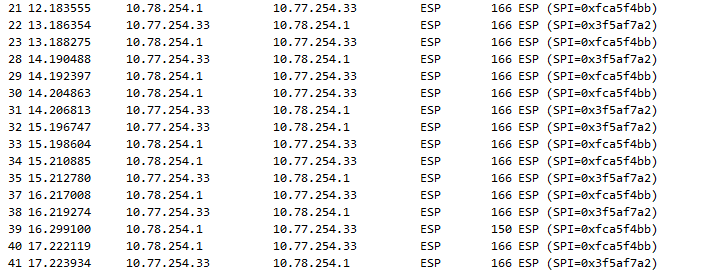
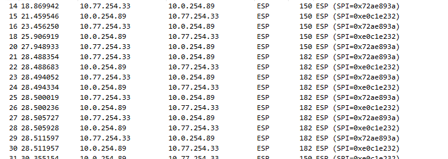

# Протоколы сети интернет

### Цели:
- ##### Настроить GRE поверх IPSec между офисами Москва и С.-Петербург
- ##### Настроить DMVPN поверх IPSec между офисами Москва и Чокурдах, Лабытнанги

### Описание/Пошаговая инструкция выполнения домашнего задания:
- ##### Настройте GRE поверх IPSec между офисами Москва и С.-Петербург.
- ##### Настройте DMVPN поверх IPSec между Москва и Чокурдах, Лабытнанги.

Экспорт лабораторной работы из EVE-NG:

- [IPSEC.zip](export_zip/IPSEC.zip)

- ##### Настройте NAT(PAT) на R14 и R15. Трансляция должна осуществляться в адрес автономной системы AS1001.
Настройка на R14 и R15:
```cfg
```


```cfg
```



- ##### Настройте NAT(PAT) на R18. Трансляция должна осуществляться в пул из 5 адресов автономной системы AS2042.


```cfg
```




- ##### Настройте статический NAT для R20.
```cfg
```
Проверка доступности:
```cfg
```


- ##### Настройте NAT так, чтобы R19 был доступен с любого узла для удаленного управления.
Настройка на R14:
```cfg
ip nat inside source static 10.0.254.5 10.77.254.14

interface Ethernet0/3
 description "to R19.e0/0"
 ip nat inside
```
Проверка:
```cfg
MSK-R19#ping 192.168.30.10
Type escape sequence to abort.
Sending 5, 100-byte ICMP Echos to 192.168.30.10, timeout is 2 seconds:
!!!!!
Success rate is 100 percent (5/5), round-trip min/avg/max = 1/1/3 ms

MSK-R14(config-router)#do sh ip nat tra
Pro Inside global      Inside local       Outside local      Outside global
udp 10.77.254.14:49212 10.0.254.5:49212   192.168.30.10:33492 192.168.30.10:33492
udp 10.77.254.14:49213 10.0.254.5:49213   192.168.30.10:33493 192.168.30.10:33493
udp 10.77.254.14:49214 10.0.254.5:49214   192.168.30.10:33494 192.168.30.10:33494
udp 10.77.254.14:49215 10.0.254.5:49215   192.168.30.10:33495 192.168.30.10:33495
udp 10.77.254.14:49216 10.0.254.5:49216   192.168.30.10:33496 192.168.30.10:33496
udp 10.77.254.14:49217 10.0.254.5:49217   192.168.30.10:33497 192.168.30.10:33497
udp 10.77.254.14:49218 10.0.254.5:49218   192.168.30.10:33498 192.168.30.10:33498
udp 10.77.254.14:49219 10.0.254.5:49219   192.168.30.10:33499 192.168.30.10:33499
udp 10.77.254.14:49220 10.0.254.5:49220   192.168.30.10:33500 192.168.30.10:33500
udp 10.77.254.14:49221 10.0.254.5:49221   192.168.30.10:33501 192.168.30.10:33501
udp 10.77.254.14:49222 10.0.254.5:49222   192.168.30.10:33502 192.168.30.10:33502
```


- ##### Настроите для IPv4 DHCP сервер в офисе Москва на маршрутизаторах R12 и R13. VPC1 и VPC7 должны получать сетевые настройки по DHCP.
Настройка на R12:
```cfg
ip dhcp excluded-address 192.168.10.1
ip dhcp excluded-address 192.168.10.2
ip dhcp excluded-address 192.168.10.3
ip dhcp excluded-address 192.168.11.3
ip dhcp excluded-address 192.168.11.2
ip dhcp excluded-address 192.168.11.1
ip dhcp excluded-address 192.168.11.129 192.168.11.254
ip dhcp excluded-address 192.168.10.129 192.168.10.254
!
ip dhcp pool vlan10
 network 192.168.10.0 255.255.255.0
 default-router 192.168.10.1
 domain-name otus.lab.com
!
ip dhcp pool vlan11
 network 192.168.11.0 255.255.255.0
 default-router 192.168.11.1
 domain-name otus.lab.com
```

Настройка на R13:
```cfg
ip dhcp excluded-address 192.168.10.1
ip dhcp excluded-address 192.168.10.2
ip dhcp excluded-address 192.168.10.3
ip dhcp excluded-address 192.168.11.3
ip dhcp excluded-address 192.168.11.2
ip dhcp excluded-address 192.168.11.1
ip dhcp excluded-address 192.168.10.4 192.168.10.128
ip dhcp excluded-address 192.168.11.4 192.168.11.128
!
ip dhcp pool vlan10
 network 192.168.10.0 255.255.255.0
 default-router 192.168.10.1
 domain-name otus.lab.com
!
ip dhcp pool vlan11
 network 192.168.11.0 255.255.255.0
 default-router 192.168.11.1
 domain-name otus.lab.com
```

Проверка:
```cfg
MSK-VPC1> ip dhcp
DDORA IP 192.168.10.129/24 GW 192.168.10.1

MSK-VPC7> ip dhcp
DDORA IP 192.168.11.4/24 GW 192.168.11.1
```

- ##### Настройте NTP сервер на R12 и R13. Все устройства в офисе Москва должны синхронизировать время с R12 и R13.
Настройка на R12 и R13:
```cfg
ntp master 1
ntp update-calendar

interface Ethernet0/0.10
 ntp broadcast

interface Ethernet0/0.11
 ntp broadcast

interface Ethernet0/1
 no ip address

interface Ethernet0/1.55
 ntp broadcast

interface Ethernet0/2
 ntp broadcast
 
interface Ethernet0/3
 ntp broadcast
 
```
Настройка клиентов:
```cfg
ntp server 172.16.255.12
ntp server 172.16.255.13
```

Проверка:
```cfg
MSK-R19(config)#do sh ntp stat
Clock is synchronized, stratum 2, reference is 172.16.255.12
nominal freq is 250.0000 Hz, actual freq is 250.0000 Hz, precision is 2**10
ntp uptime is 3200 (1/100 of seconds), resolution is 4000
reference time is EAF2F5C9.1E76C908 (16:59:37.119 MSK Thu Nov 28 2024)
clock offset is 0.5000 msec, root delay is 1.00 msec
root dispersion is 193.34 msec, peer dispersion is 189.44 msec
loopfilter state is 'CTRL' (Normal Controlled Loop), drift is 0.000000000 s/s
system poll interval is 64, last update was 21 sec ago.


MSK-R14(config)#do sh ntp status
Clock is synchronized, stratum 2, reference is 172.16.255.12
nominal freq is 250.0000 Hz, actual freq is 250.0000 Hz, precision is 2**10
ntp uptime is 13600 (1/100 of seconds), resolution is 4000
reference time is EAF2F5F4.3B645AC0 (17:00:20.232 MSK Thu Nov 28 2024)
clock offset is 0.0000 msec, root delay is 0.00 msec
root dispersion is 69.08 msec, peer dispersion is 64.87 msec
loopfilter state is 'CTRL' (Normal Controlled Loop), drift is 0.000000000 s/s
system poll interval is 128, last update was 69 sec ago.
```


### Конфиги устройств:
- [R14](R14)
- [R15](R15)
- [R12](R12)
- [R13](R13)
- [R18](R18)
