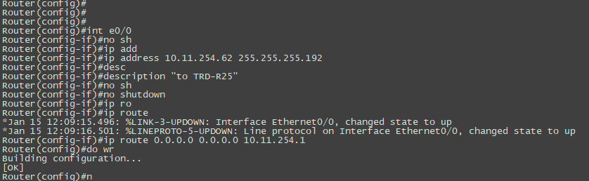
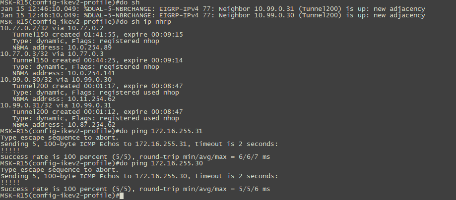

# Автоматизация задач по контролю за конфигурациями, контролю параметров, настройки АСО

### Цели:
- ##### Автоматизировать задачи по сбору актуальных конфигураций с АСО
- ##### Автоматизировать сбор критически важных парметров для маршрутизаторов и коммутаторов лабораторной среды
- ##### Автоматизировать настройку граничных маршрутизаторов вновь подключаемых филиалов

### Описание/Пошаговая инструкция выполнения домашнего задания:
- ##### Написать сценарий для сбора конфигураций и сохранения их в директорию, где инициализирован репозиторий git, продемонстрировать возможность просмотра различий конфигурации
- ##### Написать сценарии для сбора критически важных парметров для маршрутизаторов и коммутаторов, с возможностью отслеживать изменения
- ##### Написать сценарий для настройки граничных роутеров вновь подключаемых филиалов

### Схема лабораторной работы:


- ##### Написать сценарий для сбора конфигураций и сохранения их в директорию, где инициализирован репозиторий git, продемонстрировать возможность просмотра различий конфигурации

В самом начале сеть была описана в inventory-файлах [inventory-файлах](ansible/inventories/).
Затем была создана структура директорий для хранения отчётов:
```cfg
reports/
├── ro
│   └── show_stats
├── sh_run
└── sw
    └── show_stats
```
В директории reports был инициализирован локальный git-репозиторий, для того, чтобы была возможность отслеживать изменения.
Далее был написан [playbook](ansible/plays/cisco/sh_run.yml) для сбора конфигураций и с маршрутизаторов и с коммутаторов.


После этого был написан [bash-скрипт](sh_run.sh), который вызывает выполнение playbook и делает commit изменений:
```cfg
./sh_run.sh 

PLAY [Run show commands on routers] *****************************************************************************************************************************************************************************************************

TASK [sh run] ***************************************************************************************************************************************************************************************************************************
ok: [MSK-R12]
ok: [MSK-R13]
ok: [MSK-R15]
ok: [MSK-R19]
ok: [MSK-R14]
fatal: [SPB-R18]: FAILED! => {"changed": false, "msg": "ssh connection failed: ssh connect failed: Connection refused"}
fatal: [SPB-R16]: FAILED! => {"changed": false, "msg": "ssh connection failed: ssh connect failed: No route to host"}
fatal: [SPB-R32]: FAILED! => {"changed": false, "msg": "ssh connection failed: ssh connect failed: No route to host"}
ok: [MSK-R20]
ok: [SPB-R17]
ok: [LMS-R21]
ok: [KTN-R22]
ok: [TRD-R23]
ok: [TRD-R24]
ok: [TRD-R25]
ok: [TRD-R26]
ok: [LBT-R27]
ok: [CKD-R28]
ok: [VRT-R30]
ok: [AND-R31]
ok: [MSK-SW2]
ok: [MSK-SW3]
ok: [MSK-SW4]
ok: [MSK-SW5]
ok: [SPB-SW9]
ok: [SPB-SW10]
ok: [CKD-SW10]

TASK [Copy facts to files] **************************************************************************************************************************************************************************************************************
ok: [MSK-R13]
ok: [MSK-R14]
ok: [MSK-R12]
changed: [MSK-R15]
changed: [MSK-R19]
changed: [MSK-R20]
ok: [LMS-R21]
ok: [TRD-R23]
ok: [SPB-R17]
ok: [KTN-R22]
ok: [TRD-R24]
ok: [TRD-R26]
ok: [LBT-R27]
changed: [TRD-R25]
ok: [CKD-R28]
changed: [MSK-SW2]
changed: [AND-R31]
changed: [VRT-R30]
changed: [MSK-SW3]
changed: [MSK-SW4]
changed: [MSK-SW5]
changed: [SPB-SW10]
changed: [SPB-SW9]
changed: [CKD-SW10]

PLAY RECAP ******************************************************************************************************************************************************************************************************************************
AND-R31                    : ok=2    changed=1    unreachable=0    failed=0    skipped=0    rescued=0    ignored=0   
CKD-R28                    : ok=2    changed=0    unreachable=0    failed=0    skipped=0    rescued=0    ignored=0   
CKD-SW10                   : ok=2    changed=1    unreachable=0    failed=0    skipped=0    rescued=0    ignored=0   
KTN-R22                    : ok=2    changed=0    unreachable=0    failed=0    skipped=0    rescued=0    ignored=0   
LBT-R27                    : ok=2    changed=0    unreachable=0    failed=0    skipped=0    rescued=0    ignored=0   
LMS-R21                    : ok=2    changed=0    unreachable=0    failed=0    skipped=0    rescued=0    ignored=0   
MSK-R12                    : ok=2    changed=0    unreachable=0    failed=0    skipped=0    rescued=0    ignored=0   
MSK-R13                    : ok=2    changed=0    unreachable=0    failed=0    skipped=0    rescued=0    ignored=0   
MSK-R14                    : ok=2    changed=0    unreachable=0    failed=0    skipped=0    rescued=0    ignored=0   
MSK-R15                    : ok=2    changed=1    unreachable=0    failed=0    skipped=0    rescued=0    ignored=0   
MSK-R19                    : ok=2    changed=1    unreachable=0    failed=0    skipped=0    rescued=0    ignored=0   
MSK-R20                    : ok=2    changed=1    unreachable=0    failed=0    skipped=0    rescued=0    ignored=0   
MSK-SW2                    : ok=2    changed=1    unreachable=0    failed=0    skipped=0    rescued=0    ignored=0   
MSK-SW3                    : ok=2    changed=1    unreachable=0    failed=0    skipped=0    rescued=0    ignored=0   
MSK-SW4                    : ok=2    changed=1    unreachable=0    failed=0    skipped=0    rescued=0    ignored=0   
MSK-SW5                    : ok=2    changed=1    unreachable=0    failed=0    skipped=0    rescued=0    ignored=0   
SPB-R16                    : ok=0    changed=0    unreachable=0    failed=1    skipped=0    rescued=0    ignored=0   
SPB-R17                    : ok=2    changed=0    unreachable=0    failed=0    skipped=0    rescued=0    ignored=0   
SPB-R18                    : ok=0    changed=0    unreachable=0    failed=1    skipped=0    rescued=0    ignored=0   
SPB-R32                    : ok=0    changed=0    unreachable=0    failed=1    skipped=0    rescued=0    ignored=0   
SPB-SW10                   : ok=2    changed=1    unreachable=0    failed=0    skipped=0    rescued=0    ignored=0   
SPB-SW9                    : ok=2    changed=1    unreachable=0    failed=0    skipped=0    rescued=0    ignored=0   
TRD-R23                    : ok=2    changed=0    unreachable=0    failed=0    skipped=0    rescued=0    ignored=0   
TRD-R24                    : ok=2    changed=0    unreachable=0    failed=0    skipped=0    rescued=0    ignored=0   
TRD-R25                    : ok=2    changed=1    unreachable=0    failed=0    skipped=0    rescued=0    ignored=0   
TRD-R26                    : ok=2    changed=0    unreachable=0    failed=0    skipped=0    rescued=0    ignored=0   
VRT-R30                    : ok=2    changed=1    unreachable=0    failed=0    skipped=0    rescued=0    ignored=0   

[master 0651790] 2025-01-15
 67 files changed, 11958 insertions(+), 690 deletions(-)
 create mode 100644 ro/show_stats/CKD-R28_stats.txt
 create mode 100644 ro/show_stats/KTN-R22_stats.txt
 create mode 100644 ro/show_stats/LBT-R27_stats.txt
 create mode 100644 ro/show_stats/LMS-R21_stats.txt
 create mode 100644 ro/show_stats/MSK-R12_stats.txt
 create mode 100644 ro/show_stats/MSK-R13_stats.txt
 create mode 100644 ro/show_stats/MSK-R14_stats.txt
 create mode 100644 ro/show_stats/MSK-R15_stats.txt
 create mode 100644 ro/show_stats/MSK-R19_stats.txt
 create mode 100644 ro/show_stats/MSK-R20_stats.txt
 create mode 100644 ro/show_stats/SPB-R16_stats.txt
 create mode 100644 ro/show_stats/SPB-R17_stats.txt
 create mode 100644 ro/show_stats/SPB-R32_stats.txt
 create mode 100644 ro/show_stats/TRD-R23_stats.txt
 create mode 100644 ro/show_stats/TRD-R24_stats.txt
 create mode 100644 ro/show_stats/TRD-R25_stats.txt
 create mode 100644 ro/show_stats/TRD-R26_stats.txt
 create mode 100644 sh_run/AND-R31.txt
 create mode 100644 sh_run/VRT-R30.txt
 create mode 100644 sw/show_stats/CKD-R28_stats.txt
 create mode 100644 sw/show_stats/KTN-R22_stats.txt
 create mode 100644 sw/show_stats/LBT-R27_stats.txt
 create mode 100644 sw/show_stats/LMS-R21_stats.txt
 create mode 100644 sw/show_stats/MSK-R12_stats.txt
 create mode 100644 sw/show_stats/MSK-R13_stats.txt
 create mode 100644 sw/show_stats/MSK-R14_stats.txt
 create mode 100644 sw/show_stats/MSK-R15_stats.txt
 create mode 100644 sw/show_stats/MSK-R19_stats.txt
 create mode 100644 sw/show_stats/MSK-R20_stats.txt
 create mode 100644 sw/show_stats/SPB-R16_stats.txt
 create mode 100644 sw/show_stats/SPB-R17_stats.txt
 create mode 100644 sw/show_stats/SPB-R32_stats.txt
 create mode 100644 sw/show_stats/TRD-R23_stats.txt
 create mode 100644 sw/show_stats/TRD-R24_stats.txt
 create mode 100644 sw/show_stats/TRD-R25_stats.txt
 create mode 100644 sw/show_stats/TRD-R26_stats.txt
```
В результате c помощью git reflog можно посмотреть коммиты после сбора конфигураций в репозиториях:


Теперь можно проверить отличие конфигураций путем сравнения весрий с помощью git diff:


Скрипт можно поместить в cron работающего сервера с Ansible для регулярного сбора конфигураций, чтобы можно было отследить изменения, которые могли привести к аварийной ситуации или недостпуности критичного сервиса.

- ##### Написать сценарии для сбора критически важных парметров для маршрутизаторов и коммутаторов, с возможностью отслеживать изменения

Данная часть работы отличается от предыдущего пункта только написанием playbook`ов для [маршрутизаторов](ansible/plays/cisco/sw_sh_cmd.yml) и [коммутаторов](ansible/plays/cisco/ro_sh_cmd.yml).

Примеры отчётов находятся в [директории](reports/).

- ##### Написать сценарий для настройки граничных роутеров вновь подключаемых филиалов

В качестве примера для демонстрации было выбрано подключение двух новых маршрутизаторов, и поднятие на них DMVPN для связи с офисом в Москве.
В Москве на MSK-R15 был поднят новый туннельный интерфейс и новый профиль ikev2 для использования pre-share.
```cfg
crypto ikev2 keyring IKEv2-DMVPN
 peer dmvpn-node
  address 0.0.0.0 0.0.0.0
  pre-shared-key OTUS-DMVPN


crypto ikev2 profile IKEv2PROFILE-DMVPN2
 match identity remote address 0.0.0.0 
 authentication remote pre-share
 authentication local pre-share

interface Tunnel200
 ip address 10.99.0.1 255.255.255.0
 no ip redirects
 ip mtu 1400
 no ip next-hop-self eigrp 77
 no ip split-horizon eigrp 77
 ip nhrp authentication OTUS
 ip nhrp network-id 200
 ip tcp adjust-mss 1360
 tunnel source Ethernet0/2
 tunnel mode gre multipoint
 tunnel protection ipsec profile IPSECPROFILE-DMVPN2
!
```
Далее были определены [host_vars](ansible/inventories/host_vars/) для двух новых маршрутизаторов, где определены второй и четвертый октеты, которые будут использоваться для настройки loopback-интерфейса и туннельного интерфейса.

На маршрутизаторах базово был настроен IP-адресс, маршрут по умолчанию и доступ по SSH:




Как видно из скриншота - DMVPN туннели поднялись, динамическая маршрутизация тоже, что сделало возможным доступ к Loopback интерфейсов вновь установленных маршрутизаторов.
